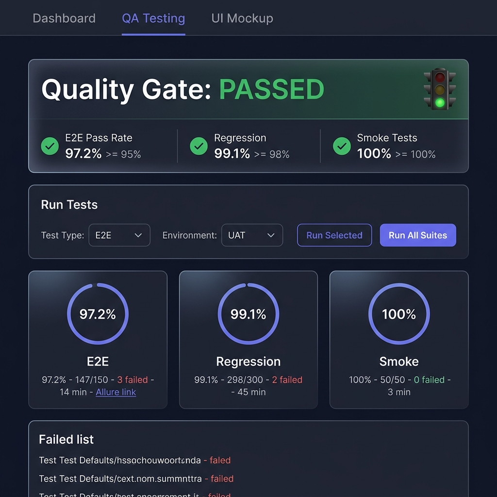
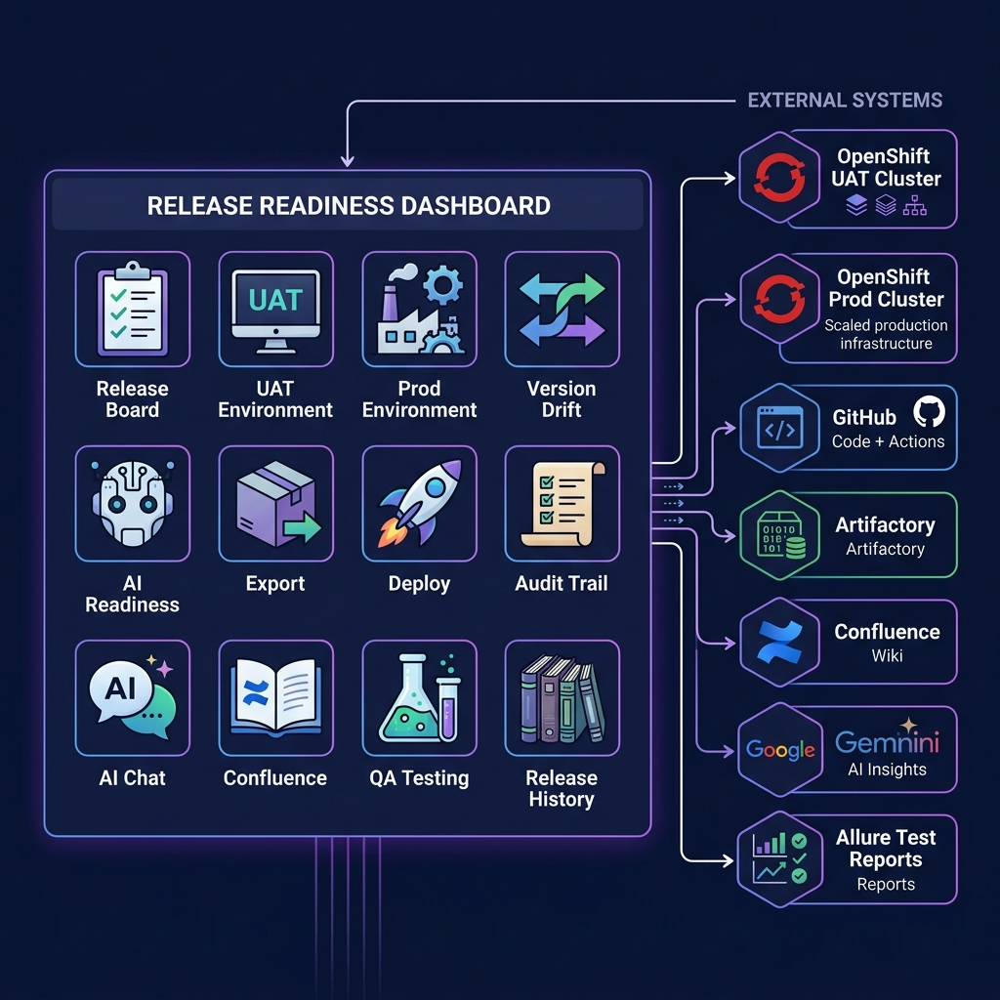
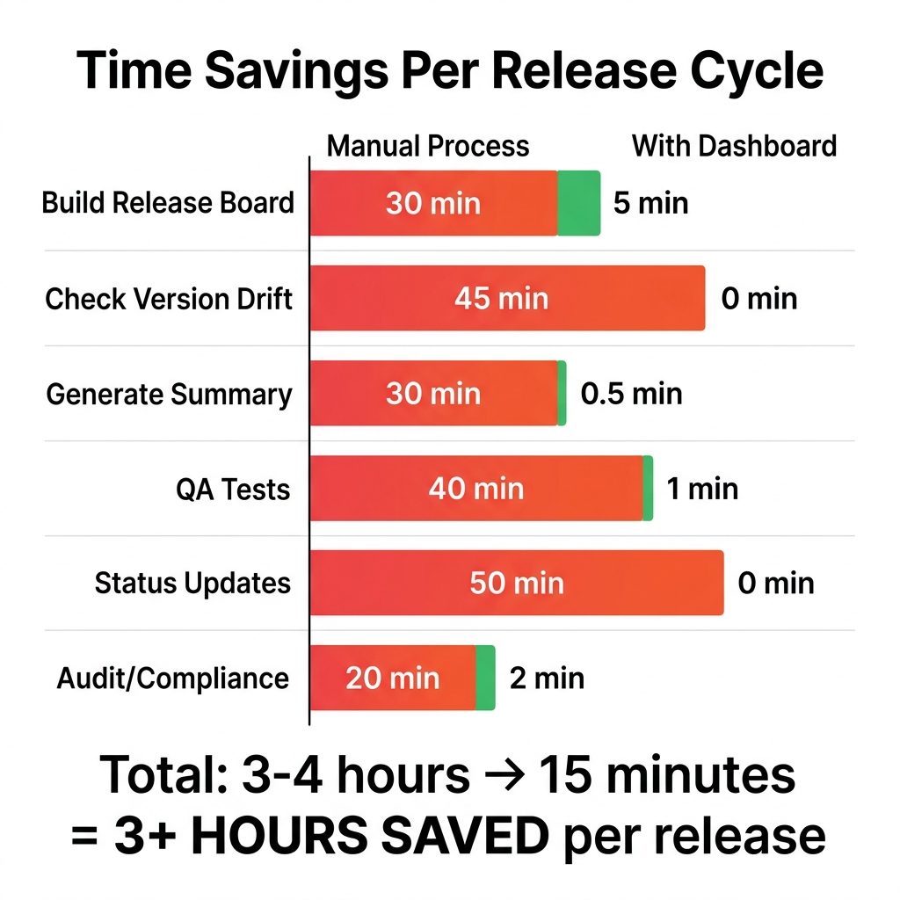

# Release Readiness Dashboard — Overview

> A single dashboard that gives your entire team a real-time answer to: **"Are we ready to release?"**

---

## The Problem

Every release cycle, teams waste time on the same questions:

- 🤷 **"What's being released?"** — Services are scattered across Jira tickets, Slack threads, and spreadsheets
- 🔀 **"Is UAT matching what we nominated?"** — Someone manually compares versions across environments
- ⏳ **"Did QA finish testing?"** — You ping QA on Slack and wait for a response
- 📋 **"What changed since last release?"** — Dig through Git logs and deployment histories
- 🔒 **"Is the release board finalized?"** — No clear cutoff, services added at the last minute
- 📊 **"Can someone give me a summary?"** — A manager asks, and someone spends 30 minutes creating a report

These problems multiply with every release and every team member involved. Information is scattered, processes are manual, and nobody has a single source of truth.

---

## The Solution

The **Release Readiness Dashboard** is a centralized platform that:

1. **Collects** all release information in one place
2. **Automates** version checks, drift detection, and quality gates
3. **Provides real-time visibility** to everyone — QA, development, management
4. **Eliminates manual work** — no more spreadsheets, Slack polls, or status emails

```
┌─────────────────────────────────────────────────────────────────────────┐
│  🚀 Release Readiness Dashboard                  ● Open  ⏱ 2d 4h left │
│ ┌──────┬──────┬──────┬──────┬───────┬──────┬──────┬──────┬────────────┐ │
│ │Board │ UAT  │ Prod │Drift │Export │Audit │Deploy│Confl.│  Chat  │QA │ │
│ └──────┴──────┴──────┴──────┴───────┴──────┴──────┴──────┴────────────┘ │
│                                                                         │
│ ┌────────────────┐ ┌────────────────┐ ┌────────────────┐ ┌───────────┐ │
│ │   8 Nominated   │ │   6 🟢 Ready   │ │   1 🟡 Review  │ │  1 🔴Risk │ │
│ └────────────────┘ └────────────────┘ └────────────────┘ └───────────┘ │
│                                                                         │
│  [billing-service v2.4.1]  [payment-gateway v3.1.0]  [user-api v1.8]  │
│  [order-service v2.0.3]    [notification-svc v1.2]   [auth-svc v4.1]  │
│  [report-engine v3.5.0]    [config-service v1.0.2]                     │
└─────────────────────────────────────────────────────────────────────────┘
```

---

## Who Benefits

| Role | What They Get |
|---|---|
| **QA Team** | One-click test execution, Allure results on screen, Quality Gate sign-off, no more "are we ready?" questions |
| **Development Team** | Nominate services for release, see version drift instantly, track what's going into production |
| **DevOps / Platform** | Live UAT and Prod environment views, one-click deployments, auto-version comparison |
| **Tech Leads** | AI readiness scores, risk assessment, audit trail of all changes |
| **Management** | Real-time release status, CSV/JSON exports for reports, historical release data |
| **Everyone** | Single source of truth — no more Slack polls, spreadsheets, or status meetings |

---

## Features

### 📋 Release Board — The Heart of the Dashboard

The central nomination board where teams declare what's being released.

**What it does**:
- Services are nominated with specific versions (image tags)
- Supports **platform services** (auto-detected from UAT cluster) and **custom components** (pulled from Artifactory)
- Board has a **configurable cutoff time** (e.g., Wednesday 12 PM) — after which nominations lock automatically
- Status tracking: 🟢 Ready / 🟡 Needs Review / 🔴 At Risk
- Exception nominations for out-of-cycle releases
- Live countdown timer to release date

**Who uses it**: Everyone — this is where the release is defined

---

### 🖥️ UAT Environment — Live Cluster View

Real-time visibility into what's actually running in your UAT environment.

**What it does**:
- Connects directly to your OpenShift/K8s cluster via API
- Shows all deployments with: image, tag, helm chart version, replica count, health status
- Filterable and searchable — find any service instantly
- One-click refresh
- Shows namespace and cluster info

**Who uses it**: QA, DevOps — confirms what's deployed before testing

---

### 🏭 Production Environment — Live Cluster View

Same real-time view, but for your production cluster.

**What it does**:
- Connects to production OpenShift/K8s cluster (via remote API or local)
- Cross-references with the release board: shows which prod services are nominated vs. not nominated
- **Export All Prod Versions (CSV)** — one-click download of every service's current live version
- Export not-nominated services — identifies services in prod that aren't on the release board
- Excel-safe exports (no scientific notation issues with long image tags)

**Who uses it**: DevOps, Tech Leads — audits what's in production vs. what's being released

---

### 🔀 Version Drift — Automated Version Comparison

Automatically detects mismatches between nominated versions and what's running in UAT.

**What it does**:
- Compares board nominations against live UAT versions
- Flags services where the nominated version ≠ deployed version
- Color-coded severity: 🟢 Match / 🟡 Minor drift / 🔴 Major drift
- Detects both platform services and custom components
- Saves hours of manual version checking before release

**Who uses it**: DevOps, QA — catches "we forgot to deploy" issues before release day

---

### 🤖 AI Readiness — Intelligent Risk Assessment

AI-powered analysis of each nominated service's release readiness.

**What it does**:
- Scores each service's readiness using multiple signals
- Considers version freshness, deployment status, drift, and history
- Provides a summary recommendation: Ready / Needs Review / At Risk
- Explains *why* a service is flagged (e.g., "version drift detected" or "not deployed to UAT yet")

**Who uses it**: Tech Leads, Management — quick risk overview without digging into details

---

### 📜 Audit Trail — Complete Release History

Every action on the release board is logged — nominations, removals, status changes, lock/unlock.

**What it does**:
- Timestamped log of every board change
- Records who made the change and what was modified
- Tracks board lock/unlock events
- Searchable and filterable
- Compliance-ready — proves release governance is followed

**Who uses it**: Management, Compliance, Tech Leads — answers "who changed what and when?"

---

### 📦 Export — Data Portability

Get the release data out of the dashboard in any format you need.

**What it does**:
- **CSV Export** — all nominated services with versions, status, and metadata
- **JSON Export** — structured data for automation and integration
- **Board Snapshot** — point-in-time snapshot of the release board
- **Lock/Unlock Board** — freeze nominations before export/release
- Excel-safe formatting (long numbers and version strings preserved correctly)

**Who uses it**: Management (reports), DevOps (automation), QA (tracking)

---

### 🚀 Deploy — GitHub Actions Integration

Trigger deployment workflows directly from the dashboard.

**What it does**:
- Connects to your GitHub repo via OAuth or PAT
- Lists available deployment workflows
- One-click trigger with parameters (environment, version)
- Live status tracking — watch the workflow run in real-time
- Direct link to GitHub Actions run page
- Supports GitHub Enterprise

**Who uses it**: DevOps — trigger deployments without leaving the dashboard

---

### 📖 Confluence Agent — AI-Powered Documentation Search

Search your organization's Confluence wiki from the dashboard with AI-summarized answers.

**What it does**:
- Natural language search across Confluence spaces
- AI reads matching pages and provides summarized answers
- Quick action buttons: Runbooks, Deploy Docs, Release Procedures, Troubleshooting
- Direct "Open in Confluence" links
- Connects via MCP server or direct REST API

**Who uses it**: Anyone — find runbooks, procedures, and documentation during release

---

### 💬 AI Chat — Release Intelligence Assistant

An AI chatbot that understands your release context and answers questions.

**What it does**:
- Powered by Google Gemini
- Has full context of the release board, UAT/Prod environments, drift status
- Answers questions like:
  - "What's in this release?"
  - "Any drift issues?"
  - "Show readiness scores"
  - "What's running in UAT?"
- Provides data-driven answers with tables and breakdowns

**Who uses it**: Anyone — get instant answers about the release without navigating tabs

---

### 📚 Release History — Past Releases

Archive of all previous releases for reference and comparison.

**What it does**:
- Stores complete board snapshots from past releases
- Compare current release with previous ones
- Track release cadence and patterns
- Historical data for metrics and reporting

**Who uses it**: Management, Tech Leads — "how does this release compare to the last one?"

---

### 🧪 QA Automation (Coming Soon)

Integrated test execution and quality gates — trigger tests, see results, sign off.

**What it does**:
- One-click test execution (E2E, smoke, regression) via GitHub Actions
- Auto-trigger tests when the board locks at cutoff
- Allure test results displayed on the dashboard
- Quality Gate: go/no-go verdict based on all test suites
- QA sign-off recorded in audit trail
- On-demand test environments for isolated testing

**Who uses it**: QA Team — run tests, see results, sign off — all from one place



---

## How It All Connects



---

## Key Differentiators

| Feature | Before (Manual) | With Dashboard |
|---|---|---|
| **Release board** | Spreadsheet or Jira board | Real-time interactive board with auto-lock |
| **Version checking** | Manually SSH into clusters, compare versions | Auto-detected from live clusters |
| **Drift detection** | Someone runs `oc get deployments` and compares | Automated — flagged in real-time |
| **Test execution** | Go to GitHub, fill in inputs, wait, check Allure | One-click from dashboard, auto-trigger at cutoff |
| **Status communication** | Slack messages, email summaries | Dashboard visible to everyone, AI chatbot |
| **Audit trail** | "Who changed the release board?" "I don't know" | Every action timestamped and recorded |
| **Documentation** | "Where's the runbook?" Search Confluence manually | AI-powered search from the dashboard |
| **Reports** | 30 min to create a CSV manually | One-click CSV/JSON export |
| **Release sign-off** | Verbal confirmation on Slack | Formal QA sign-off button with audit trail |

---

## Time Savings Per Release Cycle



| Activity | Manual Process | Dashboard | Time Saved |
|---|---|---|---|
| Build the release board | ~30 min (spreadsheet, Jira) | ~5 min (nominate services) | **25 min** |
| Check version drift | ~45 min (SSH, compare versions) | ~0 min (automated) | **45 min** |
| Generate release summary | ~30 min (compile, format) | ~30 sec (Export CSV) | **29 min** |
| QA test trigger + results | ~40 min (GitHub, Allure, Slack) | ~1 min (one-click) | **39 min** |
| Answer "are we ready?" | ~5-10 min each time, 5+ times/cycle | ~0 min (dashboard visible) | **25-50 min** |
| Audit/compliance check | ~20 min (dig through Slack, Jira) | ~2 min (audit trail) | **18 min** |
| **Total per release** | **~3-4 hours** | **~15 min** | **~3+ hours** |

> 📊 With weekly releases, that's **12+ hours saved per month** across the team.

---

## Technical Details

| Aspect | Detail |
|---|---|
| **Backend** | Python (Flask) |
| **Frontend** | Single-page HTML/JS with modern dark-mode UI |
| **Deployment** | Containerized, runs on OpenShift/K8s |
| **Cluster Integration** | Direct K8s API calls (ServiceAccount tokens) |
| **GitHub Integration** | OAuth or PAT — supports GitHub Enterprise |
| **AI** | Google Gemini for chat and readiness analysis |
| **Confluence** | MCP server or direct REST API |
| **Artifactory** | REST API for custom component versions |
| **Data Storage** | JSON file (lightweight, no database required) |
| **Auth** | GitHub OAuth for user authentication |

---

## Getting Started

### Minimum Setup (5 min)

```bash
# Clone and run
git clone https://github.com/your-org/release-readiness.git
cd release-readiness
pip install -r requirements.txt
python app.py
# Dashboard running at http://localhost:8090
```

With just this, you get:
- ✅ Release board with nomination and locking
- ✅ Audit trail
- ✅ Export (CSV/JSON)
- ✅ Release history

### Full Setup (with integrations)

```bash
# All integrations enabled
export GITHUB_TOKEN=ghp_xxx                    # GitHub integration
export GITHUB_CLIENT_ID=xxx                    # OAuth (optional)
export GITHUB_CLIENT_SECRET=xxx
export DEPLOY_REPO=your-org/deployments        # Deploy tab
export CONFLUENCE_MCP_URL=http://confluence-mcp:8000  # Confluence
export GEMINI_API_KEY=xxx                      # AI Chat
export ARTIFACTORY_URL=https://artifactory.company.com  # Custom components
export PROD_CLUSTER_API=https://api.ocp-prod:6443  # Prod cluster
export PROD_CLUSTER_TOKEN=xxx
python app.py
```

---

## Frequently Asked Questions

### Q: Do we need to change our existing workflows?
**No.** The dashboard reads from your existing clusters, GitHub, Artifactory, and Confluence. It doesn't require any changes to your CI/CD pipelines or deployment processes.

### Q: Can multiple teams use the same dashboard?
Yes. Each release cycle has its own board. Teams nominate their services independently, and everyone sees the same view.

### Q: Does it require a database?
**No.** The dashboard uses a lightweight JSON file for data storage. No database setup, no migrations, no maintenance.

### Q: Is it secure?
Yes. It uses ServiceAccount tokens for cluster access (read-only), GitHub OAuth for authentication, and all communication happens within your network.

### Q: What if we don't use Confluence?
The Confluence tab is optional. The dashboard works without it — just don't configure `CONFLUENCE_MCP_URL`.

### Q: What if we don't use Artifactory?
Also optional. Without Artifactory configured, the dashboard focuses on platform services from the cluster.

### Q: Can we customize the cutoff time and release cadence?
Yes. Cutoff day and hour are configurable via environment variables:
```bash
CUTOFF_DAY=2          # 0=Mon, 2=Wed
CUTOFF_HOUR=12        # 12:00 (noon)
RELEASE_CADENCE=friday  # Release day
```

---

*Built for teams who want to spend less time coordinating releases and more time building features.*
