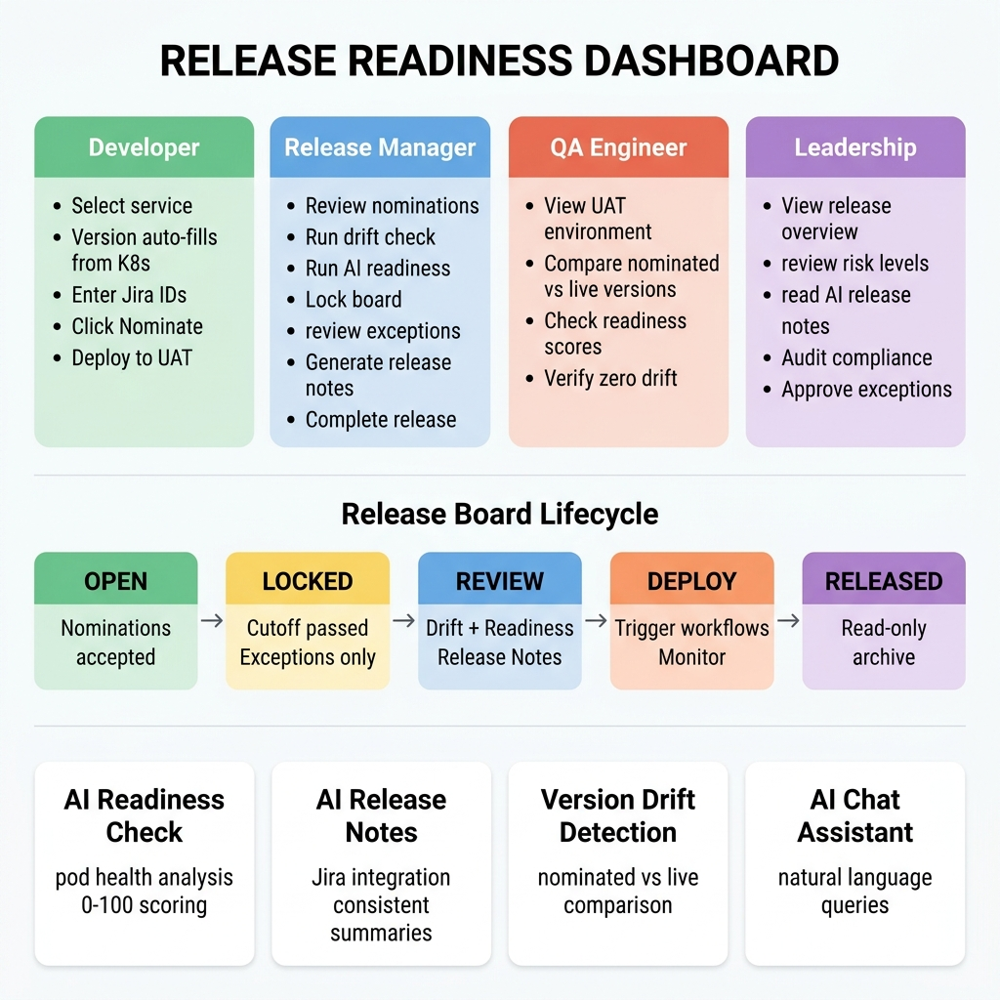
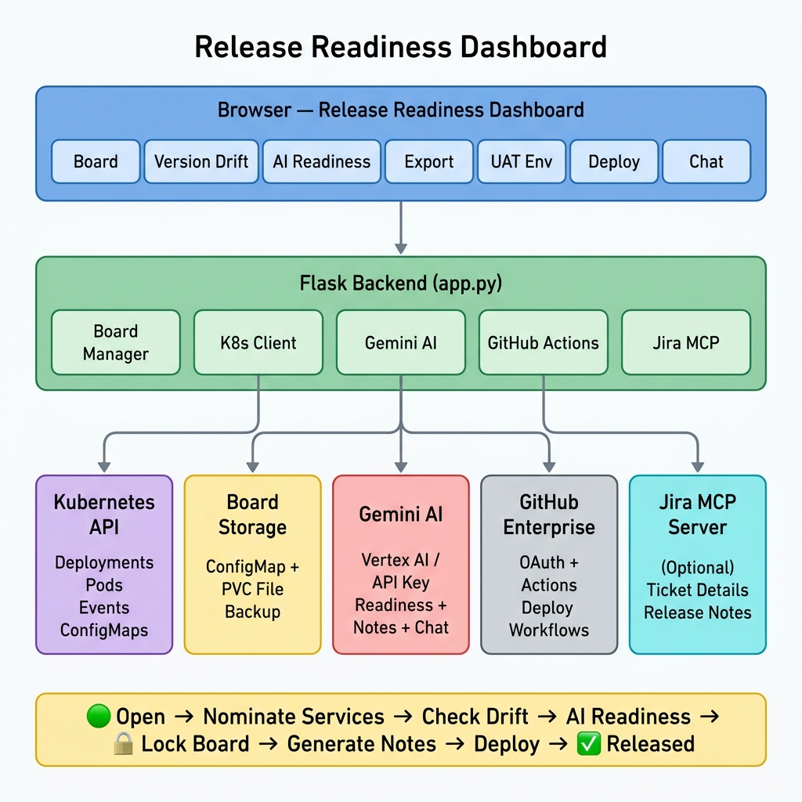

# Release Readiness Dashboard — Demo Guide

> **Purpose**: Step-by-step demo walkthrough for stakeholders, leadership, and engineering teams.
> Estimated demo time: **15–20 minutes**

---

## 1. What Problem Does This Solve?

### Before (Manual Process)

| Step | How it's done today | Pain points |
|------|-------------------|-------------|
| **Service nomination** | Emails, Slack threads, spreadsheets | No single source of truth, versions get lost |
| **Version tracking** | Manual copy-paste of image tags | Wrong versions deployed, tag drift goes unnoticed |
| **Readiness check** | Manual kubectl checks by each team | Time-consuming, inconsistent, human error |
| **Release notes** | Manual Word/Confluence docs | Takes hours, misses Jira details, inconsistent format |
| **Deployment** | SSH into servers or manual GitHub dispatch | No audit trail, error-prone, no rollback tracking |
| **Post-cutoff changes** | Email approvals, no formal process | No traceability, no risk flagging |

### After (Release Readiness Dashboard)

| Step | How it works now | Improvement |
|------|-----------------|-------------|
| **Service nomination** | One-click from live cluster data | Auto-fills image tag + Helm version from K8s |
| **Version tracking** | Real-time drift detection | Instantly see if cluster drifted from nomination |
| **Readiness check** | AI-powered analysis (Gemini) | Automated health scoring in seconds |
| **Release notes** | AI-generated with Jira enrichment | Consistent, detailed, one-click generation |
| **Deployment** | GitHub Actions integration | Trigger, monitor, audit — all from one UI |
| **Post-cutoff changes** | Formal exception workflow | Requires reason + approver, flagged in notes |

---

## 2. Who Benefits?

---

## 3. Core Features — Demo Walkthrough

### Step 1: 📋 Board Tab (The Heart of the App)

**What to show:**
1. Open the dashboard — point out the **summary bar** (nominated count, readiness breakdown, countdown timer)
2. Show **Tile view** — each card shows service name, version, Helm chart, readiness badge, Jira tickets
3. Switch to **List view** — compact table with all details at a glance
4. Click a card → **Service Detail** modal shows full version history, image, Helm chart, AI readiness

**Key talking points:**
- "This is our single source of truth for what's going into the next release"
- "Version info is auto-populated from the live Kubernetes cluster — no manual entry"
- "Each card shows exactly which Jira tickets are linked to this change"

---

### Step 2: Nominate a Service

**What to show:**
1. In the right panel, select a **K8s Service** from the dropdown
2. Point out that **image tag and Helm version auto-fill** from the cluster
3. Enter your name, Jira IDs (e.g., `PROJ-123, PROJ-456`), and optional notes
4. Click **Nominate** → card appears on the board instantly

5. Switch to **⚡ Custom Component** tab
6. Select a component (Spark job, PySpark pipeline, etc.)
7. Enter version **manually** (custom components don't live in K8s)
8. Nominate → shows on the same board alongside K8s services

**Key talking points:**
- "We support both Kubernetes services AND non-K8s components like Spark jobs"
- "Jira IDs are mandatory — every nomination must be traceable to a ticket"
- "If the board is locked (past cutoff), you get an **Exception Nomination** workflow requiring a reason and approver"

---

### Step 3: 🔀 Version Drift Tab

**What to show:**
1. Click **Check Drift** button
2. Results show each nominated service with:
   - 🟢 **Match** — cluster version matches nomination
   - 🟡 **Drift** — minor version difference
   - 🔴 **Major Drift** — completely different version in cluster

**Key talking points:**
- "This catches the #1 release problem — someone deploys a hotfix and the nomination is now stale"
- "Run this before every release to ensure what we nominated is what's actually running"

---

### Step 4: 🤖 AI Readiness Tab

**What to show:**
1. Click **Run AI Readiness Check**
2. Wait ~30-60 seconds (Gemini analyzes each service)
3. Results show:
   - **Overall readiness**: 🟢 Ready / 🟡 Review / 🔴 Risk
   - **Per-service score** (0-100) with individual checks:
     - ✅ Pod health, replica count, resource limits
     - ⚠️ Recent restarts, image age, missing probes
     - ❌ CrashLoopBackOff, OOMKilled, down replicas

**Key talking points:**
- "Gemini AI analyzes live cluster state — pod health, events, resource config"
- "Each service gets a readiness score and specific risk flags"
- "This replaces 30 minutes of manual kubectl checks per service"

---

### Step 5: 📦 Export Tab — AI Release Notes

**What to show:**
1. Click **✨ AI Release Notes**
2. Wait ~10-20 seconds
3. Show the generated output:
   - **Executive summary** (2-3 sentences)
   - **Service table** with Version, Jira Tickets, Change Summary, Risk Level
   - **What's Changed** section organized by type (Features, Bug Fixes, etc.)
   - **AI Risk Assessment**
   - **Exception nominations** section (if any)
4. Click **Copy Markdown** → paste into Teams/Confluence

**Key talking points:**
- "Release notes are generated in seconds, not hours"
- "Jira tickets are fetched via MCP integration — the AI reads ticket descriptions and writes meaningful change summaries"
- "Version column always shows both image tag AND Helm chart version for K8s services"
- "Every run produces consistent format — 2-3 sentences per service, organized by change type"

Also show: **Export as JSON** and **Export as YAML** for manifest archival.

---

### Step 6: 🖥️ UAT Environment Tab

**What to show:**
1. Click the tab → live view of all services in the UAT namespace
2. Table shows: Service name, Kind, Image, Tag, Helm Chart, Replicas, Status
3. Point out healthy (🟢) vs down (🔴) indicators

**Key talking points:**
- "Real-time cluster view — no need to SSH or run kubectl"
- "Compare UAT versions against what's nominated on the board"

---

### Step 7: 🚀 Deploy Tab

**What to show:**
1. Click the tab → shows GitHub Actions workflows from the deployment repo
2. Expand a workflow → see input fields (version, service name, etc.)
3. Environment is **locked to UAT** (can't accidentally deploy to prod)
4. Click **Run Workflow** → status updates in real-time
5. Link to GitHub Actions run for full logs

**Key talking points:**
- "Deploy directly from the dashboard — no need to open GitHub"
- "Environment is locked to UAT for safety"
- "Full audit trail — who triggered what and when"

---

### Step 8: 📜 Audit Trail Tab

**What to show:**
1. Click the tab → chronological log of every action:
   - ➕ Nominations, 🔄 Re-nominations, ❌ Removals
   - 🔒 Board locked, 🚀 Release completed
   - ⚠️ Exception nominations (with approver + reason)
   - 🚢 Deploy triggered

**Key talking points:**
- "Complete audit compliance — every action is recorded with who, what, when"
- "Exception nominations are highlighted in yellow with approver details"

---

### Step 9: 💬 AI Chat Tab

**What to show:**
1. Ask: "What services are at risk?"
2. Ask: "Summarize the current release"
3. Ask: "What changed in billing-service?"

**Key talking points:**
- "Natural language interface powered by Gemini"
- "Context-aware — it knows what's on your board and in your cluster"

---

### Step 10: Board Lifecycle

**What to show:**
1. **Lock Board** → status changes to 🔒 Locked
2. Try nominating → get the **Exception Nomination** modal
3. Fill in reason + approver → exception is recorded
4. **Complete Release** → board becomes read-only, archived in history

**Key talking points:**
- "Formal release lifecycle: Open → Locked → Released"
- "Post-cutoff changes require explicit approval — no more stealth deployments"

---

## 4. Architecture Overview

---

## 5. Integration Points

| Integration | Purpose | Required? |
|------------|---------|-----------|
| **Kubernetes API** | Service discovery, live cluster state, pod health | ✅ Required |
| **Gemini AI** (Vertex AI or API Key) | AI Readiness scoring, Release Notes, Chat | ✅ Required |
| **GitHub** (OAuth or PAT) | Deploy tab — trigger/monitor GitHub Actions workflows | Optional |
| **Jira MCP Server** | Fetch Jira ticket details for enriched release notes | Optional |
| **ConfigMap storage** | Persist board state across pod restarts | Recommended |
| **PVC** | Backup board data to persistent disk | Recommended |

---

## 6. Possible Q&A

### General

**Q: What happens if the pod restarts? Do we lose the board data?**
> A: No. Board state is persisted in two places: Kubernetes ConfigMap (primary) and local file system via PVC (backup). Even if the pod crashes, data is preserved.

**Q: Can multiple people use the dashboard simultaneously?**
> A: Yes. The board state is stored server-side (ConfigMap). All users see the same board. Concurrent modifications are handled with optimistic updates.

**Q: Does this work with on-premise Kubernetes (GDC/Anthos)?**
> A: Yes. It only needs standard Kubernetes API access. Works on GKE, GDC, Anthos, EKS, AKS, or any conformant K8s cluster.

### Nominations

**Q: What if a developer nominates the wrong version?**
> A: They can re-nominate the same service with the correct version. The version history tracks every change, and you can rollback to any previous version.

**Q: What if someone needs to add a service after the cutoff?**
> A: They get an Exception Nomination workflow — must provide a reason and approver name. This is flagged in the audit trail and highlighted in AI release notes.

**Q: Can we nominate non-Kubernetes services like Spark jobs?**
> A: Yes! The Custom Components feature supports any non-K8s artifact — Spark, PySpark, mobile apps, config rules, etc. Versions are entered manually.

### AI Features

**Q: What AI model is used?**
> A: Google Gemini (configurable — default `gemini-2.0-flash`). Supports both Vertex AI (GDC/GCP) and Gemini API Key authentication.

**Q: What if Gemini is unavailable?**
> A: All AI features have a **deterministic fallback**. Release notes generate a structured table, readiness checks return basic pod health status. The app never fails due to AI unavailability.

**Q: How does Jira integration work?**
> A: We connect to a Jira MCP (Model Context Protocol) server. When generating release notes, the app fetches ticket details (summary, description, status, priority) and passes them to Gemini. The AI writes change summaries based on actual Jira ticket content.

### Security & Compliance

**Q: Who can deploy from this dashboard?**
> A: Only users authenticated via GitHub OAuth. Deploy actions are locked to UAT environment. Every deployment is recorded in the audit trail with the GitHub username.

**Q: Is there an audit trail for compliance?**
> A: Yes. Every action (nominate, remove, re-nominate, lock, exception, deploy, complete) is recorded with who did it, when, and what changed. This is visible in the Audit Trail tab.

**Q: Can someone bypass the cutoff and nominate without approval?**
> A: No. Once the board is locked, the only path is the Exception Nomination workflow which requires a documented reason and an approver name. These are prominently flagged in release notes and audit trail.

### Deployment

**Q: How is this app itself deployed?**
> A: Standard Kubernetes Deployment with a Dockerfile. Manifests in `manifests/deploy.yaml` include Deployment, Service, ServiceAccount, and RBAC. Takes about 5 minutes to set up.

**Q: What RBAC permissions does it need?**
> A: Read access to Deployments, StatefulSets, Pods, Events, Services, Secrets (for Helm releases). Read/Write access to ConfigMaps (for board persistence). All scoped to a single namespace.

**Q: Does it require an external database?**
> A: No. Board state is stored in Kubernetes ConfigMaps + optional PVC file backup. Zero external dependencies.

---

## 7. Quick Feature Matrix

| Feature | Tab | AI-Powered | Jira Integration |
|---------|-----|-----------|-----------------|
| Service nomination (K8s + Custom) | 📋 Board | — | Links tickets |
| Tile / List view toggle | 📋 Board | — | Shows ticket IDs |
| Version history + rollback | 📋 Board | — | — |
| Exception nomination workflow | 📋 Board | — | — |
| Board lifecycle (Open → Locked → Released) | 📋 Board | — | — |
| Version drift detection | 🔀 Drift | — | — |
| AI readiness analysis (per-service scoring) | 🤖 Readiness | ✅ Gemini | — |
| AI release notes generation | 📦 Export | ✅ Gemini | ✅ Jira MCP |
| JSON/YAML manifest export | 📦 Export | — | — |
| Live UAT environment viewer | 🖥️ UAT | — | — |
| GitHub Actions deploy trigger | 🚀 Deploy | — | — |
| Deploy status monitoring | 🚀 Deploy | — | — |
| Full audit trail | 📜 Audit | — | — |
| AI chat assistant | 💬 Chat | ✅ Gemini | — |

---

## 8. Demo Script (Cheat Sheet)

> Use this to run the demo in 15 minutes:

1. **Open dashboard** → "This is our release command center" (30s)
2. **Show board** with existing nominations → point out readiness badges, Jira tickets (1min)
3. **Nominate a K8s service** → show auto-fill of version + Helm (1min)
4. **Nominate a custom component** → show manual version entry (1min)
5. **Run Version Drift** → "Catches stale nominations instantly" (1min)
6. **Run AI Readiness** → "Replaces 30 min of kubectl checks" (2min)
7. **Generate AI Release Notes** → "From 2 hours to 10 seconds" (2min)
8. **Show Audit Trail** → "Full compliance trail" (1min)
9. **Show UAT Environment** → "Real-time cluster view" (30s)
10. **Show Deploy tab** → "One-click deploy with safety locks" (1min)
11. **Lock Board** → show exception workflow → "Post-cutoff governance" (2min)
12. **AI Chat** → ask a question → "Natural language interface" (1min)
13. **Q&A** (5min)

---

*Last updated: 2026-05-06*
