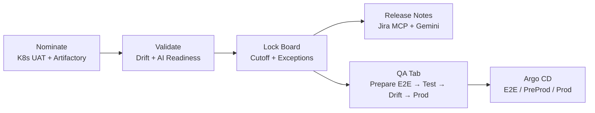

# Engineering Excellence Award Submission — Release Readiness Dashboard

> *An AI-assisted, single source of truth for "Are we ready to release?" — built on Google Distributed Cloud (GDC)*

---

## 1. Problem / Opportunity Description

### Background Context

Our platform runs **~30 microservices** on Google Distributed Cloud (GDC). We use trunk-based development and deploy to UAT continuously. Releases go out **every Friday** with a **Wednesday 2 PM EST cutoff**. In any given week, any subset of services (from 1 to 10+) may be released, along with non-Kubernetes components such as Spark/PySpark jobs. Only the developers who own a service know whether it is "ready", so release scope is a human decision that has to be gathered from many people every week.

### The Problem

Before this solution, release coordination was entirely manual and spread across disconnected tools:

| Step | How it was done | What went wrong |
|---|---|---|
| **Nominate** | Developers posted free-text messages in Teams (e.g. *"billing-service v2.3.1, helm 0.5.0"*) | Unstructured, versions typed by hand, messages buried in chat |
| **Collect** | Support/DevOps read the threads and built a spreadsheet | Slow and error-prone; time spent chasing developers for missing details |
| **Validate** | Release manager compared versions against the cluster by running `kubectl` by hand | No automated health or stability checks; inconsistent from person to person |
| **Document** | Someone wrote release notes and updated the Jira release ticket by hand | Duplicate effort, copy-paste errors, notes took hours |
| **Govern** | Late changes were approved over email or chat | No formal cutoff, no audit trail, "stealth" additions after cutoff |
| **Release** | DevOps deployed on Friday | Teams hoped nothing had been missed |

### Severity and Importance

- **Release risk:** The most common failure was **version drift**. A developer nominates `v2.3.3`, then a hotfix (`v2.3.5`) is deployed to UAT, and the nomination is now stale. What QA tested, what was nominated and what reaches production can all differ without anyone noticing.
- **Productivity cost:** Each cycle took about **3–4 hours of coordination effort** across the team: building the board (~30 min), checking drift (~45 min), writing summaries and release notes (~30 min to 2 hrs), triggering and collecting QA results (~40 min), repeated "are we ready?" check-ins (5+ per cycle) and audit look-ups (~20 min).
- **Dependence on experts:** Validating readiness required Kubernetes CLI skills and cluster access. Only a few senior engineers could do it, so they became a bottleneck every week.
- **Compliance and governance gap:** There was no reliable record of who nominated, changed or approved what, or when. Exceptions after the cutoff could not be traced.

**Example:** A service was nominated early in the week. A bug fix was later deployed to UAT, but the nomination was never updated. The mismatch was found only at release time, which forced a last-minute scramble to confirm which version had actually been tested. Version typos in Teams messages (e.g. `v2.3.1` vs `v2.3.11`) caused similar confusion.

### Why Existing Methods Could Not Solve It

| Existing option | Why it fell short |
|---|---|
| **Teams/Email + spreadsheets** | Static and manual. No connection to the live cluster, so versions are always "as typed", not "as deployed". |
| **Jira fix versions / release tickets** | Tracks *tickets*, not *deployed artifacts*. Jira does not know which image tag or Helm chart is running in UAT or Prod. |
| **Argo CD / GitHub Actions** | Shows the sync or deploy state of individual apps. Has no concept of *release intent* (nominations), cutoffs, exceptions or a cross-service readiness view. |
| **`kubectl` / cluster consoles** | Accurate, but needs expert skills and access. Gives no summary, history or governance. |
| **Commercial release-management tools** | Not designed for our on-prem GDC environment. They need extra licensing and do not cover our mix of K8s services *and* custom components (Spark, PySpark) or our internal Jira/Confluence setup. |

No single existing tool linked **release intent** (what developers nominate) with **deployed reality** (what is running in UAT/Prod), **quality evidence** (QA results, health) and **governance** (cutoff, exceptions, audit). The Release Readiness Dashboard closes that gap.

---

## 2. Engineering Excellence

### Core Capabilities — From Nomination to Production in One Place

The dashboard covers the **entire release lifecycle**: nominate → validate → document → test → promote to production.

**1. Version Nomination Directly from Source Systems (Kubernetes UAT + Artifactory)**
- **Kubernetes services:** The nomination dropdown lists services discovered from the **live UAT cluster**. The image tag and Helm chart version are **auto-filled from the Kubernetes API**, so nobody types a version.
- **Custom / non-K8s components** (Spark, PySpark jobs, etc.): Available versions are **fetched from Artifactory** through its REST API, so developers pick a published artifact version instead of typing one.
- Both kinds of nomination appear on **one unified release board**, with the nominator, linked Jira IDs, notes, version history and one-click rollback to an earlier nomination.

**2. AI Release Notes Generated via Jira MCP**
- Each release cycle gets a **Jira Fix Version** automatically, derived from the release date.
- The dashboard pulls every ticket tagged with that Fix Version through the **Jira MCP server**, with a REST fallback.
- Tickets are **mapped to nominated services automatically** using the Jira *component* field (case-, dash- and underscore-insensitive matching). Tickets that don't match any service are flagged.
- **Gemini** reads each ticket's summary, description, type and priority, then writes **consistent release notes**: an executive summary, a service table (image tag + Helm version + Jira tickets), changes grouped by type, an AI risk assessment, and post-cutoff exceptions called out.
- Notes are generated in **seconds** instead of hours and can be copied as Markdown into Teams or Confluence.

**3. QA Tab — Full, GitOps-Driven Release Execution**

The QA tab unlocks once the board is locked, and walks the release through to production in five guided steps:

| Step | What it does | Why it matters |
|---|---|---|
| **1. Prepare E2E** | Builds a complete `version.yaml` (nominated versions + current Prod versions for all other services) and pushes it to the `e2e` branch. Argo CD deploys it to the QA namespace. | A **complete, reproducible, production-like** test environment, with no hand-written version files |
| **2. QA Namespace Status** | Live view of the QA namespace through the K8s API: image tags, replicas, health | Confirms Argo CD synced correctly and catches crash loops or image-pull errors, without needing `kubectl` |
| **3. Test Pipelines** | One-click **Smoke / E2E / Regression** suites run as GitHub Actions workflows, with status and run links | Central, visible test execution recorded in the audit trail |
| **4. Drift Check** | Compares the current board against the `version.yaml` already deployed to E2E and flags **changed / new / removed** services | Guarantees **what was tested is exactly what ships** |
| **5. Prepare Prod / PreProd** | Requires a **Change Ticket** (e.g. `CHG0012345`), builds a `version.yaml` with **only the nominated services**, and pushes it to the `prod` and `preprod` branches together. Argo CD then syncs. | Enforces change management, deploys only what changed, and links every release to an ITSM ticket |

**4. Continuous Validation — Version Drift + AI Readiness**
- **Drift detection** compares nominated versions with live UAT and classifies each as 🟢 Match, 🟡 Drift or 🔴 Major Drift.
- **AI readiness scoring** (Gemini) gives each service a score from 0 to 100 based on pod health, restarts, OOMKills, CrashLoopBackOff, probes and resource configuration, and explains every flag.

**5. Release Governance**
- Board lifecycle **Open → Locked → Released**, with a configurable cutoff, an **exception nomination** workflow (reason + approver) and a full **audit trail**.
- **Release history** and JSON/YAML/CSV manifest exports for reporting and archiving.

### Architecture and Design Quality

- **Reads live data as the source of truth:** Versions come straight from the Kubernetes API (`containers[].image`, `helm.sh/chart` labels), not from user input, so version typos cannot happen.
- **Versions locked at nomination:** A nomination snapshots the UAT version as a deliberate commitment. Drift detection is the safety net, rather than silently auto-updating to untested builds.
- **Formal release lifecycle:** The board moves **Open → Locked → Released**. Cutoffs are enforced by configuration (`CUTOFF_DAY`, `CUTOFF_HOUR`, `RELEASE_CADENCE`). After cutoff, the only path is an **exception workflow** that requires a reason and an approver.
- **GitOps-first QA flow:** The QA tab builds a complete `version.yaml` (nominated versions plus current Prod versions for everything else) and pushes it to `e2e` / `preprod` / `prod` branches. **Argo CD** then syncs the clusters, so every environment change is versioned, reviewable and reversible.
- **Clean API surface:** **51 REST endpoints** covering board lifecycle, drift, AI, export, Jira, Confluence, deploy and QA. Each capability can be used independently by other tools and pipelines.

### Reliability and Resilience

- **Deterministic AI fallback:** Every Gemini feature (readiness scoring, release notes, chat) has a non-AI fallback. If the AI service is unavailable, the app still returns structured tables and basic health status. The app never fails because the AI is down.
- **Storage that adapts to its permissions:** At startup the app probes whether it can write ConfigMaps. If it can, it uses **ConfigMap (primary) + PVC file backup**. If RBAC does not allow it, it falls back to **file-only mode** with no code or config change.
- **Integration fallbacks:** Jira and Confluence connect via **MCP servers**, with a raw HTTP JSON-RPC / REST fallback. This keeps the app working where the `fastmcp`/`httpx` libraries conflict with the gevent runtime (a deliberate, documented trade-off in `requirements.txt`).
- **Async long-running jobs:** AI release notes run as background jobs with polling (`/api/ai/release_notes/<job_id>`), so the UI stays responsive.
- **Built-in diagnostics:** Endpoints such as `/api/k8s-diag`, `/api/network-diag` and `/api/confluence-mcp-health` speed up troubleshooting in restricted networks.

### Security

- **Least-privilege RBAC:** Read-only access to workloads, scoped to a single namespace. Write access is limited to ConfigMaps used for board persistence.
- **Authenticated actions:** GitHub OAuth (with PAT fallback, GitHub Enterprise supported). Deploys from the dashboard are **locked to UAT** to prevent accidental production changes.
- **Removing static credentials:** A Workload Identity Federation (Azure AD → GCP STS → SA impersonation) design replaces long-lived service-account JSON keys for Vertex AI access.
- **Zero-trust networking:** An Istio service mesh design with mTLS and authorization policies (Helm chart `service-mesh-chart/`) protects service-to-service traffic.
- **Full audit trail:** Every nomination, re-nomination, rollback, removal, lock/unlock, exception, deploy and release completion is recorded with who, what and when.

### Scalability

- **Stateless app tier:** Gunicorn + gevent workers run in a containerized Kubernetes Deployment. Board state lives in Kubernetes-native storage, with **no external database to provision or maintain**.
- **Scales with organization size:** Handles any number of services, namespaces and release cycles. Each cycle has its own board, and history is archived for trend analysis.
- **Portable:** Uses only standard Kubernetes APIs, so it runs on GDC, GKE, Anthos, EKS, AKS or any conformant cluster.

### Extensibility

- **Pluggable, optional integrations:** GitHub, Jira, Confluence, Artifactory and the Prod cluster are each enabled by environment variables. The minimum setup (board, audit, export, history) runs with **zero integrations** in about 5 minutes.
- **Artifact-agnostic nominations:** Supports both **K8s services** (auto-discovered) and **custom components** (Spark, PySpark, etc., with versions from Artifactory or manual entry).
- **Open data formats:** CSV (Excel-safe for long image tags), JSON and YAML manifest exports allow downstream automation.
- **Clear roadmap hooks:** The API is designed for CI-driven auto-nomination, test-result webhooks, composite readiness scores and release gates (see `ENHANCEMENT-IDEAS.md`).

### Quality and Maintainability

- **Automated tests:** 47 automated tests across end-to-end flows, Jira MCP, Confluence MCP and Kubernetes auth (`test_e2e.py`, `test_jira_mcp.py`, `test_confluence_mcp.py`, `test_k8s_auth.py`).
- **Mock mode:** `mock_app.py` and `_demo_data/` allow demos, UI development and testing without cluster access.
- **Thorough documentation:** 15+ design and operations documents covering architecture, QA automation, MCP designs, WIF, service mesh, SMTP testing, a demo guide and a walkthrough.

### Reuse — Leveraged and Created

**Reused from existing assets:**
- Gemini function-calling and AI-diagnosis patterns from the **GDC KubeInsight** platform (chat agent tools, health analysis, config/security insights).
- Existing org infrastructure: Argo CD, GitHub Actions, Jira, Confluence and Artifactory. **No changes were required to existing CI/CD pipelines.**

**Reusable components created:**

| Component | Reuse potential |
|---|---|
| **Jira MCP & Confluence MCP clients** (with REST fallback) | Any internal tool or AI agent that needs Jira/Confluence context |
| **K8s live-version discovery + drift engine** | Environment comparison (Dev ↔ UAT ↔ Prod), compliance audits, CMDB sync |
| **Adaptive storage layer** (ConfigMap + file fallback) | Any lightweight K8s app that needs persistence without a database |
| **AI-with-deterministic-fallback pattern** | Standard pattern for any GenAI feature that must be production-safe |
| **WIF auth module for Vertex AI** | Any workload calling Vertex AI without static keys |
| **GitOps `version.yaml` promotion flow** | Standard environment promotion for other product teams |
| **Istio security Helm chart** | Drop-in mTLS/authorization baseline for other namespaces |
| **The whole dashboard** | Other teams with a weekly/bi-weekly release cadence can adopt it via environment-variable config |

---

## 3. Outcome / Benefits

### Benefits Realized

| Activity | Before (manual) | After (dashboard) | Time saved |
|---|---|---|---|
| Build the release board | ~30 min | ~5 min (nominate from live cluster) | **~25 min** |
| Check version drift | ~45 min | ~0 min (automated) | **~45 min** |
| Generate release summary / notes | ~30 min – 2 hrs | ~10–30 sec (export / AI notes) | **~30 min – 2 hrs** |
| Map Jira tickets to services for notes | ~30–60 min (manual Jira search) | ~0 min (Fix Version via Jira MCP) | **~30–60 min** |
| Prepare E2E / Prod `version.yaml` files | ~30–45 min (hand-edited, error-prone) | ~1 min (generated + pushed via GitOps) | **~30–45 min** |
| Trigger QA tests + gather results | ~40 min | ~1 min (one-click) | **~39 min** |
| Answer "are we ready?" (5+ times/cycle) | ~25–50 min | ~0 min (always visible) | **~25–50 min** |
| Audit / compliance look-up | ~20 min | ~2 min (audit trail) | **~18 min** |
| **Total per release** | **~4–6 hours** | **~20 minutes** | **~4+ hours** |

> 📊 With weekly releases, that is **16+ hours saved per month** (~200 hours per year) of coordination effort, freed up for feature work.

**Qualitative outcomes:**
- **Version typos eliminated:** K8s versions are read from the UAT cluster and custom-component versions from Artifactory. Nothing is typed by hand.
- **Stale nominations caught before release:** Drift detection flags mismatches between nominated and deployed versions.
- **What was tested is what ships:** The QA tab's E2E drift check plus GitOps promotion guarantee that production receives exactly the versions QA validated.
- **End-to-end release from one screen:** Nominate → test → promote to PreProd/Prod with a mandatory change ticket, all from the dashboard and all deployed by Argo CD.
- **Fewer expert-only tasks:** AI readiness scoring replaces ~30 min of manual `kubectl` checks per service. Developers, QA and managers can assess readiness without cluster expertise.
- **Governance:** Formal cutoff, exception workflow with approver, change-ticket enforcement for production and a complete audit trail. Release decisions are traceable and audit-ready.
- **One source of truth:** Dev, QA, DevOps, tech leads and management all see the same real-time view. Fewer Teams polls, spreadsheets and status meetings.
- **Consistent, richer release notes:** Jira Fix Version tickets are pulled via MCP and mapped to services automatically, and Gemini writes the notes in the same format every time.
- **Safer deployments:** GitOps-driven environment changes, UAT-locked deploy triggers and full traceability.

### Benefits to Be Realized

- **Org-wide adoption:** Other teams can use the dashboard as-is, so the time savings multiply. For example, 5 teams × 12 hrs/month ≈ **60+ hours/month**.
- **Quality gates:** QA sign-off, test-result integration and composite readiness scores enable automated go/no-go decisions.
- **Automated communications:** Post-cutoff reports and drift alerts sent to Teams, email, Jira and Confluence.
- **Fewer release incidents and rollbacks:** Achieved through pre-release AI risk assessment, change-impact analysis and post-release health monitoring with rollback recommendations.
- **Release analytics:** Release history enables trend reporting (release size, cadence, at-risk services, rollback rate) for engineering leadership.
- **Security posture:** Rolling out WIF (no static keys) and Istio mTLS improves the security baseline for this and other workloads.

### Potential for Reuse (Summary)

The Release Readiness Dashboard is **configuration-driven, database-free and uses only standard Kubernetes APIs**. Any team on Kubernetes can adopt it with environment variables alone. Its building blocks can also be reused independently by other internal tools and AI agents: MCP clients, drift engine, adaptive storage, the AI-with-fallback pattern, WIF auth, GitOps promotion and the service mesh chart. This makes the project both a **product** and a **reusable engineering toolkit** for the organization.

---

*Figures are based on measured and estimated effort per weekly release cycle. Update with actual adoption metrics (teams onboarded, releases run, incidents avoided) before final submission.*
