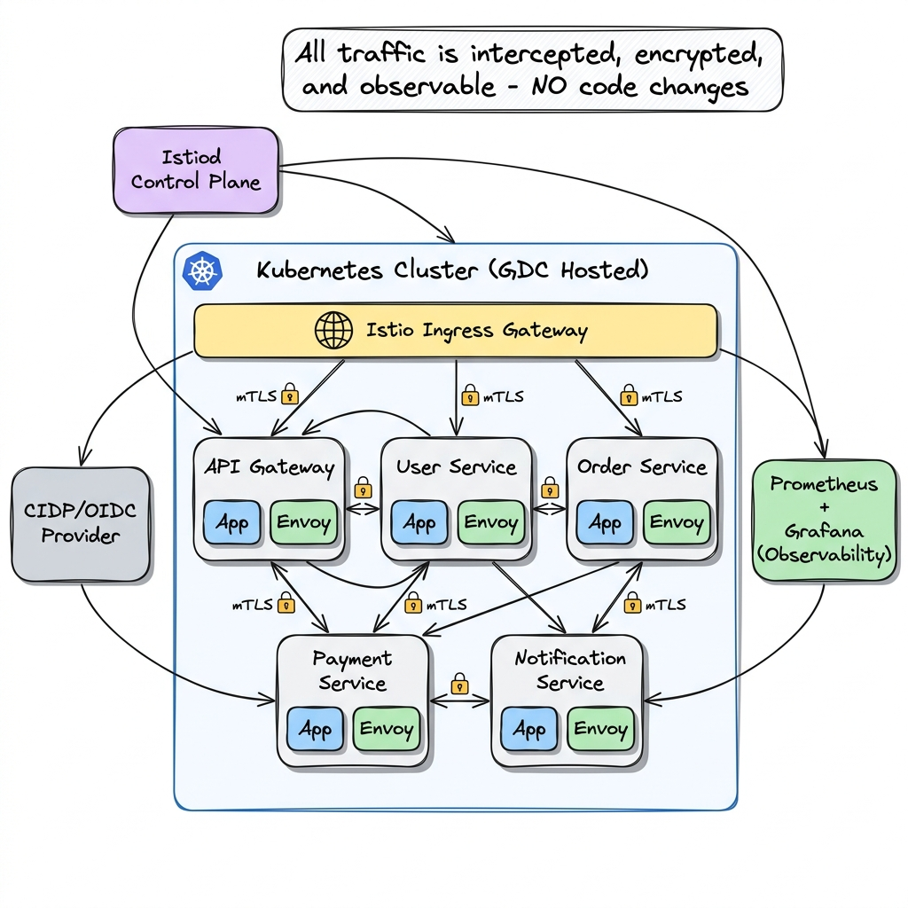
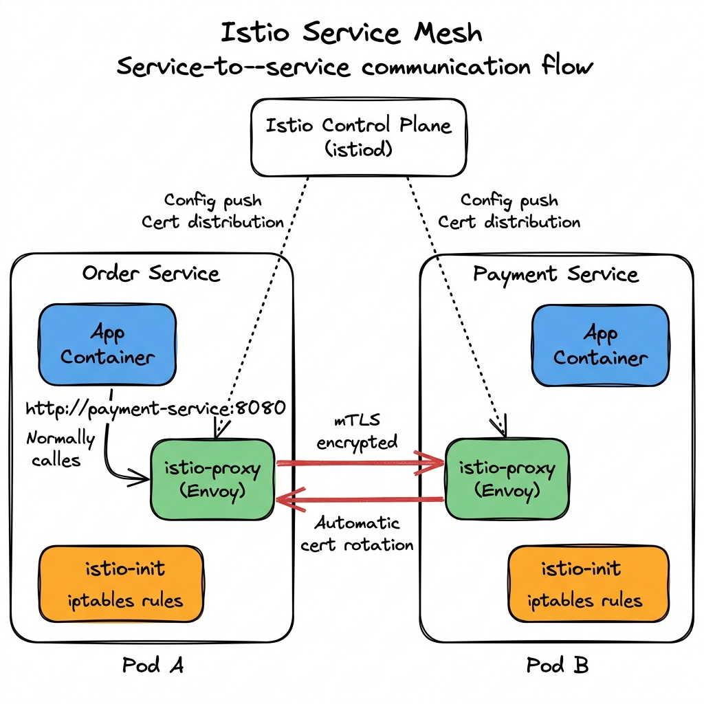
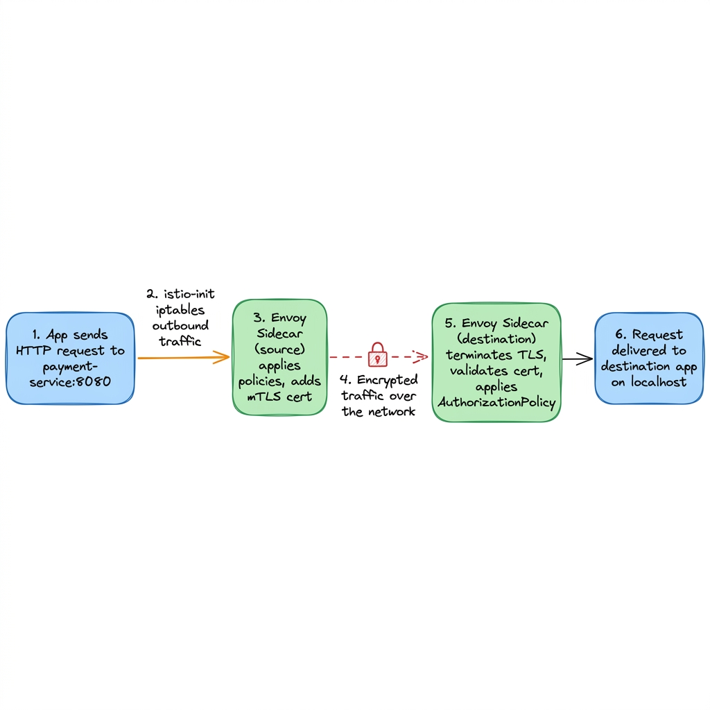
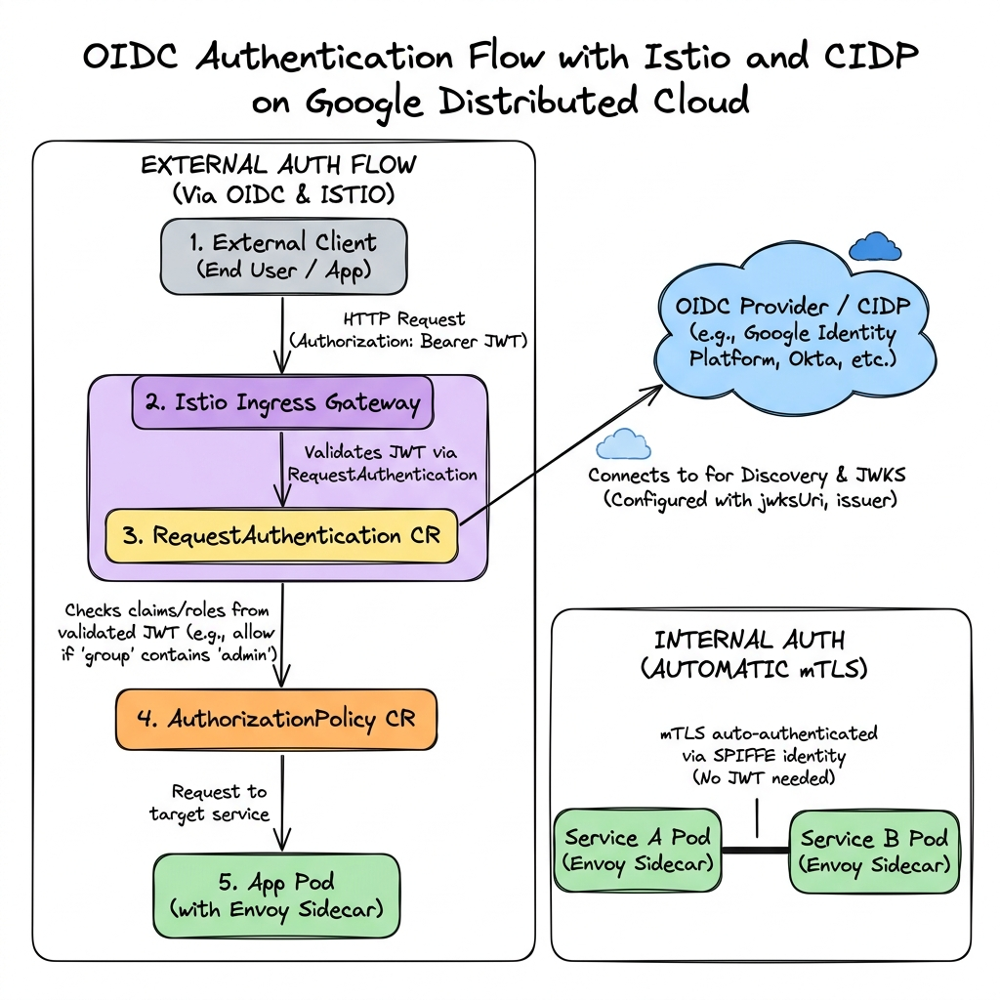
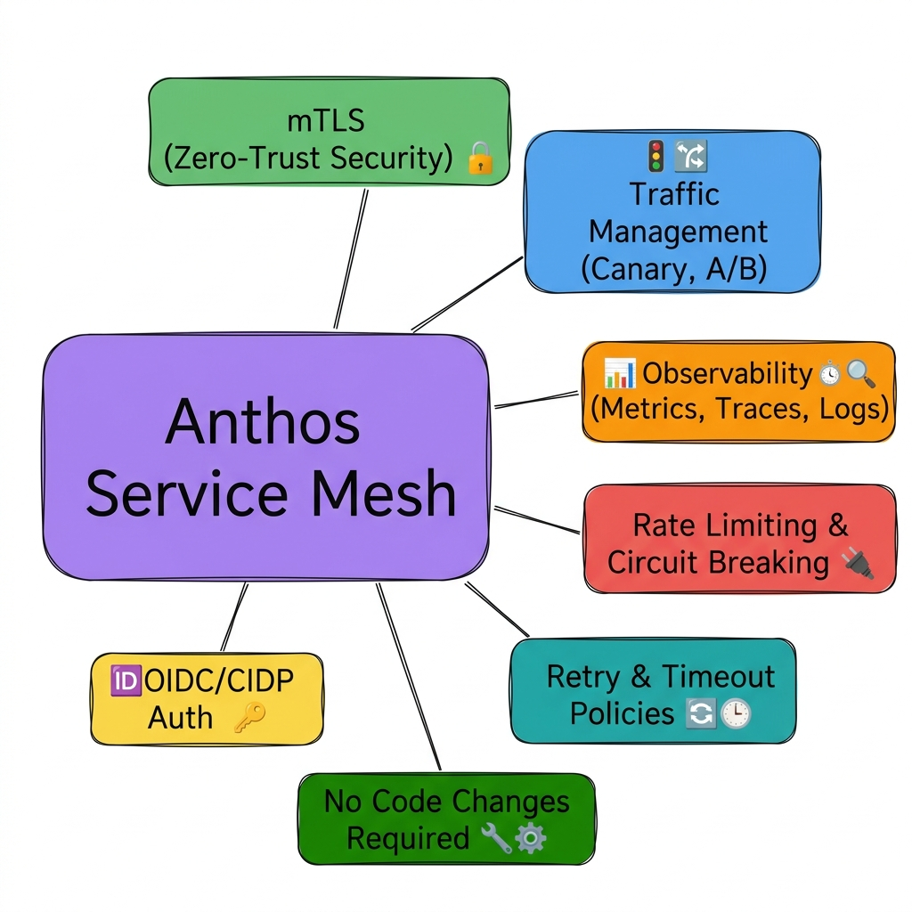

# Istio Service Mesh on Google Distributed Cloud
## A Developer's Guide to Service-to-Service Communication with Anthos Service Mesh

---

## 1. Overview: What is Anthos Service Mesh?

Anthos Service Mesh (ASM) is Google's managed implementation of **Istio** on Google Distributed Cloud (GDC). It provides a **transparent infrastructure layer** that handles service-to-service communication without requiring any changes to your application code.

### Your Current Setup

| Component | Status |
|-----------|--------|
| Google Distributed Cloud | ✅ Deployed |
| Anthos Service Mesh | ✅ Enabled |
| Sidecar Injection | ✅ `istio-proxy` + `istio-init` per pod |
| CIDP (Cloud Identity) | ✅ Enabled |
| Auth Label | ✅ `auth-type: oidc` |
| Application Language | Python microservices |

---

## 2. Architecture Overview



Every pod in your mesh has **3 containers**:

| Container | Purpose | Lifecycle |
|-----------|---------|-----------|
| **Your App** | Your Python microservice (Flask, FastAPI, etc.) | Runs continuously |
| **istio-proxy** (Envoy) | Sidecar proxy — intercepts ALL inbound/outbound traffic | Runs continuously alongside your app |
| **istio-init** | Init container — sets up `iptables` rules to redirect traffic to Envoy | Runs once at pod startup, then exits |

---

## 3. How Service-to-Service Communication Works



### The Key Insight: Your App Doesn't Know the Mesh Exists

When your **Order Service** calls the **Payment Service**, your Python code simply does:

```python
import requests

# Your app just makes a normal HTTP call — nothing special
response = requests.get("http://payment-service:8080/api/process")
```

Your app sends a **plain HTTP** request to a Kubernetes service name. It has **no idea** that:
- The request is being intercepted by Envoy
- mTLS certificates are being attached
- The traffic is encrypted on the wire
- Authorization policies are being evaluated
- Metrics and traces are being collected

---

## 4. The 6-Step Request Flow (What Actually Happens)



Here's what happens step-by-step when Service A calls Service B:

### Step 1: App Makes a Normal HTTP Request
```python
# In order-service (Python)
response = requests.post("http://payment-service:8080/api/charge", json={"amount": 99.99})
```
Your app sends a plain HTTP request to `payment-service:8080`. It uses standard Kubernetes DNS resolution.

### Step 2: istio-init iptables Rules Intercept the Traffic
The `istio-init` container (which ran at pod startup) configured `iptables` rules that redirect **all outbound TCP traffic** to the Envoy sidecar's port (15001). Your app's outbound request never goes directly to the network.

```bash
# What istio-init configured (you don't need to do this — it's automatic):
iptables -t nat -A OUTPUT -p tcp -j REDIRECT --to-ports 15001
```

### Step 3: Source Envoy Processes the Request
The Envoy sidecar in the **source pod** (Order Service):
- Looks up the destination service in its service registry
- Selects a healthy backend pod (load balancing)
- Applies any configured policies (retries, timeouts, circuit breaking)
- Attaches the **mTLS client certificate** (issued by istiod)
- Encrypts the request using TLS 1.3

### Step 4: Encrypted Traffic Over the Network
The request travels over the pod network as **fully encrypted mTLS traffic**. Even if someone captures packets on the network, they see only encrypted data. The identity is embedded in the SPIFFE certificate:
```
spiffe://cluster.local/ns/uat/sa/order-service
```

### Step 5: Destination Envoy Receives and Validates
The Envoy sidecar in the **destination pod** (Payment Service):
- Terminates the TLS connection
- Validates the source identity certificate
- Checks **AuthorizationPolicy** rules (is Order Service allowed to call Payment Service?)
- Checks **RequestAuthentication** if configured
- Records metrics (latency, status code, request size)

### Step 6: Request Delivered to the App
The destination Envoy forwards the decrypted request to your Payment Service app on `localhost:8080`. Your app receives a **plain HTTP request** — it never sees the mTLS certificates.

```python
# In payment-service (Python) — receives a normal request
@app.route('/api/charge', methods=['POST'])
def charge():
    data = request.json
    # Process payment — no mesh-related code needed
    return jsonify({"status": "charged", "amount": data["amount"]})
```

---

## 5. OIDC / CIDP Authentication Flow



Your mesh has two distinct authentication flows:

### External Authentication (OIDC + CIDP)
For traffic **entering the mesh** from external clients:

1. Client sends request with `Authorization: Bearer <JWT>` header
2. **Istio Ingress Gateway** receives the request
3. **RequestAuthentication** CR validates the JWT against your OIDC/CIDP provider's JWKS endpoint
4. **AuthorizationPolicy** checks claims from the validated JWT (roles, groups, scopes)
5. If valid, request reaches your app pod

```yaml
# Example: RequestAuthentication for CIDP
apiVersion: security.istio.io/v1
kind: RequestAuthentication
metadata:
  name: cidp-auth
  namespace: uat
spec:
  selector:
    matchLabels:
      auth-type: oidc
  jwtRules:
  - issuer: "https://accounts.google.com"
    jwksUri: "https://www.googleapis.com/oauth2/v3/certs"
    forwardOriginalToken: true
```

### Internal Authentication (Automatic mTLS)
For traffic **between services inside the mesh**:

- **No JWT needed** — services authenticate each other via mTLS certificates
- Identity is derived from the Kubernetes ServiceAccount
- Certificate format: `spiffe://cluster.local/ns/{namespace}/sa/{service-account}`
- **Completely automatic** — zero code changes

> [!IMPORTANT]
> **For service-to-service calls within the mesh, your Python code does NOT need to handle any authentication.** The Envoy sidecars handle mTLS automatically. Your app just makes plain HTTP calls.

---

## 6. Do Developers Need to Change Application Code?

### Short Answer: NO for Core Mesh Features ✅

| Feature | Code Changes? | Details |
|---------|:---:|---------|
| mTLS encryption | ❌ None | Automatic via sidecar |
| Service discovery | ❌ None | Use K8s service names as before |
| Load balancing | ❌ None | Envoy handles it |
| Circuit breaking | ❌ None | Configured via `DestinationRule` CR |
| Retries & timeouts | ❌ None | Configured via `VirtualService` CR |
| Rate limiting | ❌ None | Configured via `EnvoyFilter` CR |
| Authorization | ❌ None | Configured via `AuthorizationPolicy` CR |
| Metrics collection | ❌ None | Envoy reports to Prometheus automatically |

### Optional: Trace Header Propagation ⚡

The **one thing** developers can optionally do is **propagate trace headers** for distributed tracing. Envoy generates trace headers, but they must be forwarded by your app to correlate traces across services.

```python
# OPTIONAL: Propagate tracing headers for distributed tracing
TRACE_HEADERS = [
    'x-request-id',
    'x-b3-traceid',
    'x-b3-spanid',
    'x-b3-parentspanid',
    'x-b3-sampled',
    'x-b3-flags',
    'x-ot-span-context',
    'traceparent',
    'tracestate',
]

@app.route('/api/orders', methods=['POST'])
def create_order():
    # Forward trace headers when calling another service
    headers = {h: request.headers.get(h) for h in TRACE_HEADERS if request.headers.get(h)}
    
    # Call payment service with propagated trace headers
    response = requests.post(
        "http://payment-service:8080/api/charge",
        json={"amount": 99.99},
        headers=headers  # ← This enables end-to-end tracing
    )
    return jsonify({"order_id": "ORD-001", "payment": response.json()})
```

> [!TIP]
> **This is optional but highly recommended.** Without header propagation, you'll see individual service traces but can't correlate them into an end-to-end request trace in Jaeger/Kiali.

### Python Helper: Trace Header Middleware

For Flask apps, you can create a simple middleware:

```python
from flask import Flask, request, g
import requests as req_lib

app = Flask(__name__)

TRACE_HEADERS = [
    'x-request-id', 'x-b3-traceid', 'x-b3-spanid',
    'x-b3-parentspanid', 'x-b3-sampled', 'x-b3-flags',
    'traceparent', 'tracestate',
]

@app.before_request
def capture_trace_headers():
    """Capture incoming trace headers for propagation."""
    g.trace_headers = {h: request.headers.get(h) for h in TRACE_HEADERS if request.headers.get(h)}

def mesh_call(method, url, **kwargs):
    """Make an HTTP call with automatic trace header propagation."""
    headers = kwargs.pop('headers', {})
    headers.update(getattr(g, 'trace_headers', {}))
    return req_lib.request(method, url, headers=headers, **kwargs)

# Usage:
@app.route('/api/process')
def process():
    # Automatically propagates trace headers
    result = mesh_call('GET', 'http://user-service:8080/api/profile')
    return jsonify(result.json())
```

---

## 7. Advantages for Development Teams



### 🔒 Security — Zero-Trust by Default

| What You Get | Without Mesh | With Mesh |
|-------------|-------------|-----------|
| Encryption | You implement TLS in every service | ✅ Automatic mTLS everywhere |
| Identity | You manage API keys/tokens | ✅ SPIFFE identity per service |
| Authorization | You code auth checks in every service | ✅ Declarative `AuthorizationPolicy` |
| Cert management | You rotate certs manually | ✅ Auto-rotation every 24h |

**Example: Restrict which services can call your payment service:**

```yaml
apiVersion: security.istio.io/v1
kind: AuthorizationPolicy
metadata:
  name: payment-service-policy
  namespace: uat
spec:
  selector:
    matchLabels:
      app: payment-service
  action: ALLOW
  rules:
  - from:
    - source:
        principals:
        - "cluster.local/ns/uat/sa/order-service"
        - "cluster.local/ns/uat/sa/api-gateway"
    to:
    - operation:
        methods: ["POST"]
        paths: ["/api/charge", "/api/refund"]
```

### 🚦 Traffic Management — Canary & A/B Deployments

Deploy new versions gradually without code changes:

```yaml
# Send 90% of traffic to v1, 10% to v2 (canary)
apiVersion: networking.istio.io/v1
kind: VirtualService
metadata:
  name: payment-service
  namespace: uat
spec:
  hosts:
  - payment-service
  http:
  - route:
    - destination:
        host: payment-service
        subset: v1
      weight: 90
    - destination:
        host: payment-service
        subset: v2
      weight: 10
---
apiVersion: networking.istio.io/v1
kind: DestinationRule
metadata:
  name: payment-service
  namespace: uat
spec:
  host: payment-service
  subsets:
  - name: v1
    labels:
      version: v1
  - name: v2
    labels:
      version: v2
```

### ⚡ Resilience — Retries, Timeouts, Circuit Breaking

```yaml
# Automatic retries and timeouts
apiVersion: networking.istio.io/v1
kind: VirtualService
metadata:
  name: payment-service
  namespace: uat
spec:
  hosts:
  - payment-service
  http:
  - timeout: 10s
    retries:
      attempts: 3
      perTryTimeout: 3s
      retryOn: "5xx,reset,connect-failure"
    route:
    - destination:
        host: payment-service
---
# Circuit breaking
apiVersion: networking.istio.io/v1
kind: DestinationRule
metadata:
  name: payment-service
  namespace: uat
spec:
  host: payment-service
  trafficPolicy:
    connectionPool:
      tcp:
        maxConnections: 100
      http:
        h2UpgradePolicy: DEFAULT
        http1MaxPendingRequests: 100
        http2MaxRequests: 1000
    outlierDetection:
      consecutive5xxErrors: 5
      interval: 30s
      baseEjectionTime: 60s
      maxEjectionPercent: 50
```

### 📊 Observability — Metrics, Traces, and Logs (Free)

Without writing a single line of telemetry code, you get:

| Metric | Automatically Captured |
|--------|----------------------|
| Request rate (RPS) | ✅ Per service, per endpoint |
| Latency (P50, P95, P99) | ✅ Per service pair |
| Error rate (4xx, 5xx) | ✅ Per service, per endpoint |
| Connection count | ✅ TCP level |
| Request size / Response size | ✅ Per request |

Access via:
- **Kiali** → Service topology visualization
- **Grafana** → Pre-built Istio dashboards
- **Jaeger** → Distributed tracing (needs header propagation)
- **Prometheus** → Raw metrics queries

---

## 8. Enforcing mTLS Across the Namespace

To ensure ALL communication in your namespace is encrypted:

```yaml
# Enforce STRICT mTLS — reject any plain-text traffic
apiVersion: security.istio.io/v1
kind: PeerAuthentication
metadata:
  name: default
  namespace: uat
spec:
  mtls:
    mode: STRICT
```

Modes:

| Mode | Behavior |
|------|----------|
| `STRICT` | Only accept mTLS connections (recommended for production) |
| `PERMISSIVE` | Accept both mTLS and plain text (useful during migration) |
| `DISABLE` | Disable mTLS (not recommended) |

---

## 9. Common Scenarios for Your Dev Team

### Scenario 1: "I need to call another microservice"

**Answer:** Just call it. No changes needed.

```python
# This is ALL you need. The mesh handles everything else.
response = requests.get("http://user-service:8080/api/users/123")
```

### Scenario 2: "I need to restrict who can call my service"

**Answer:** Apply an `AuthorizationPolicy`. No code changes.

### Scenario 3: "I want to deploy a new version gradually"

**Answer:** Apply a `VirtualService` + `DestinationRule` for canary routing. No code changes.

### Scenario 4: "My downstream service is flaky"

**Answer:** Add retry/timeout/circuit-breaking via `VirtualService` + `DestinationRule`. No code changes.

### Scenario 5: "I need to see which services call my service"

**Answer:** Open Kiali dashboard — the service graph shows all traffic flows in real time.

### Scenario 6: "I need to debug a slow request across 5 services"

**Answer:** Add trace header propagation (the one optional code change), then use Jaeger to trace the full request path.

---

## 10. What NOT to Do (Anti-patterns)

| ❌ Don't Do This | ✅ Do This Instead |
|-----------------|-------------------|
| Implement TLS in your Python code | Let the mesh handle it via mTLS |
| Add auth middleware for internal service calls | Use `AuthorizationPolicy` CR |
| Build retry logic in every service | Configure retries in `VirtualService` |
| Add rate limiting code | Use `DestinationRule` or `EnvoyFilter` |
| Run your own Prometheus exporter for HTTP metrics | The mesh already exports them |
| Use IP-based access control | Use SPIFFE identity-based `AuthorizationPolicy` |

---

## 11. Quick Reference: Key Istio CRDs

| CRD | Purpose | Example Use |
|-----|---------|-------------|
| `PeerAuthentication` | Configure mTLS mode | Enforce STRICT mTLS |
| `RequestAuthentication` | Validate JWTs from external clients | OIDC/CIDP integration |
| `AuthorizationPolicy` | Control who can call what | Allow only Order Service → Payment Service |
| `VirtualService` | Route traffic, retries, timeouts | Canary deployments, A/B testing |
| `DestinationRule` | Circuit breaking, load balancing, subsets | Connection pooling, outlier detection |
| `Gateway` | Configure ingress/egress | Expose services externally |
| `ServiceEntry` | Register external services in the mesh | Call external APIs through the mesh |
| `EnvoyFilter` | Advanced Envoy configuration | Custom rate limiting, header manipulation |

---

## 12. Summary

> [!IMPORTANT]
> **The #1 takeaway for your development team:** The service mesh is an infrastructure concern, not an application concern. Developers should continue writing normal Python HTTP services. The mesh handles security, reliability, and observability transparently.

### What the Mesh Gives You for Free (No Code Changes):
- ✅ Encrypted service-to-service communication (mTLS)
- ✅ Automatic identity and certificate management
- ✅ Request-level metrics and monitoring
- ✅ Traffic control (canary, A/B, blue/green)
- ✅ Resilience patterns (retries, timeouts, circuit breaking)
- ✅ Access control policies (who can call what)

### The One Optional Enhancement:
- ⚡ Propagate trace headers for end-to-end distributed tracing

---

*Document prepared for internal distribution to development teams working with Istio/Anthos Service Mesh on GDC.*
