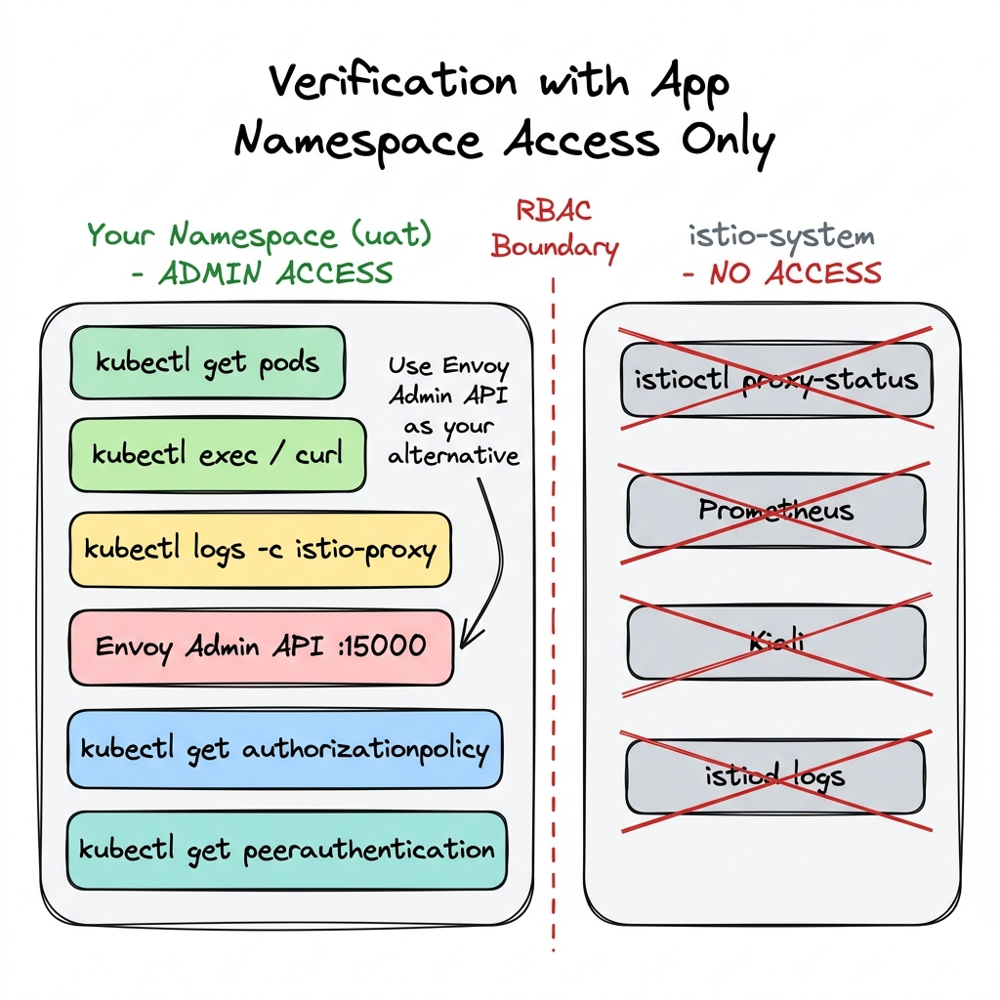
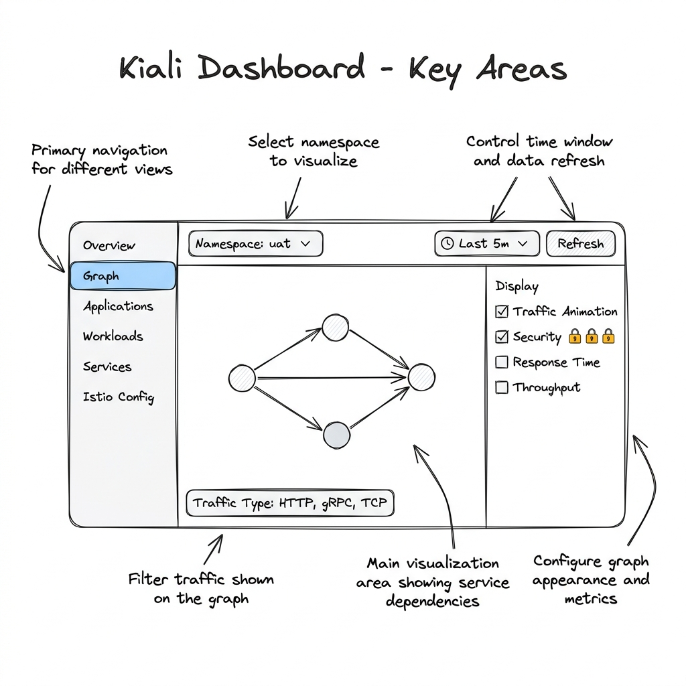
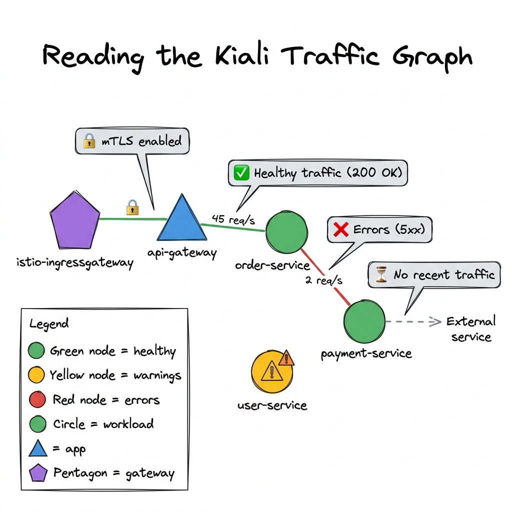
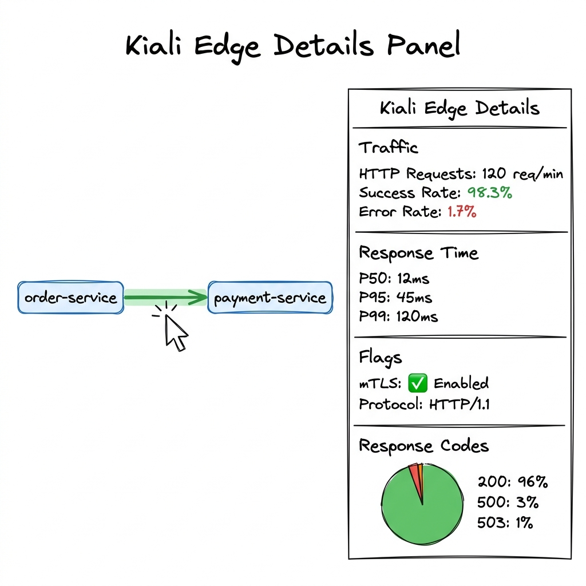

# Istio Service Mesh on Google Distributed Cloud
## A Developer's Guide to Service-to-Service Communication with Anthos Service Mesh

---

## 1. Overview: What is Anthos Service Mesh?

Anthos Service Mesh (ASM) is Google's managed implementation of **Istio** on Google Distributed Cloud (GDC). It provides a **transparent infrastructure layer** that handles service-to-service communication without requiring any changes to your application code.

### Your Current Setup

| Component | Status |
|-----------|--------|
| Google Distributed Cloud | ✅ Deployed |
| Anthos Service Mesh | ✅ Enabled |
| Sidecar Injection | ✅ `istio-proxy` + `istio-init` per pod |
| CIDP (Cloud Identity) | ✅ Enabled |
| Auth Label | ✅ `auth-type: oidc` |
| Application Language | Python microservices |

---

## 2. Architecture Overview


Every pod in your mesh has **3 containers**:

| Container | Purpose | Lifecycle |
|-----------|---------|-----------|
| **Your App** | Your Python microservice (Flask, FastAPI, etc.) | Runs continuously |
| **istio-proxy** (Envoy) | Sidecar proxy — intercepts ALL inbound/outbound traffic | Runs continuously alongside your app |
| **istio-init** | Init container — sets up `iptables` rules to redirect traffic to Envoy | Runs once at pod startup, then exits |

---

## 3. How Service-to-Service Communication Works


### The Key Insight: Your App Doesn't Know the Mesh Exists

When your **Order Service** calls the **Payment Service**, your Python code simply does:

```python
import requests

# Your app just makes a normal HTTP call — nothing special
response = requests.get("http://payment-service:8080/api/process")
```

Your app sends a **plain HTTP** request to a Kubernetes service name. It has **no idea** that:
- The request is being intercepted by Envoy
- mTLS certificates are being attached
- The traffic is encrypted on the wire
- Authorization policies are being evaluated
- Metrics and traces are being collected

---

## 4. The 6-Step Request Flow (What Actually Happens)


Here's what happens step-by-step when Service A calls Service B:

### Step 1: App Makes a Normal HTTP Request
```python
# In order-service (Python)
response = requests.post("http://payment-service:8080/api/charge", json={"amount": 99.99})
```
Your app sends a plain HTTP request to `payment-service:8080`. It uses standard Kubernetes DNS resolution.

### Step 2: istio-init iptables Rules Intercept the Traffic
The `istio-init` container (which ran at pod startup) configured `iptables` rules that redirect **all outbound TCP traffic** to the Envoy sidecar's port (15001). Your app's outbound request never goes directly to the network.

```bash
# What istio-init configured (you don't need to do this — it's automatic):
iptables -t nat -A OUTPUT -p tcp -j REDIRECT --to-ports 15001
```

### Step 3: Source Envoy Processes the Request
The Envoy sidecar in the **source pod** (Order Service):
- Looks up the destination service in its service registry
- Selects a healthy backend pod (load balancing)
- Applies any configured policies (retries, timeouts, circuit breaking)
- Attaches the **mTLS client certificate** (issued by istiod)
- Encrypts the request using TLS 1.3

### Step 4: Encrypted Traffic Over the Network
The request travels over the pod network as **fully encrypted mTLS traffic**. Even if someone captures packets on the network, they see only encrypted data. The identity is embedded in the SPIFFE certificate:
```
spiffe://cluster.local/ns/uat/sa/order-service
```

### Step 5: Destination Envoy Receives and Validates
The Envoy sidecar in the **destination pod** (Payment Service):
- Terminates the TLS connection
- Validates the source identity certificate
- Checks **AuthorizationPolicy** rules (is Order Service allowed to call Payment Service?)
- Checks **RequestAuthentication** if configured
- Records metrics (latency, status code, request size)

### Step 6: Request Delivered to the App
The destination Envoy forwards the decrypted request to your Payment Service app on `localhost:8080`. Your app receives a **plain HTTP request** — it never sees the mTLS certificates.

```python
# In payment-service (Python) — receives a normal request
@app.route('/api/charge', methods=['POST'])
def charge():
    data = request.json
    # Process payment — no mesh-related code needed
    return jsonify({"status": "charged", "amount": data["amount"]})
```

---

## 5. OIDC / CIDP Authentication Flow


Your mesh has two distinct authentication flows:

### External Authentication (OIDC + CIDP)
For traffic **entering the mesh** from external clients:

1. Client sends request with `Authorization: Bearer <JWT>` header
2. **Istio Ingress Gateway** receives the request
3. **RequestAuthentication** CR validates the JWT against your OIDC/CIDP provider's JWKS endpoint
4. **AuthorizationPolicy** checks claims from the validated JWT (roles, groups, scopes)
5. If valid, request reaches your app pod

```yaml
# Example: RequestAuthentication for CIDP
apiVersion: security.istio.io/v1
kind: RequestAuthentication
metadata:
  name: cidp-auth
  namespace: uat
spec:
  selector:
    matchLabels:
      auth-type: oidc
  jwtRules:
  - issuer: "https://accounts.google.com"
    jwksUri: "https://www.googleapis.com/oauth2/v3/certs"
    forwardOriginalToken: true
```

### Internal Authentication (Automatic mTLS)
For traffic **between services inside the mesh**:

- **No JWT needed** — services authenticate each other via mTLS certificates
- Identity is derived from the Kubernetes ServiceAccount
- Certificate format: `spiffe://cluster.local/ns/{namespace}/sa/{service-account}`
- **Completely automatic** — zero code changes

> [!IMPORTANT]
> **For service-to-service calls within the mesh, your Python code does NOT need to handle any authentication.** The Envoy sidecars handle mTLS automatically. Your app just makes plain HTTP calls.

---

## 6. Do Developers Need to Change Application Code?

### Short Answer: NO for Core Mesh Features ✅

| Feature | Code Changes? | Details |
|---------|:---:|---------|
| mTLS encryption | ❌ None | Automatic via sidecar |
| Service discovery | ❌ None | Use K8s service names as before |
| Load balancing | ❌ None | Envoy handles it |
| Circuit breaking | ❌ None | Configured via `DestinationRule` CR |
| Retries & timeouts | ❌ None | Configured via `VirtualService` CR |
| Rate limiting | ❌ None | Configured via `EnvoyFilter` CR |
| Authorization | ❌ None | Configured via `AuthorizationPolicy` CR |
| Metrics collection | ❌ None | Envoy reports to Prometheus automatically |

### Optional: Trace Header Propagation ⚡

The **one thing** developers can optionally do is **propagate trace headers** for distributed tracing. Envoy generates trace headers, but they must be forwarded by your app to correlate traces across services.

```python
# OPTIONAL: Propagate tracing headers for distributed tracing
TRACE_HEADERS = [
    'x-request-id',
    'x-b3-traceid',
    'x-b3-spanid',
    'x-b3-parentspanid',
    'x-b3-sampled',
    'x-b3-flags',
    'x-ot-span-context',
    'traceparent',
    'tracestate',
]

@app.route('/api/orders', methods=['POST'])
def create_order():
    # Forward trace headers when calling another service
    headers = {h: request.headers.get(h) for h in TRACE_HEADERS if request.headers.get(h)}
    
    # Call payment service with propagated trace headers
    response = requests.post(
        "http://payment-service:8080/api/charge",
        json={"amount": 99.99},
        headers=headers  # ← This enables end-to-end tracing
    )
    return jsonify({"order_id": "ORD-001", "payment": response.json()})
```

> [!TIP]
> **This is optional but highly recommended.** Without header propagation, you'll see individual service traces but can't correlate them into an end-to-end request trace in Jaeger/Kiali.

### Python Helper: Trace Header Middleware

For Flask apps, you can create a simple middleware:

```python
from flask import Flask, request, g
import requests as req_lib

app = Flask(__name__)

TRACE_HEADERS = [
    'x-request-id', 'x-b3-traceid', 'x-b3-spanid',
    'x-b3-parentspanid', 'x-b3-sampled', 'x-b3-flags',
    'traceparent', 'tracestate',
]

@app.before_request
def capture_trace_headers():
    """Capture incoming trace headers for propagation."""
    g.trace_headers = {h: request.headers.get(h) for h in TRACE_HEADERS if request.headers.get(h)}

def mesh_call(method, url, **kwargs):
    """Make an HTTP call with automatic trace header propagation."""
    headers = kwargs.pop('headers', {})
    headers.update(getattr(g, 'trace_headers', {}))
    return req_lib.request(method, url, headers=headers, **kwargs)

# Usage:
@app.route('/api/process')
def process():
    # Automatically propagates trace headers
    result = mesh_call('GET', 'http://user-service:8080/api/profile')
    return jsonify(result.json())
```

---

## 7. Advantages for Development Teams


### 🔒 Security — Zero-Trust by Default

| What You Get | Without Mesh | With Mesh |
|-------------|-------------|-----------|
| Encryption | You implement TLS in every service | ✅ Automatic mTLS everywhere |
| Identity | You manage API keys/tokens | ✅ SPIFFE identity per service |
| Authorization | You code auth checks in every service | ✅ Declarative `AuthorizationPolicy` |
| Cert management | You rotate certs manually | ✅ Auto-rotation every 24h |

**Example: Restrict which services can call your payment service:**

```yaml
apiVersion: security.istio.io/v1
kind: AuthorizationPolicy
metadata:
  name: payment-service-policy
  namespace: uat
spec:
  selector:
    matchLabels:
      app: payment-service
  action: ALLOW
  rules:
  - from:
    - source:
        principals:
        - "cluster.local/ns/uat/sa/order-service"
        - "cluster.local/ns/uat/sa/api-gateway"
    to:
    - operation:
        methods: ["POST"]
        paths: ["/api/charge", "/api/refund"]
```

### 🚦 Traffic Management — Canary & A/B Deployments

Deploy new versions gradually without code changes:

```yaml
# Send 90% of traffic to v1, 10% to v2 (canary)
apiVersion: networking.istio.io/v1
kind: VirtualService
metadata:
  name: payment-service
  namespace: uat
spec:
  hosts:
  - payment-service
  http:
  - route:
    - destination:
        host: payment-service
        subset: v1
      weight: 90
    - destination:
        host: payment-service
        subset: v2
      weight: 10
---
apiVersion: networking.istio.io/v1
kind: DestinationRule
metadata:
  name: payment-service
  namespace: uat
spec:
  host: payment-service
  subsets:
  - name: v1
    labels:
      version: v1
  - name: v2
    labels:
      version: v2
```

### ⚡ Resilience — Retries, Timeouts, Circuit Breaking

```yaml
# Automatic retries and timeouts
apiVersion: networking.istio.io/v1
kind: VirtualService
metadata:
  name: payment-service
  namespace: uat
spec:
  hosts:
  - payment-service
  http:
  - timeout: 10s
    retries:
      attempts: 3
      perTryTimeout: 3s
      retryOn: "5xx,reset,connect-failure"
    route:
    - destination:
        host: payment-service
---
# Circuit breaking
apiVersion: networking.istio.io/v1
kind: DestinationRule
metadata:
  name: payment-service
  namespace: uat
spec:
  host: payment-service
  trafficPolicy:
    connectionPool:
      tcp:
        maxConnections: 100
      http:
        h2UpgradePolicy: DEFAULT
        http1MaxPendingRequests: 100
        http2MaxRequests: 1000
    outlierDetection:
      consecutive5xxErrors: 5
      interval: 30s
      baseEjectionTime: 60s
      maxEjectionPercent: 50
```

### 📊 Observability — Metrics, Traces, and Logs (Free)

Without writing a single line of telemetry code, you get:

| Metric | Automatically Captured |
|--------|----------------------|
| Request rate (RPS) | ✅ Per service, per endpoint |
| Latency (P50, P95, P99) | ✅ Per service pair |
| Error rate (4xx, 5xx) | ✅ Per service, per endpoint |
| Connection count | ✅ TCP level |
| Request size / Response size | ✅ Per request |

Access via:
- **Kiali** → Service topology visualization
- **Grafana** → Pre-built Istio dashboards
- **Jaeger** → Distributed tracing (needs header propagation)
- **Prometheus** → Raw metrics queries

---

## 8. Enforcing mTLS Across the Namespace

To ensure ALL communication in your namespace is encrypted:

```yaml
# Enforce STRICT mTLS — reject any plain-text traffic
apiVersion: security.istio.io/v1
kind: PeerAuthentication
metadata:
  name: default
  namespace: uat
spec:
  mtls:
    mode: STRICT
```

Modes:

| Mode | Behavior |
|------|----------|
| `STRICT` | Only accept mTLS connections (recommended for production) |
| `PERMISSIVE` | Accept both mTLS and plain text (useful during migration) |
| `DISABLE` | Disable mTLS (not recommended) |

---

## 9. Common Scenarios for Your Dev Team

### Scenario 1: "I need to call another microservice"

**Answer:** Just call it. No changes needed.

```python
# This is ALL you need. The mesh handles everything else.
response = requests.get("http://user-service:8080/api/users/123")
```

### Scenario 2: "I need to restrict who can call my service"

**Answer:** Apply an `AuthorizationPolicy`. No code changes.

### Scenario 3: "I want to deploy a new version gradually"

**Answer:** Apply a `VirtualService` + `DestinationRule` for canary routing. No code changes.

### Scenario 4: "My downstream service is flaky"

**Answer:** Add retry/timeout/circuit-breaking via `VirtualService` + `DestinationRule`. No code changes.

### Scenario 5: "I need to see which services call my service"

**Answer:** Open Kiali dashboard — the service graph shows all traffic flows in real time.

### Scenario 6: "I need to debug a slow request across 5 services"

**Answer:** Add trace header propagation (the one optional code change), then use Jaeger to trace the full request path.

---

## 10. What NOT to Do (Anti-patterns)

| ❌ Don't Do This | ✅ Do This Instead |
|-----------------|-------------------|
| Implement TLS in your Python code | Let the mesh handle it via mTLS |
| Add auth middleware for internal service calls | Use `AuthorizationPolicy` CR |
| Build retry logic in every service | Configure retries in `VirtualService` |
| Add rate limiting code | Use `DestinationRule` or `EnvoyFilter` |
| Run your own Prometheus exporter for HTTP metrics | The mesh already exports them |
| Use IP-based access control | Use SPIFFE identity-based `AuthorizationPolicy` |

---

## 11. Quick Reference: Key Istio CRDs

| CRD | Purpose | Example Use |
|-----|---------|-------------|
| `PeerAuthentication` | Configure mTLS mode | Enforce STRICT mTLS |
| `RequestAuthentication` | Validate JWTs from external clients | OIDC/CIDP integration |
| `AuthorizationPolicy` | Control who can call what | Allow only Order Service → Payment Service |
| `VirtualService` | Route traffic, retries, timeouts | Canary deployments, A/B testing |
| `DestinationRule` | Circuit breaking, load balancing, subsets | Connection pooling, outlier detection |
| `Gateway` | Configure ingress/egress | Expose services externally |
| `ServiceEntry` | Register external services in the mesh | Call external APIs through the mesh |
| `EnvoyFilter` | Advanced Envoy configuration | Custom rate limiting, header manipulation |

---

## 12. How to Verify Service Mesh Traffic is Working

> [!IMPORTANT]
> **Access Constraint:** This section assumes you have admin access **only to your application namespace** (e.g., `uat`), NOT to `istio-system`. All commands below work within your namespace.



### What You CAN vs CANNOT Access

| ✅ Available (your namespace) | ❌ Not Available (istio-system) |
|------------------------------|-------------------------------|
| `kubectl get pods -n uat` | `istioctl proxy-status` |
| `kubectl exec` into your pods | `kubectl port-forward` to Prometheus |
| `kubectl logs -c istio-proxy` | `kubectl port-forward` to Kiali |
| Envoy Admin API (`:15000` inside pod) | istiod logs |
| `kubectl get peerauthentication -n uat` | `istioctl authn tls-check` |
| `kubectl get authorizationpolicy -n uat` | Grafana dashboards |

---

### Step 1: Verify Sidecar Injection

Every meshed pod should show **2/2** in the `READY` column:

```bash
kubectl get pods -n uat
```

**✅ Expected (mesh working):**
```
NAME                              READY   STATUS    RESTARTS
order-service-7b9d4f6c88-x2j4k   2/2     Running   0
payment-service-5c8f7d9b44-m8p2   2/2     Running   0
```

**❌ Problem:** `1/1` means sidecar not injected.

**Fix:**
```bash
kubectl get namespace uat --show-labels | grep istio
kubectl label namespace uat istio-injection=enabled
kubectl rollout restart deployment -n uat
```

Confirm containers:
```bash
kubectl get pod <pod-name> -n uat -o jsonpath='{.spec.containers[*].name}'
# ✅ Expected: order-service istio-proxy

kubectl get pod <pod-name> -n uat -o jsonpath='{.spec.initContainers[*].name}'
# ✅ Expected: istio-init
```

---

### Step 2: Test Service-to-Service Connectivity

This is the **most direct proof** the mesh is working. Exec into one pod and curl another:

```bash
kubectl exec -it deploy/order-service -n uat -c order-service -- /bin/sh

# From inside the pod:
curl -v http://payment-service:8080/health
```

**✅ Key indicators in the response proving mesh is active:**
```
< HTTP/1.1 200 OK
< server: envoy                          ← Traffic went through Envoy sidecar
< x-envoy-upstream-service-time: 3       ← Envoy measured upstream latency
< x-request-id: abc-123-trace-id         ← Envoy generated a trace ID
< x-envoy-decorator-operation: payment-service.uat.svc.cluster.local:8080/*
```

> [!TIP]
> **The `server: envoy` header is your definitive proof.** If you see this, traffic is flowing through the mesh sidecar — not directly to the app.

**❌ If you see `server: gunicorn` or `server: uvicorn`** → Sidecar is NOT intercepting traffic.

---

### Step 3: Verify mTLS Using the Envoy Admin API

Since you can't use `istioctl authn tls-check`, use the **Envoy Admin API** available on port `15000` inside every pod:

```bash
# Port-forward to Envoy admin (runs on your pod, NOT istio-system)
kubectl port-forward deploy/order-service -n uat 15000:15000
```

Then in another terminal:

**Check if mTLS certs are loaded:**
```bash
curl -s http://localhost:15000/certs | python3 -m json.tool | head -30
```

**✅ Expected:** You'll see certificate details with SPIFFE URIs:
```json
{
  "certificates": [
    {
      "ca_cert": [...],
      "cert_chain": [
        {
          "subject_alt_names": [
            {
              "uri": "spiffe://cluster.local/ns/uat/sa/order-service"
            }
          ],
          "valid_from": "2026-04-24T00:00:00Z",
          "expiration_time": "2026-04-25T00:00:00Z"
        }
      ]
    }
  ]
}
```

If you see a `spiffe://` URI → **mTLS is active** and your pod has a valid identity certificate.

**Check upstream clusters (which services Envoy knows about):**
```bash
curl -s http://localhost:15000/clusters | grep -E "payment-service|user-service" | head -10
```

**✅ Expected:**
```
outbound|8080||payment-service.uat.svc.cluster.local::10.244.1.15:8080::health_flags::healthy
outbound|8080||payment-service.uat.svc.cluster.local::cx_active::2
```

**Check active listeners:**
```bash
curl -s http://localhost:15000/listeners | python3 -m json.tool | grep -E "name|address" | head -20
```

**Check connection stats (proof of mTLS traffic):**
```bash
curl -s http://localhost:15000/stats | grep -E "ssl\.(handshake|connection)" | head -10
```

**✅ Expected:**
```
listener.0.0.0.0_8080.ssl.handshake: 47
listener.0.0.0.0_8080.ssl.connection_error: 0
cluster.outbound|8080||payment-service.uat.svc.cluster.local.ssl.handshake: 12
```

If `ssl.handshake` > 0 and `ssl.connection_error` = 0 → **mTLS is working correctly**.

---

### Step 4: Check Envoy Proxy Logs

View the istio-proxy container logs to see request flow:

```bash
kubectl logs deploy/order-service -n uat -c istio-proxy --tail=50
```

**✅ Healthy log (mTLS request through mesh):**
```
[2026-04-24T12:30:15.123Z] "GET /api/users/123 HTTP/1.1" 200 - via_upstream -
"-" 0 234 12 11 "-" "python-requests/2.31.0" "abc123-trace-id"
"user-service.uat.svc.cluster.local:8080" "10.244.1.15:8080"
outbound|8080||user-service.uat.svc.cluster.local 10.244.2.8:54321
```

What each part tells you:
- `200` → Successful response
- `via_upstream` → Request was proxied through the mesh
- `outbound|8080||user-service.uat.svc.cluster.local` → Envoy routed to the correct service
- `12` → Total request latency (ms)

**❌ Error patterns:**
```
"GET /api/charge HTTP/1.1" 503 UF upstream_reset_before_response_started
```
- `503 UF` → Upstream failure — destination pod is down or unreachable

**Enable debug logging (no istioctl needed):**
```bash
# Use the Envoy Admin API to change log level
kubectl exec deploy/order-service -n uat -c istio-proxy -- \
    curl -s -X POST "http://localhost:15000/logging?level=debug"

# Reset to warning
kubectl exec deploy/order-service -n uat -c istio-proxy -- \
    curl -s -X POST "http://localhost:15000/logging?level=warning"
```

---

### Step 5: Check Istio Policies in Your Namespace

You can view the mesh policies applied to your namespace:

```bash
# mTLS enforcement policy
kubectl get peerauthentication -n uat -o yaml

# Authorization policies (who can call what)
kubectl get authorizationpolicy -n uat -o yaml

# Traffic routing rules
kubectl get virtualservice -n uat 2>/dev/null || echo "None"
kubectl get destinationrule -n uat 2>/dev/null || echo "None"
```

---

### Step 6: Verify Metrics from Envoy Stats

Since you can't access Prometheus, use Envoy's built-in stats endpoint:

```bash
kubectl port-forward deploy/order-service -n uat 15000:15000
```

**Request count by service:**
```bash
curl -s http://localhost:15000/stats | grep "cluster.outbound" | grep "upstream_rq_completed" | sort
```

**✅ Expected:**
```
cluster.outbound|8080||payment-service.uat.svc.cluster.local.upstream_rq_completed: 156
cluster.outbound|8080||user-service.uat.svc.cluster.local.upstream_rq_completed: 89
```

**Error rates:**
```bash
curl -s http://localhost:15000/stats | grep "cluster.outbound" | grep "upstream_rq_5xx"
```

**Latency stats:**
```bash
curl -s http://localhost:15000/stats | grep "cluster.outbound" | grep "upstream_rq_time"
```

**Connection pool stats:**
```bash
curl -s http://localhost:15000/stats | grep "cluster.outbound" | grep "cx_active"
```

---

### Step 7: End-to-End Mesh Verification Test

Deploy a temporary test pod in your namespace to verify service connectivity:

```bash
# Run a curl pod in your namespace
kubectl run mesh-test --image=curlimages/curl -n uat --rm -it --restart=Never -- /bin/sh

# Inside the test pod, call your services:
curl -sv http://payment-service:8080/health 2>&1 | grep -E "server:|x-envoy|x-request-id"

# Expected output:
# < server: envoy
# < x-envoy-upstream-service-time: 5
# < x-request-id: d4e5f6a7-b8c9-1234-5678-abcdef012345
```

If the test pod also shows `server: envoy`, it means:
1. The namespace has sidecar injection enabled
2. The mesh is intercepting traffic
3. mTLS is being applied automatically

---

### Quick Verification Script (App Namespace Only)

```bash
#!/bin/bash
# Works with app namespace admin access ONLY — no istio-system access needed
NAMESPACE="uat"

echo "═══ 1. Sidecar Injection Check ═══"
kubectl get pods -n $NAMESPACE -o custom-columns='NAME:.metadata.name,READY:.status.containerStatuses[*].ready,CONTAINERS:.spec.containers[*].name' | head -20

echo ""
echo "═══ 2. Namespace Labels ═══"
kubectl get namespace $NAMESPACE --show-labels 2>/dev/null | grep -o 'istio[^ ]*' || echo "  No istio labels found"

echo ""
echo "═══ 3. Istio Policies in Namespace ═══"
echo "PeerAuthentication:"
kubectl get peerauthentication -n $NAMESPACE 2>/dev/null || echo "  None"
echo "AuthorizationPolicy:"
kubectl get authorizationpolicy -n $NAMESPACE 2>/dev/null || echo "  None"

echo ""
echo "═══ 4. Service-to-Service Test ═══"
SOURCE_POD=$(kubectl get pod -n $NAMESPACE -o jsonpath='{.items[0].metadata.name}' 2>/dev/null)
if [ -n "$SOURCE_POD" ]; then
    APP_CONTAINER=$(kubectl get pod $SOURCE_POD -n $NAMESPACE -o jsonpath='{.spec.containers[0].name}')
    TARGET_SVC=$(kubectl get svc -n $NAMESPACE -o jsonpath='{.items[1].metadata.name}' 2>/dev/null)
    if [ -n "$TARGET_SVC" ]; then
        echo "Testing from $SOURCE_POD → $TARGET_SVC..."
        kubectl exec $SOURCE_POD -n $NAMESPACE -c $APP_CONTAINER -- \
            curl -s -o /dev/null -w "HTTP %{http_code} | Time: %{time_total}s\n" \
            http://$TARGET_SVC:8080/health 2>/dev/null || echo "  Could not reach $TARGET_SVC"
    fi
fi

echo ""
echo "═══ 5. mTLS Certificate Check (via Envoy Admin) ═══"
if [ -n "$SOURCE_POD" ]; then
    SPIFFE=$(kubectl exec $SOURCE_POD -n $NAMESPACE -c istio-proxy -- \
        curl -s http://localhost:15000/certs 2>/dev/null | grep -o 'spiffe://[^"]*' | head -1)
    if [ -n "$SPIFFE" ]; then
        echo "  ✅ mTLS active — identity: $SPIFFE"
    else
        echo "  ❌ No SPIFFE certificate found"
    fi
fi

echo ""
echo "═══ 6. Envoy Response Header Check ═══"
if [ -n "$SOURCE_POD" ] && [ -n "$TARGET_SVC" ]; then
    HEADERS=$(kubectl exec $SOURCE_POD -n $NAMESPACE -c $APP_CONTAINER -- \
        curl -s -D- -o /dev/null http://$TARGET_SVC:8080/health 2>/dev/null | grep -iE "server:|x-envoy")
    if echo "$HEADERS" | grep -qi "envoy"; then
        echo "  ✅ Mesh is routing traffic (server: envoy detected)"
    else
        echo "  ❌ Traffic may NOT be going through mesh"
    fi
    echo "  $HEADERS"
fi

echo ""
echo "═══ 7. Recent Proxy Errors ═══"
if [ -n "$SOURCE_POD" ]; then
    kubectl logs $SOURCE_POD -n $NAMESPACE -c istio-proxy --tail=10 2>/dev/null | grep -E "(503|404|5xx|connection refused|upstream)" || echo "  No recent errors"
fi
```

---

### Common Issues & Fixes

| Symptom | Cause | Fix |
|---------|-------|-----|
| Pod shows `1/1` not `2/2` | Sidecar not injected | Check namespace label, restart deployment |
| `server: gunicorn` in curl | Sidecar not intercepting | Verify `istio-init` ran, check iptables |
| `503 UF` in proxy logs | Destination pod is down | Check destination pod health |
| `503 UC` in proxy logs | Connection failure | Check service port, network policies |
| `RBAC: access denied` in logs | AuthorizationPolicy blocking | Check policy rules in your namespace |
| No SPIFFE cert in `/certs` | mTLS not configured | Ask platform team to check PeerAuthentication |
| `ssl.handshake: 0` | mTLS not negotiating | Check PeerAuthentication mode (STRICT vs PERMISSIVE) |
| `ssl.connection_error` > 0 | Cert mismatch | Restart pod to get fresh certificates |

---

## 13. Understanding the Kiali Traffic Graph

Since you have access to Kiali, it's the **best visual tool** to understand how your services communicate. Here's how to read it.

### Navigating to Your Traffic Graph



**Step-by-step:**
1. Open Kiali in your browser
2. In the left sidebar, click **Graph**
3. At the top, select your namespace from the **Namespace** dropdown → `uat`
4. Set the time range (top right) → `Last 5m` or `Last 10m` to see recent traffic
5. Click **Refresh** to load the latest data

> [!TIP]
> If the graph is empty, it means **no traffic has flowed** in the selected time window. Try increasing to `Last 30m` or `Last 1h`, or generate some traffic by calling your services.

---

### Reading the Graph: Nodes



Each shape on the graph represents a component:

| Shape | What It Represents | Example |
|-------|-------------------|---------|
| ⬠ **Pentagon** | Istio Gateway (ingress/egress) | `istio-ingressgateway` |
| △ **Triangle** | Application (group of workloads) | `api-gateway` |
| ● **Circle** | Workload (individual deployment) | `order-service`, `payment-service` |
| ◇ **Diamond** | Service Entry (external service) | External API, database |
| □ **Square** | Unknown/outside mesh | Services without sidecar |

**Node Colors tell you health:**

| Color | Meaning | What to Do |
|-------|---------|-----------|
| 🟢 **Green** | Healthy — all requests succeeding | Nothing, everything is good |
| 🟡 **Yellow** | Degraded — some errors (< 20%) | Click to investigate which requests fail |
| 🔴 **Red** | Failing — high error rate (> 20%) | Immediate investigation needed |
| ⚪ **Gray** | No traffic in the time window | Normal if service isn't being called |

---

### Reading the Graph: Edges (Connection Lines)

The lines between nodes represent **actual traffic flow**:

| Edge Style | Meaning |
|-----------|---------|
| **Solid green line** | Healthy traffic — requests succeeding |
| **Solid red line** | Error traffic — 5xx responses |
| **Solid orange line** | Mixed — some successes and some errors |
| **Dashed gray line** | No recent traffic on this path |
| **Line thickness** | Proportional to request volume (thicker = more traffic) |
| **🔒 Lock icon on line** | mTLS is active on this connection |
| **Arrow direction** | Shows which service is calling which |

---

### Display Settings You Should Enable

In the **Display** panel (right side or top of the graph), enable these options:

| Setting | What It Shows | Recommended |
|---------|--------------|:-----------:|
| **Traffic Animation** | Moving dots along edges showing live requests | ✅ Enable |
| **Security** | Lock icons on edges where mTLS is active | ✅ Enable |
| **Response Time** | Latency labels on edges (e.g., `12ms`) | ✅ Enable |
| **Throughput** | Request rate labels (e.g., `45 req/s`) | ✅ Enable |
| **Traffic Distribution** | Percentage split if using canary routing | Optional |

**Graph Type** (dropdown at top):
- **Workload graph** → Shows individual deployments (recommended for debugging)
- **App graph** → Groups workloads by `app` label (cleaner view)
- **Service graph** → Shows K8s services only
- **Versioned app graph** → Shows version subsets (useful for canary deployments)

---

### Clicking on Edges: The Details Panel



**Click on any edge (line)** between two services to see detailed traffic metrics:

| Panel Section | What It Shows | What to Look For |
|--------------|---------------|-----------------|
| **Traffic** | Request rate, success rate, error rate | Success rate should be > 99% |
| **Response Time** | P50, P95, P99 latency | P95 should be < your SLA target |
| **Flags** | mTLS status, protocol | mTLS should show ✅ Enabled |
| **Response Codes** | Breakdown of HTTP status codes | 200s should dominate; watch for 500s |

**Key metrics to check:**
- **Success Rate: 98%+** → Healthy
- **Success Rate: 90-98%** → Investigate — some requests failing
- **Success Rate: < 90%** → Critical — service communication issues
- **mTLS: Enabled** → Traffic is encrypted ✅
- **mTLS: Disabled** → Traffic is plain text ⚠️ (check PeerAuthentication)

---

### Clicking on Nodes: Service Details

**Click on any node (service)** to see:

1. **Inbound traffic** — who is calling this service, at what rate
2. **Outbound traffic** — what services this node calls
3. **Health** — success rate, error breakdown
4. **Workload details** — pod count, Istio config status

From the side panel, you can also click:
- **"Workload"** → See pod details, logs link
- **"Service"** → See Kubernetes service details
- **"Istio Config"** → See VirtualService, DestinationRule applied

---

### What a Healthy Graph Looks Like

✅ **All good signs:**
- All nodes are **green**
- All edges are **solid green**
- Lock icons (🔒) on every edge → mTLS is active everywhere
- Traffic animation shows moving dots → live traffic flowing
- Response times on edges are low (< 100ms for internal calls)

---

### What Problems Look Like

❌ **Red edges between services:**
- Click the red edge → check "Response Codes" → look for 500, 502, 503
- Check the destination service pod health
- Check proxy logs: `kubectl logs deploy/<service> -n uat -c istio-proxy --tail=20`

❌ **Missing edges (no line between services that should communicate):**
- No traffic is flowing in the selected time window
- Check if the source service is actually making calls
- Verify the service DNS name is correct in the code

❌ **No lock icon on an edge:**
- mTLS is not active on that connection
- Check: `kubectl get peerauthentication -n uat`
- If mode is `PERMISSIVE`, some connections may fall back to plaintext

❌ **Node showing as a square (outside mesh):**
- That workload doesn't have a sidecar
- Check: `kubectl get pod <pod> -n uat` → should show 2/2, not 1/1

❌ **"Unknown" node appearing:**
- Traffic is coming from outside the mesh (external client or non-meshed pod)
- This is normal for ingress traffic

---

### Useful Kiali Workflows

**"Is my new deployment receiving traffic?"**
1. Go to Graph → select `uat`
2. Look for your service node
3. Check if edges point TO it with green traffic
4. Click the edge → verify request count is increasing

**"Which service is causing errors?"**
1. Go to Graph → look for red nodes or red edges
2. Click the red edge → check Response Codes panel
3. Note the error percentage and status codes
4. Go to Workloads → click the failing service → check pod logs

**"Is mTLS enabled on all my services?"**
1. Go to Graph → enable **Security** in Display settings
2. Every edge should show a 🔒 lock icon
3. If any edge is missing the lock → click it → check the "Flags" section
4. Fix: apply `PeerAuthentication` with `mode: STRICT`

**"What's the latency between my services?"**
1. Go to Graph → enable **Response Time** in Display settings
2. Each edge shows P95 latency
3. Click any edge for full P50/P95/P99 breakdown
4. High latency? Check pod resources, connection pool settings

---

## 14. Summary

> [!IMPORTANT]
> **The #1 takeaway for your development team:** The service mesh is an infrastructure concern, not an application concern. Developers should continue writing normal Python HTTP services. The mesh handles security, reliability, and observability transparently.

### What the Mesh Gives You for Free (No Code Changes):
- ✅ Encrypted service-to-service communication (mTLS)
- ✅ Automatic identity and certificate management
- ✅ Request-level metrics and monitoring
- ✅ Traffic control (canary, A/B, blue/green)
- ✅ Resilience patterns (retries, timeouts, circuit breaking)
- ✅ Access control policies (who can call what)

### The One Optional Enhancement:
- ⚡ Propagate trace headers for end-to-end distributed tracing

---

*Document prepared for internal distribution to development teams working with Istio/Anthos Service Mesh on GDC.*

