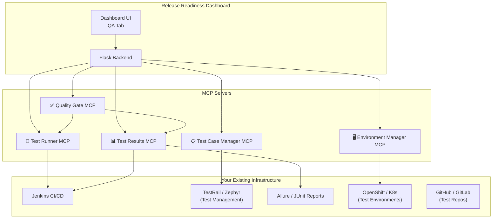
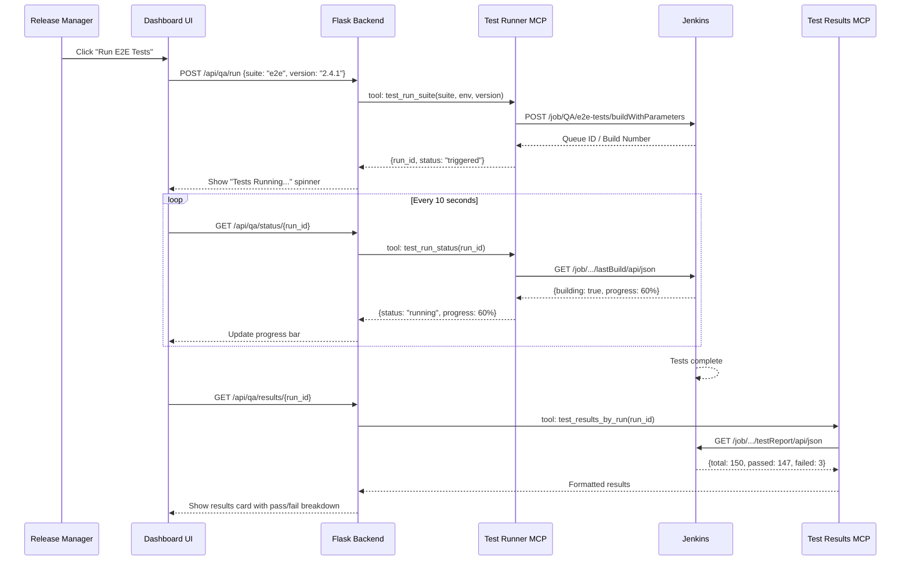

# QA Automation MCP Servers — Design Proposal

## Overview

Build MCP servers that connect your **existing test suites** (E2E, regression, performance) to the Release Readiness Dashboard, enabling one-click test execution and automated quality gates before release.



---

## MCP Server #1: Test Runner

**Purpose**: Trigger existing test suites from the dashboard — no need to rewrite tests.

### How It Works

Your tests already exist in Jenkins pipelines. This MCP server simply **triggers** them with the right parameters (environment, version, test suite) and monitors their progress.

### Tools

| Tool Name | Parameters | What It Does |
|---|---|---|
| `test_run_suite` | `suite` (e2e\|regression\|performance\|smoke), `environment` (uat\|staging), `version` (image tag), `services` (list) | Triggers a Jenkins job/pipeline for the selected test suite |
| `test_run_status` | `run_id` | Gets current status of a running test (in_progress, passed, failed) |
| `test_run_cancel` | `run_id` | Cancels a running test |
| `test_list_suites` | `environment` | Lists available test suites for an environment |
| `test_run_history` | `suite`, `limit` | Recent runs for a suite (last 10) |

### Implementation

```python
# test_runner_mcp/server.py
import requests
from mcp.server import Server

JENKINS_URL = os.getenv('JENKINS_URL')  # https://jenkins.company.com
JENKINS_USER = os.getenv('JENKINS_USER')
JENKINS_TOKEN = os.getenv('JENKINS_TOKEN')

# Map suite names to Jenkins job paths
SUITE_JOBS = {
    'e2e':         'QA/e2e-tests',
    'regression':  'QA/regression-suite',
    'performance': 'QA/performance-tests',
    'smoke':       'QA/smoke-tests',
}

@server.tool("test_run_suite")
async def run_suite(suite: str, environment: str, version: str, services: list[str] = None):
    """Trigger a test suite via Jenkins."""
    job_path = SUITE_JOBS.get(suite)
    if not job_path:
        return {"error": f"Unknown suite: {suite}. Available: {list(SUITE_JOBS.keys())}"}
    
    # Trigger Jenkins build with parameters
    resp = requests.post(
        f"{JENKINS_URL}/job/{job_path}/buildWithParameters",
        auth=(JENKINS_USER, JENKINS_TOKEN),
        params={
            'ENVIRONMENT': environment,
            'VERSION': version,
            'SERVICES': ','.join(services or []),
        }
    )
    
    # Get the queue item → build number
    queue_url = resp.headers.get('Location', '')
    return {
        "status": "triggered",
        "suite": suite,
        "environment": environment,
        "jenkins_job": job_path,
        "queue_url": queue_url,
        "run_id": f"{suite}-{int(time.time())}",
    }
```

### Dashboard Integration

Add a **"QA" tab** on the dashboard with:
- Dropdown to select suite (E2E, Regression, Performance, Smoke)
- Auto-populated environment and version from the release board
- "▶ Run Tests" button that triggers via MCP
- Live progress indicator (polls `test_run_status`)

---

## MCP Server #2: Test Results

**Purpose**: Fetch test results from your reporting tools (Allure, JUnit XML, Jenkins test reports) and display them on the dashboard.

### Tools

| Tool Name | Parameters | What It Does |
|---|---|---|
| `test_results_latest` | `suite`, `environment` | Gets the latest test results for a suite |
| `test_results_by_run` | `run_id` | Gets results for a specific run |
| `test_results_trend` | `suite`, `days` | Pass/fail trend over time |
| `test_results_failures` | `run_id` | Detailed failure info (stack traces, screenshots) |
| `test_results_compare` | `run_id_a`, `run_id_b` | Compare two runs (new failures, fixed tests) |

### Implementation

```python
@server.tool("test_results_latest")
async def get_latest_results(suite: str, environment: str = "uat"):
    """Fetch latest test results from Jenkins/Allure."""
    job_path = SUITE_JOBS.get(suite)
    
    # Option A: Parse Jenkins test report
    resp = requests.get(
        f"{JENKINS_URL}/job/{job_path}/lastBuild/testReport/api/json",
        auth=(JENKINS_USER, JENKINS_TOKEN)
    )
    data = resp.json()
    
    return {
        "suite": suite,
        "total": data.get("totalCount", 0),
        "passed": data.get("passCount", 0),
        "failed": data.get("failCount", 0),
        "skipped": data.get("skipCount", 0),
        "duration_seconds": data.get("duration", 0),
        "pass_rate": round(data["passCount"] / max(data["totalCount"], 1) * 100, 1),
        "timestamp": data.get("timestamp", ""),
        "failures": [
            {
                "test": case["className"] + "." + case["name"],
                "error": case.get("errorDetails", "")[:500],
                "duration": case.get("duration", 0),
            }
            for suite_data in data.get("suites", [])
            for case in suite_data.get("cases", [])
            if case.get("status") == "FAILED"
        ][:20],  # Top 20 failures
    }
```

### Dashboard Integration

- **Test Results Cards** showing pass rate, total/passed/failed counts
- **Trend Chart** (sparkline) showing pass rate over last 10 runs
- **Failure List** with expandable stack traces
- **Comparison View** between previous and current run

---

## MCP Server #3: Test Case Manager

**Purpose**: Interface with your test management tool (TestRail, Zephyr, Xray, qTest) to list test cases, map them to services, and track coverage.

### Tools

| Tool Name | Parameters | What It Does |
|---|---|---|
| `testcase_list` | `suite`, `component`, `priority` | List test cases filtered by component/priority |
| `testcase_coverage` | `services` (list) | Show test coverage per nominated service |
| `testcase_search` | `query` | Search test cases by keyword |
| `testcase_run_map` | `run_id` | Map a test run to specific test cases |
| `testcase_update_status` | `case_id`, `status`, `run_id` | Update test case status after execution |

### Why This Matters for Release Readiness

```
Release Board shows:
  ✅ billing-service v2.4.1
  ⚠️ auth-service v1.8.0
  
Test Case Manager shows:
  billing-service: 45 test cases, 42 passed, 3 skipped → 93% coverage
  auth-service: 30 test cases, 28 passed, 2 FAILED → 93% coverage ⚠️
    FAILED: test_oauth2_token_refresh
    FAILED: test_ldap_group_sync
```

---

## MCP Server #4: Quality Gate

**Purpose**: Aggregate all test results into a **go/no-go decision** for release. This is the most valuable server for the release readiness workflow.

### Tools

| Tool Name | Parameters | What It Does |
|---|---|---|
| `quality_gate_check` | `services`, `environment` | Run all quality checks and return pass/fail |
| `quality_gate_configure` | `rules` (JSON) | Set thresholds (e.g., "E2E pass rate > 95%") |
| `quality_gate_history` | `limit` | Past gate results |
| `quality_gate_override` | `gate_id`, `reason`, `approver` | Manual override (with audit trail) |

### Quality Gate Rules (Configurable)

```json
{
  "rules": [
    {"name": "E2E Pass Rate",        "suite": "e2e",         "metric": "pass_rate",  "threshold": 95,  "required": true},
    {"name": "Regression Pass Rate", "suite": "regression",  "metric": "pass_rate",  "threshold": 98,  "required": true},
    {"name": "Performance P99",      "suite": "performance", "metric": "p99_ms",     "threshold": 500, "required": false},
    {"name": "Smoke Tests",          "suite": "smoke",       "metric": "pass_rate",  "threshold": 100, "required": true},
    {"name": "No Critical Failures", "suite": "*",           "metric": "critical_failures", "threshold": 0, "required": true}
  ]
}
```

### Dashboard Integration

Add a **Quality Gate section** to the release board:

```
┌──────────────────────────────────────────────────────┐
│ 🚦 Quality Gate: PASSED                              │
│──────────────────────────────────────────────────────│
│ ✅ E2E Pass Rate:        97.2% (threshold: 95%)     │
│ ✅ Regression Pass Rate:  99.1% (threshold: 98%)     │
│ ⚠️ Performance P99:      480ms (threshold: 500ms)    │
│ ✅ Smoke Tests:           100% (threshold: 100%)     │
│ ✅ No Critical Failures:  0 (threshold: 0)           │
│──────────────────────────────────────────────────────│
│ [▶ Re-run All]  [📋 Full Report]  [🔓 Override]     │
└──────────────────────────────────────────────────────┘
```

---

## MCP Server #5: Environment Manager

**Purpose**: Provision/manage test environments (namespaces, service deployments) on your OpenShift/K8s clusters.

### Tools

| Tool Name | Parameters | What It Does |
|---|---|---|
| `env_provision` | `name`, `services`, `versions` | Create a test environment with specific versions |
| `env_status` | `name` | Check environment health |
| `env_teardown` | `name` | Clean up after testing |
| `env_list` | | List active test environments |
| `env_deploy_version` | `name`, `service`, `version` | Deploy a specific version to a test env |

---

## Implementation Priority

> [!IMPORTANT]
> Recommended build order — each server is independently useful, so you can ship incrementally.

| Priority | MCP Server | Effort | Impact | Why |
|---|---|---|---|---|
| **P0** | 🧪 Test Runner | 2-3 days | High | Immediately lets you trigger tests from the dashboard instead of going to Jenkins |
| **P0** | 📊 Test Results | 2-3 days | High | Shows test health directly on the board — critical for release decisions |
| **P1** | ✅ Quality Gate | 1-2 days | Very High | Combines Test Runner + Results into a go/no-go — the "killer feature" |
| **P2** | 📋 Test Case Manager | 3-5 days | Medium | Requires test management tool integration (TestRail/Zephyr API) |
| **P3** | 🖥️ Environment Manager | 3-5 days | Medium | Most useful if you need on-demand test environments |

## Architecture: How MCP Servers Connect



## Folder Structure

```
enterprise-mcp-servers/
├── test-runner-mcp/
│   ├── server.py           # MCP server with test_run_* tools
│   ├── jenkins_client.py   # Jenkins API wrapper
│   ├── config.py           # Suite → Jenkins job mapping
│   └── Dockerfile
├── test-results-mcp/
│   ├── server.py           # MCP server with test_results_* tools
│   ├── allure_client.py    # Allure report parser (optional)
│   ├── jenkins_reports.py  # Jenkins test report fetcher
│   └── Dockerfile
├── quality-gate-mcp/
│   ├── server.py           # MCP server with quality_gate_* tools
│   ├── rules_engine.py     # Configurable threshold checks
│   └── Dockerfile
└── test-case-manager-mcp/
    ├── server.py           # MCP server with testcase_* tools
    ├── testrail_client.py  # TestRail API (or Zephyr/Xray)
    └── Dockerfile
```

## Open Questions

1. **What CI tool do you use?** Jenkins (we saw this in Confluence), GitLab CI, GitHub Actions, or something else?
2. **How are tests organized?** Single Jenkins job per suite? Or parameterized multi-branch pipeline?
3. **Test reporting**: Do you use Allure, or just Jenkins' built-in JUnit report parsing?
4. **Test management tool**: TestRail, Zephyr (Jira plugin), Xray, or custom?
5. **Environment provisioning**: Do you need on-demand test environments, or tests run against a standing UAT environment?
6. **Which test suite is highest priority?** Which one do release managers check most before release?
