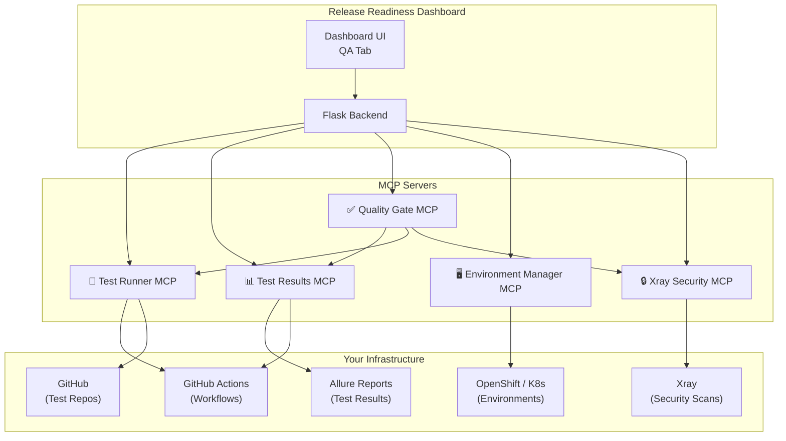
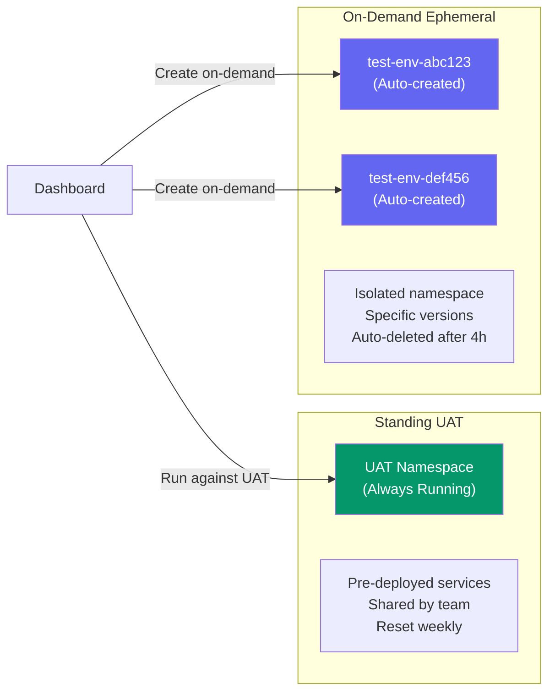
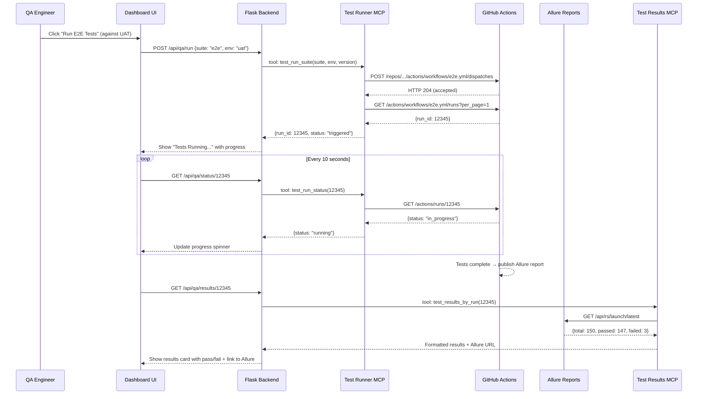

# QA Automation MCP Servers — Design Document

## Tech Stack (Confirmed)

| Component | Technology |
|---|---|
| **CI/CD** | GitHub Actions |
| **Test Reporting** | Allure |
| **Security Scanning** | Xray |
| **Code Repository** | GitHub |
| **Container Platform** | OpenShift / K8s |
| **Test Environments** | Standing UAT + On-Demand ephemeral |

---

## Architecture



---

## MCP Server #1: Test Runner (GitHub Actions)

**Purpose**: Trigger existing test suites (E2E, regression, performance, smoke) from the dashboard via GitHub Actions `workflow_dispatch`.

### How It Works

Your test workflows already exist in GitHub. This MCP server triggers them via the GitHub Actions API with the right parameters (environment, version, test suite) and monitors their progress.

### Prerequisites

- Test workflows must have `workflow_dispatch` trigger with `inputs`
- A GitHub Personal Access Token (PAT) or GitHub App with `actions:write` scope

### Example Workflow (already in your repo)

```yaml
# .github/workflows/e2e-tests.yml
name: E2E Tests
on:
  workflow_dispatch:
    inputs:
      environment:
        description: 'Target environment'
        required: true
        type: choice
        options: [uat, staging, on-demand]
      version:
        description: 'Image tag to test'
        required: false
      services:
        description: 'Comma-separated services to test'
        required: false
```

### Tools

| Tool Name | Parameters | What It Does |
|---|---|---|
| `test_run_suite` | `suite`, `environment`, `version`, `services` | Triggers a GitHub Actions workflow_dispatch |
| `test_run_status` | `run_id` | Gets current status (queued, in_progress, completed) |
| `test_run_cancel` | `run_id` | Cancels a running workflow |
| `test_list_suites` | | Lists available test workflows |
| `test_run_history` | `suite`, `limit` | Recent workflow runs (last 10) |

### Implementation

```python
# test_runner_mcp/server.py
import httpx, os, time
from mcp.server import Server

GITHUB_TOKEN = os.getenv('GITHUB_TOKEN')  # PAT with actions:write
GITHUB_OWNER = os.getenv('GITHUB_OWNER')  # e.g. 'your-org'
GITHUB_REPO  = os.getenv('GITHUB_REPO')   # e.g. 'qa-tests'

HEADERS = {
    'Authorization': f'Bearer {GITHUB_TOKEN}',
    'Accept': 'application/vnd.github.v3+json',
}
BASE = f'https://api.github.com/repos/{GITHUB_OWNER}/{GITHUB_REPO}'

# Map suite names to workflow files
SUITE_WORKFLOWS = {
    'e2e':          'e2e-tests.yml',
    'regression':   'regression-suite.yml',
    'performance':  'performance-tests.yml',
    'smoke':        'smoke-tests.yml',
}

server = Server("test-runner")

@server.tool("test_run_suite")
async def run_suite(suite: str, environment: str = "uat", version: str = "", services: str = ""):
    """Trigger a test suite via GitHub Actions workflow_dispatch."""
    workflow_file = SUITE_WORKFLOWS.get(suite)
    if not workflow_file:
        return {"error": f"Unknown suite: {suite}. Available: {list(SUITE_WORKFLOWS.keys())}"}

    # Trigger workflow via GitHub API
    async with httpx.AsyncClient() as client:
        resp = await client.post(
            f"{BASE}/actions/workflows/{workflow_file}/dispatches",
            headers=HEADERS,
            json={
                "ref": "main",
                "inputs": {
                    "environment": environment,
                    "version": version,
                    "services": services,
                }
            }
        )

    if resp.status_code == 204:
        # GitHub doesn't return a run ID immediately — poll for it
        await asyncio.sleep(2)
        runs_resp = await httpx.AsyncClient().get(
            f"{BASE}/actions/workflows/{workflow_file}/runs?per_page=1",
            headers=HEADERS
        )
        runs = runs_resp.json().get('workflow_runs', [])
        run_id = runs[0]['id'] if runs else None

        return {
            "status": "triggered",
            "suite": suite,
            "environment": environment,
            "run_id": run_id,
            "run_url": runs[0].get('html_url') if runs else None,
        }

    return {"error": f"Failed to trigger: HTTP {resp.status_code} - {resp.text}"}


@server.tool("test_run_status")
async def run_status(run_id: int):
    """Get the current status of a GitHub Actions workflow run."""
    async with httpx.AsyncClient() as client:
        resp = await client.get(f"{BASE}/actions/runs/{run_id}", headers=HEADERS)
    data = resp.json()
    return {
        "run_id": run_id,
        "status": data.get("status"),           # queued, in_progress, completed
        "conclusion": data.get("conclusion"),     # success, failure, cancelled
        "started_at": data.get("run_started_at"),
        "updated_at": data.get("updated_at"),
        "html_url": data.get("html_url"),
        "run_attempt": data.get("run_attempt"),
    }


@server.tool("test_run_cancel")
async def run_cancel(run_id: int):
    """Cancel a running GitHub Actions workflow."""
    async with httpx.AsyncClient() as client:
        resp = await client.post(f"{BASE}/actions/runs/{run_id}/cancel", headers=HEADERS)
    return {"cancelled": resp.status_code == 202, "run_id": run_id}


@server.tool("test_run_history")
async def run_history(suite: str, limit: int = 10):
    """Get recent workflow runs for a test suite."""
    workflow_file = SUITE_WORKFLOWS.get(suite, suite)
    async with httpx.AsyncClient() as client:
        resp = await client.get(
            f"{BASE}/actions/workflows/{workflow_file}/runs?per_page={limit}",
            headers=HEADERS
        )
    runs = resp.json().get('workflow_runs', [])
    return [{
        "run_id": r["id"],
        "status": r["status"],
        "conclusion": r.get("conclusion"),
        "started_at": r.get("run_started_at"),
        "duration_seconds": _calc_duration(r),
        "html_url": r["html_url"],
        "triggering_actor": r.get("triggering_actor", {}).get("login"),
    } for r in runs]
```

### Dashboard Integration

Add a **"QA" tab** on the dashboard with:
- Dropdown to select suite (E2E, Regression, Performance, Smoke)
- Environment selector: **Standing UAT** or **On-Demand**
- Auto-populated version from the release board
- "▶ Run Tests" button → triggers GitHub Actions
- Live progress indicator (polls `test_run_status` every 10s)
- Direct link to the GitHub Actions run page

---

## MCP Server #2: Test Results (Allure)

**Purpose**: Fetch test results from Allure reports and display them on the dashboard.

### How It Works

After GitHub Actions completes, test results are published to Allure. This MCP server reads the Allure API or parses the Allure report artifacts.

### Tools

| Tool Name | Parameters | What It Does |
|---|---|---|
| `test_results_latest` | `suite`, `environment` | Gets the latest Allure results for a suite |
| `test_results_by_run` | `run_id` | Gets Allure results for a specific GHA run |
| `test_results_trend` | `suite`, `days` | Pass/fail trend over time |
| `test_results_failures` | `run_id` | Detailed failure info (stack traces, screenshots) |
| `test_results_compare` | `run_id_a`, `run_id_b` | Compare two runs (new failures, fixed tests) |

### Implementation

```python
# test_results_mcp/server.py
ALLURE_URL = os.getenv('ALLURE_URL')  # e.g. https://allure.company.com

@server.tool("test_results_latest")
async def get_latest_results(suite: str, environment: str = "uat"):
    """Fetch latest test results from Allure."""
    # Option A: Allure TestOps API
    async with httpx.AsyncClient() as client:
        resp = await client.get(
            f"{ALLURE_URL}/api/rs/launch/latest",
            params={"projectId": suite, "env": environment},
            headers={"Authorization": f"Bearer {ALLURE_TOKEN}"}
        )
    data = resp.json()

    return {
        "suite": suite,
        "total": data.get("statistic", {}).get("total", 0),
        "passed": data.get("statistic", {}).get("passed", 0),
        "failed": data.get("statistic", {}).get("failed", 0),
        "broken": data.get("statistic", {}).get("broken", 0),
        "skipped": data.get("statistic", {}).get("skipped", 0),
        "duration_seconds": data.get("duration", 0) / 1000,
        "pass_rate": _calc_pass_rate(data.get("statistic", {})),
        "report_url": f"{ALLURE_URL}/launch/{data.get('id')}",
        "failures": _extract_failures(data),
    }

# Option B: Parse Allure report from GitHub Actions artifact
@server.tool("test_results_by_run")
async def get_results_by_run(run_id: int):
    """Fetch Allure results from a GitHub Actions run artifact."""
    # Download the allure-results artifact from the GHA run
    async with httpx.AsyncClient() as client:
        artifacts_resp = await client.get(
            f"{BASE}/actions/runs/{run_id}/artifacts",
            headers=HEADERS
        )
    artifacts = artifacts_resp.json().get("artifacts", [])
    allure_artifact = next((a for a in artifacts if "allure" in a["name"].lower()), None)

    if not allure_artifact:
        return {"error": "No Allure artifact found for this run"}

    # Download and parse the artifact ZIP
    # ... extract summary.json from allure-report/widgets/summary.json
    return {
        "run_id": run_id,
        "total": summary["statistic"]["total"],
        "passed": summary["statistic"]["passed"],
        "failed": summary["statistic"]["failed"],
        "pass_rate": round(summary["statistic"]["passed"] / max(summary["statistic"]["total"], 1) * 100, 1),
        "report_url": f"https://your-allure-server.com/reports/{run_id}",
    }
```

### Dashboard Integration

- **Test Results Cards** showing pass rate gauge, total/passed/failed
- **Trend Chart** (sparkline) showing pass rate over last 10 runs
- **Failure List** with expandable stack traces + Allure links
- Direct **"Open Allure Report"** button for each run

---

## MCP Server #3: Quality Gate

**Purpose**: Aggregate all test results + Xray security scans into a **go/no-go decision** for release.

### Quality Gate Rules (Configurable)

```json
{
  "rules": [
    {"name": "E2E Pass Rate",        "suite": "e2e",         "metric": "pass_rate",       "threshold": 95,  "required": true},
    {"name": "Regression Pass Rate", "suite": "regression",  "metric": "pass_rate",       "threshold": 98,  "required": true},
    {"name": "Performance P99",      "suite": "performance", "metric": "p99_ms",          "threshold": 500, "required": false},
    {"name": "Smoke Tests",          "suite": "smoke",       "metric": "pass_rate",       "threshold": 100, "required": true},
    {"name": "Xray Critical CVEs",   "source": "xray",       "metric": "critical_count",  "threshold": 0,   "required": true},
    {"name": "Xray High CVEs",       "source": "xray",       "metric": "high_count",      "threshold": 5,   "required": false}
  ]
}
```

### Dashboard Integration — Quality Gate Widget

```
┌──────────────────────────────────────────────────────┐
│ 🚦 Quality Gate: PASSED                              │
│──────────────────────────────────────────────────────│
│ ✅ E2E Pass Rate:        97.2% (threshold: 95%)     │
│ ✅ Regression Pass Rate:  99.1% (threshold: 98%)     │
│ ⚠️ Performance P99:      480ms (threshold: 500ms)    │
│ ✅ Smoke Tests:           100% (threshold: 100%)     │
│ ✅ Xray Critical CVEs:    0 (threshold: 0)           │
│ ⚠️ Xray High CVEs:       3 (threshold: 5)           │
│──────────────────────────────────────────────────────│
│ [▶ Run All Suites]  [📋 Full Report]  [🔓 Override] │
└──────────────────────────────────────────────────────┘
```

---

## MCP Server #4: Environment Manager

**Purpose**: Manage test environments — both the standing UAT and on-demand ephemeral environments on OpenShift.

### Dual Environment Strategy



### How On-Demand Works

1. **User clicks "Create Test Environment"** on the dashboard
2. MCP server creates a new OpenShift namespace (e.g., `test-env-abc123`)
3. Deploys the nominated services at the specific board versions
4. Runs the selected test suite against this fresh environment
5. **Auto-deletes** the namespace after tests complete (or after 4h TTL)

### How Standing UAT Works

1. UAT namespace is always running with the latest deployed versions
2. Tests run against it directly — no provisioning needed
3. Good for quick smoke tests and regression checks
4. Dashboard shows both UAT live versions AND test results

### Tools

| Tool Name | Parameters | What It Does |
|---|---|---|
| `env_provision` | `services`, `versions`, `ttl_hours` | Create an on-demand namespace with specific versions |
| `env_status` | `name` | Check environment health (all pods running?) |
| `env_teardown` | `name` | Delete an on-demand environment |
| `env_list` | | List active on-demand environments |
| `env_run_tests` | `name`, `suite` | Trigger test suite against a specific environment |

### Implementation

```python
# env_manager_mcp/server.py
from kubernetes import client, config

@server.tool("env_provision")
async def provision_env(services: list, versions: dict, ttl_hours: int = 4):
    """Create an on-demand test environment on OpenShift."""
    import uuid
    env_name = f"test-env-{uuid.uuid4().hex[:8]}"

    # Create namespace with TTL annotation
    v1 = client.CoreV1Api()
    ns = client.V1Namespace(
        metadata=client.V1ObjectMeta(
            name=env_name,
            labels={"purpose": "qa-testing", "managed-by": "release-readiness"},
            annotations={
                "ttl": f"{ttl_hours}h",
                "created-by": "release-readiness-dashboard",
                "expires-at": (datetime.utcnow() + timedelta(hours=ttl_hours)).isoformat(),
            }
        )
    )
    v1.create_namespace(ns)

    # Deploy each service at the specified version
    apps_v1 = client.AppsV1Api()
    for svc_name in services:
        version = versions.get(svc_name, "latest")
        # Copy deployment spec from UAT, override image tag
        uat_deploy = apps_v1.read_namespaced_deployment(svc_name, "uat-namespace")
        uat_deploy.metadata = client.V1ObjectMeta(name=svc_name, namespace=env_name)
        uat_deploy.spec.template.spec.containers[0].image = f"registry.company.com/{svc_name}:{version}"
        apps_v1.create_namespaced_deployment(env_name, uat_deploy)

    return {
        "environment": env_name,
        "services": services,
        "versions": versions,
        "ttl_hours": ttl_hours,
        "status": "provisioning",
        "expires_at": (datetime.utcnow() + timedelta(hours=ttl_hours)).isoformat(),
    }
```

---

## MCP Server #5: Xray Security Scans

**Purpose**: Fetch Xray scan results for container images being nominated for release. Blocks releases with critical CVEs.

### Tools

| Tool Name | Parameters | What It Does |
|---|---|---|
| `xray_scan_image` | `image`, `tag` | Trigger an Xray scan for a specific image |
| `xray_scan_results` | `image`, `tag` | Get scan results (CVE list, severity counts) |
| `xray_scan_board` | | Scan ALL images on the release board |
| `xray_policy_check` | `image`, `tag` | Check if image passes Xray policies |

### Dashboard Integration

- Show 🛡️ security badge next to each nominated service
- Red alert for critical CVEs, yellow for high
- Block release in Quality Gate if critical CVEs > 0

---

## Implementation Priority

> [!IMPORTANT]
> Build order — each server is independently useful, ship incrementally.

| Priority | MCP Server | Effort | Impact | Why |
|---|---|---|---|---|
| **P0** | 🧪 Test Runner | 2-3 days | High | Trigger E2E/regression/perf from dashboard via GitHub Actions |
| **P0** | 📊 Test Results | 2-3 days | High | Show Allure results on the board — critical for release decisions |
| **P1** | ✅ Quality Gate | 1-2 days | Very High | Combines Test Runner + Results + Xray into go/no-go |
| **P1** | 🔒 Xray Security | 2-3 days | High | CVE visibility on the release board |
| **P2** | 🖥️ Environment Manager | 3-5 days | Medium | On-demand test environments for isolated testing |

---

## Sequence: Full Flow



---

## Folder Structure

```
enterprise-mcp-servers/
├── test-runner-mcp/
│   ├── server.py             # MCP server with test_run_* tools
│   ├── github_actions.py     # GitHub Actions API wrapper
│   ├── config.py             # Suite → workflow mapping
│   └── Dockerfile
├── test-results-mcp/
│   ├── server.py             # MCP server with test_results_* tools
│   ├── allure_client.py      # Allure report API client
│   ├── gha_artifacts.py      # Parse Allure from GHA artifacts
│   └── Dockerfile
├── quality-gate-mcp/
│   ├── server.py             # MCP server with quality_gate_* tools
│   ├── rules_engine.py       # Configurable threshold checks
│   └── Dockerfile
├── xray-security-mcp/
│   ├── server.py             # MCP server with xray_* tools
│   ├── xray_client.py        # JFrog Xray API wrapper
│   └── Dockerfile
└── env-manager-mcp/
    ├── server.py             # MCP server with env_* tools
    ├── openshift_client.py   # Namespace provisioning
    └── Dockerfile
```

---

## Environment Variables

```bash
# Test Runner MCP
GITHUB_TOKEN=ghp_xxx              # PAT with actions:write, repo scope
GITHUB_OWNER=your-org
GITHUB_REPO=qa-tests

# Test Results MCP
ALLURE_URL=https://allure.company.com
ALLURE_TOKEN=xxx

# Xray Security MCP
XRAY_URL=https://xray.company.com
XRAY_TOKEN=xxx

# Environment Manager MCP
OPENSHIFT_API=https://api.ocp.company.com:6443
OPENSHIFT_TOKEN=xxx
UAT_NAMESPACE=uat-prod
```

---

## Resolved Questions

| Question | Answer |
|---|---|
| CI tool | **GitHub Actions** — code is on GitHub |
| Test reporting | **Allure** |
| Test management tool | **None** — no TestRail, Zephyr, or similar. Tests live in GitHub repos |
| Security scanning | **Xray** — vulnerability scanning on container images |
| Environment strategy | **Both**: standing UAT + on-demand ephemeral |
| Test suite priority | **All equal** — QA team runs E2E, regression, and performance. All must pass |
| Release sign-off | **QA team** signs off the release (no dedicated release managers) |
