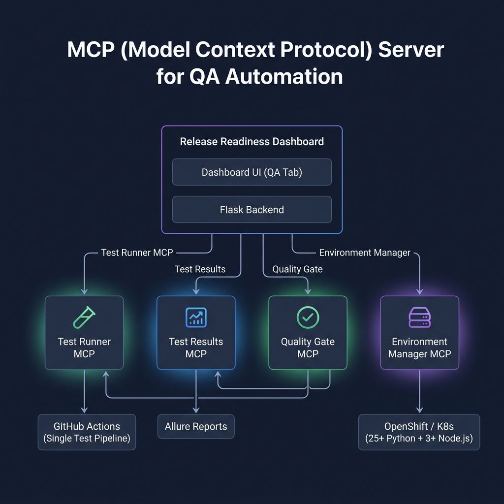
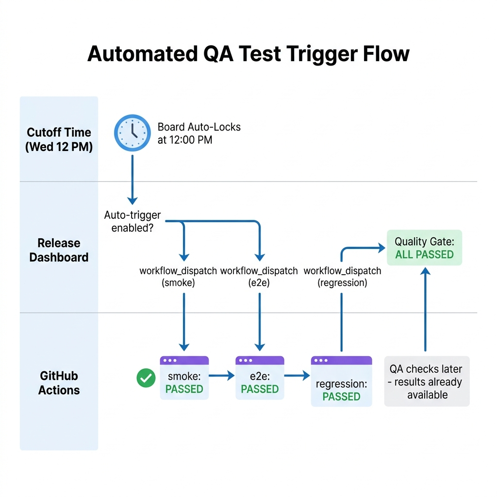
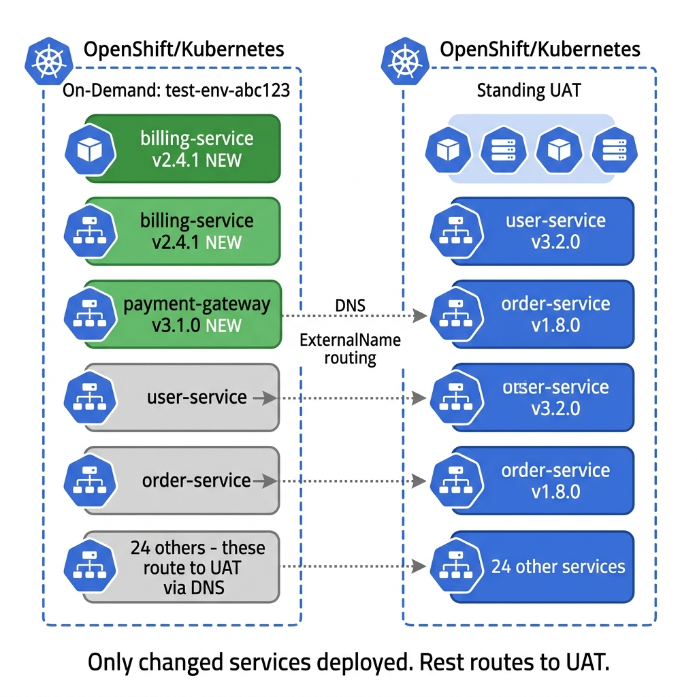
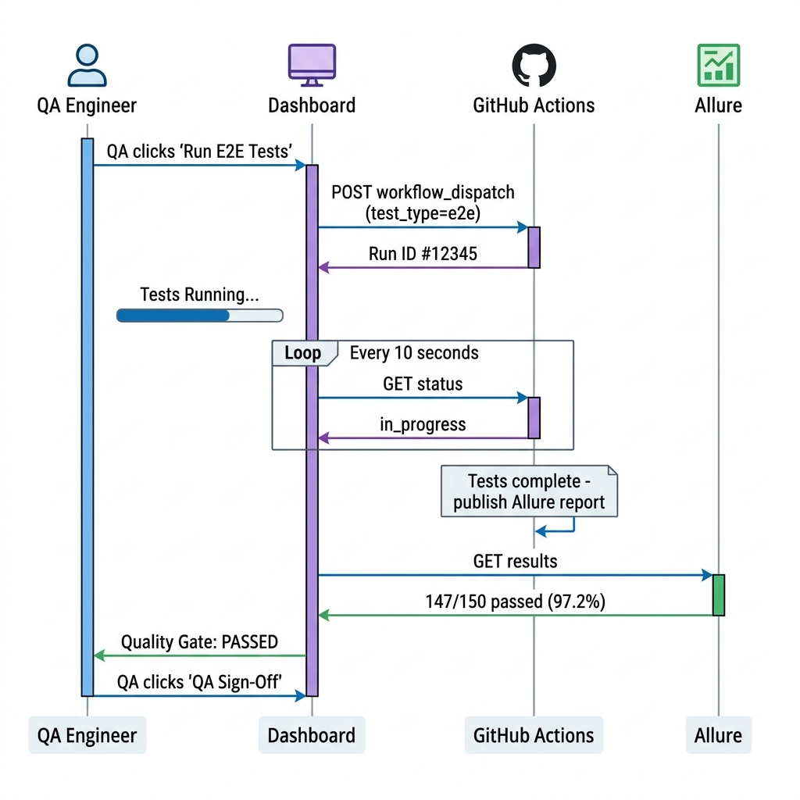

# QA Automation MCP Servers — Design Document

## Tech Stack (Confirmed)

| Component | Technology |
|---|---|
| **Application** | 25+ Python microservices (API) + 3+ Node.js UI apps |
| **CI/CD** | GitHub Actions |
| **Test Pipeline** | Single workflow with `test_type` flag (e2e / smoke / regression) |
| **Performance Testing** | LoadRunner (separate — not integrated into dashboard) |
| **Test Reporting** | Allure |
| **Security Scanning** | Xray (already in CI pipeline — not in dashboard scope) |
| **Code Repository** | GitHub |
| **Container Platform** | OpenShift / K8s |
| **Test Environments** | Standing UAT + On-Demand ephemeral |

---

## Architecture



> **Note**: Performance testing (LoadRunner) and security scanning (Xray) both run independently in your CI pipeline and are not triggered from the dashboard. The dashboard focuses on E2E, smoke, and regression testing.

---

## MCP Server #1: Test Runner (GitHub Actions)

**Purpose**: Trigger the existing test pipeline from the dashboard via GitHub Actions `workflow_dispatch`.

### How It Works

You have a **single test pipeline** that accepts a `test_type` flag to run different test suites. The dashboard triggers this same workflow:

- **Manually**: QA clicks "▶ Run Tests" on the dashboard
- **Automatically**: Tests auto-trigger after the board locks at cutoff time (Wednesday 12 PM)

### Auto-Trigger After Cutoff

When the board auto-locks at cutoff, the dashboard automatically kicks off the full test suite:



**How it works technically**:

```python
# In app.py — background scheduler
from apscheduler.schedulers.background import BackgroundScheduler

def _auto_trigger_tests():
    """Called every minute. Checks if board just locked and triggers tests."""
    board = _read_board()
    if not board:
        return

    # Only trigger once per release cycle
    if board.get('tests_auto_triggered'):
        return

    # Check if board just passed cutoff
    cutoff = board.get('cutoff', '')
    now = datetime.datetime.utcnow().isoformat()
    if now > cutoff and board.get('status') != 'locked':
        return  # Not past cutoff yet or already handled

    # Trigger: smoke → e2e → regression (sequential)
    for test_type in ['smoke', 'e2e', 'regression']:
        _github_post(
            f'/repos/{QA_TEST_REPO}/actions/workflows/{QA_WORKFLOW_FILE}/dispatches',
            data={
                "ref": "main",
                "inputs": {
                    "test_type": test_type,
                    "environment": "uat",
                }
            }
        )
        time.sleep(5)  # Brief delay between triggers

    # Mark as triggered (prevent re-trigger)
    board['tests_auto_triggered'] = True
    board['tests_auto_triggered_at'] = now
    _write_board(board)
    print(f"[QA Auto-Trigger] All test suites triggered at {now}")

scheduler = BackgroundScheduler()
scheduler.add_job(_auto_trigger_tests, 'interval', minutes=1)
scheduler.start()
```

### Configuration

| Env Var | Default | Description |
|---|---|---|
| `QA_AUTO_TRIGGER` | `true` | Enable/disable auto-trigger after cutoff |
| `QA_AUTO_TRIGGER_DELAY_MIN` | `5` | Minutes to wait after cutoff before triggering |
| `QA_AUTO_TRIGGER_ORDER` | `smoke,e2e,regression` | Order of test suites to trigger |

### Your Test Pipeline (Existing)

```yaml
# .github/workflows/test-pipeline.yml
name: Test Pipeline
on:
  push:
    branches: [main]
  workflow_dispatch:
    inputs:
      test_type:
        description: 'Type of tests to run'
        required: true
        type: choice
        options:
          - e2e
          - smoke
          - regression
      environment:
        description: 'Target environment'
        required: true
        default: 'uat'
        type: choice
        options:
          - uat
          - on-demand
      target_namespace:
        description: 'Target namespace (for on-demand envs)'
        required: false
        type: string

jobs:
  test:
    runs-on: [self-hosted]
    steps:
      - uses: actions/checkout@v4
      - name: Run Tests
        run: |
          pytest tests/ \
            --test-type=${{ inputs.test_type }} \
            --environment=${{ inputs.environment }} \
            --alluredir=allure-results
      - name: Publish Allure
        uses: allure-framework/publish-allure@v1
        with:
          results-dir: allure-results
```

### Tools

| Tool Name | Parameters | What It Does |
|---|---|---|
| `test_run` | `test_type` (e2e\|smoke\|regression), `environment`, `version` | Triggers the single test pipeline with the right flag |
| `test_run_status` | `run_id` | Gets current status (queued, in_progress, completed) |
| `test_run_cancel` | `run_id` | Cancels a running workflow |
| `test_list_runs` | `test_type`, `limit` | Recent workflow runs filtered by test type |

### Implementation

```python
# test_runner_mcp/server.py
import httpx, os
from mcp.server.fastmcp import FastMCP

GITHUB_TOKEN = os.getenv('GITHUB_TOKEN')
GITHUB_OWNER = os.getenv('GITHUB_OWNER')
GITHUB_REPO  = os.getenv('QA_TEST_REPO')

HEADERS = {
    'Authorization': f'Bearer {GITHUB_TOKEN}',
    'Accept': 'application/vnd.github.v3+json',
}
BASE = f'https://api.github.com/repos/{GITHUB_OWNER}/{GITHUB_REPO}'

# Single workflow file — test type is an input parameter
TEST_WORKFLOW = os.getenv('QA_WORKFLOW_FILE', 'test-pipeline.yml')

server = FastMCP("test-runner")

@server.tool()
async def test_run(test_type: str, environment: str = "uat", version: str = "",
                   target_namespace: str = ""):
    """Trigger the test pipeline via GitHub Actions workflow_dispatch.
    
    test_type: e2e | smoke | regression
    environment: uat | on-demand
    """
    if test_type not in ('e2e', 'smoke', 'regression'):
        return {"error": f"Invalid test_type: {test_type}. Use: e2e, smoke, regression"}

    async with httpx.AsyncClient() as client:
        resp = await client.post(
            f"{BASE}/actions/workflows/{TEST_WORKFLOW}/dispatches",
            headers=HEADERS,
            json={
                "ref": "main",
                "inputs": {
                    "test_type": test_type,
                    "environment": environment,
                    "target_namespace": target_namespace,
                }
            }
        )

    if resp.status_code == 204:
        # GitHub doesn't return run ID immediately — poll for it
        import asyncio
        await asyncio.sleep(3)
        async with httpx.AsyncClient() as client:
            runs_resp = await client.get(
                f"{BASE}/actions/workflows/{TEST_WORKFLOW}/runs?per_page=1",
                headers=HEADERS
            )
        runs = runs_resp.json().get('workflow_runs', [])
        run = runs[0] if runs else {}

        return {
            "status": "triggered",
            "test_type": test_type,
            "environment": environment,
            "run_id": run.get('id'),
            "html_url": run.get('html_url'),
        }

    return {"error": f"Failed to trigger: HTTP {resp.status_code} - {resp.text}"}


@server.tool()
async def test_run_status(run_id: int):
    """Get the current status of a GitHub Actions workflow run."""
    async with httpx.AsyncClient() as client:
        resp = await client.get(f"{BASE}/actions/runs/{run_id}", headers=HEADERS)
    data = resp.json()
    return {
        "run_id": run_id,
        "status": data.get("status"),           # queued, in_progress, completed
        "conclusion": data.get("conclusion"),     # success, failure, cancelled
        "started_at": data.get("run_started_at"),
        "updated_at": data.get("updated_at"),
        "html_url": data.get("html_url"),
    }
```

---

## MCP Server #2: Test Results (Allure)

**Purpose**: Fetch test results from Allure reports and display them on the dashboard.

### Tools

| Tool Name | Parameters | What It Does |
|---|---|---|
| `test_results_latest` | `test_type`, `environment` | Gets the latest Allure results for a test type |
| `test_results_by_run` | `run_id` | Gets Allure results for a specific GHA run |
| `test_results_trend` | `test_type`, `days` | Pass/fail trend over time |
| `test_results_failures` | `run_id` | Detailed failure info (stack traces, screenshots) |

### Implementation

```python
# test_results_mcp/server.py
ALLURE_URL   = os.getenv('ALLURE_URL')
ALLURE_TOKEN = os.getenv('ALLURE_TOKEN')

@server.tool()
async def test_results_latest(test_type: str, environment: str = "uat"):
    """Fetch latest test results from Allure."""
    async with httpx.AsyncClient() as client:
        resp = await client.get(
            f"{ALLURE_URL}/api/rs/launch/latest",
            params={"projectId": test_type, "env": environment},
            headers={"Authorization": f"Bearer {ALLURE_TOKEN}"}
        )
    data = resp.json()
    stat = data.get("statistic", {})
    total = stat.get("total", 0)
    passed = stat.get("passed", 0)

    return {
        "test_type": test_type,
        "total": total,
        "passed": passed,
        "failed": stat.get("failed", 0),
        "broken": stat.get("broken", 0),
        "skipped": stat.get("skipped", 0),
        "pass_rate": round(passed / max(total, 1) * 100, 1),
        "duration_seconds": data.get("duration", 0) / 1000,
        "report_url": f"{ALLURE_URL}/launch/{data.get('id')}",
    }
```

---

## MCP Server #3: Quality Gate

**Purpose**: Aggregate all test results into a **go/no-go decision** for release sign-off by the QA team.

### Quality Gate Rules (Configurable)

```json
{
  "rules": [
    {"name": "E2E Pass Rate",        "test_type": "e2e",        "metric": "pass_rate",      "threshold": 95,  "required": true},
    {"name": "Regression Pass Rate", "test_type": "regression", "metric": "pass_rate",      "threshold": 98,  "required": true},
    {"name": "Smoke Tests",          "test_type": "smoke",      "metric": "pass_rate",      "threshold": 100, "required": true}
  ]
}
```

### Dashboard Integration — Quality Gate Widget

```
┌──────────────────────────────────────────────────────────────┐
│ 🚦 Quality Gate: PASSED — QA Sign-Off Ready                 │
│──────────────────────────────────────────────────────────────│
│ ✅ E2E Pass Rate:        97.2% (threshold: 95%)             │
│ ✅ Regression Pass Rate:  99.1% (threshold: 98%)             │
│ ✅ Smoke Tests:           100% (threshold: 100%)             │
│──────────────────────────────────────────────────────────────│
│ [▶ Run All Tests]  [📋 Full Report]  [✅ QA Sign-Off]       │
└──────────────────────────────────────────────────────────────┘
```

---

## MCP Server #4: Environment Manager

**Purpose**: Provision a full QA test environment with all 28+ services — nominated services at release candidate versions, non-nominated services at production live versions — deployed into a **pre-provisioned namespace** via GitHub Actions → ArgoCD MetaApp.

### The Challenge

With 25+ Python services and 3+ UI apps, QA needs a complete environment that mirrors production **but** includes the release candidate versions being tested. Manually setting this up takes 2-3 hours. The Environment Manager automates this to ~10 minutes.

### Infrastructure Constraints

| Constraint | Detail |
|---|---|
| **Namespace** | Pre-provisioned by the platform team (not auto-created by dashboard) |
| **Current platform** | OpenShift with GitHub CI/CD pipelines |
| **Future platform** | Google Distributed Cloud (GDC) with GitHub CI + ArgoCD |
| **Deployment method** | GitHub Actions workflow → ArgoCD MetaApp sync |
| **Cluster topology** | QA namespace is on the **same cluster** as UAT |
| **ArgoCD MetaApp** | Single ArgoCD YAML that deploys all applications at once (App-of-Apps pattern) |

### On-Demand Environment Strategy



The dashboard deploys **all 28+ services** into a dedicated `qa-testing` namespace:

- **Nominated services** (from the release board) → deployed with **release candidate versions**
- **Non-nominated services** → deployed with **production live versions**

This gives QA a complete, isolated environment that mirrors what production will look like **after** the release.

```
Standing UAT (uat-prod)                    QA Testing (qa-testing)
┌──────────────────────────────┐           ┌──────────────────────────────┐
│ billing-service    v2.3.3    │           │ billing-service    v2.3.4   │ ← board (release candidate)
│ payment-gateway    v2.0.0    │           │ payment-gateway    v2.1.0   │ ← board (release candidate)
│ auth-service       v2.7.0    │           │ auth-service       v2.7.0   │ ← prod version (unchanged)
│ user-service       v3.2.0    │           │ user-service       v3.2.0   │ ← prod version (unchanged)
│ order-service      v1.5.2    │           │ order-service      v1.5.3   │ ← board (release candidate)
│ ... (25+ total)              │           │ ... (all 28+ services)      │
└──────────────────────────────┘           └──────────────────────────────┘
```

### How It Works

```
┌─────────────────────────────────────────────────────────────────────┐
│  QA clicks "Prepare QA Environment" on the dashboard                │
│                                                                      │
│  Step 1: Dashboard reads the release board                          │
│          → 8 services nominated with release candidate versions     │
│                                                                      │
│  Step 2: Dashboard reads production cluster (read-only)             │
│          → Gets live versions of all 28+ services in prod           │
│                                                                      │
│  Step 3: Merge version manifest                                     │
│          • 8 nominated services  → use board versions               │
│          • 20 remaining services → use prod live versions           │
│          → Full manifest: 28 services with target image tags        │
│                                                                      │
│  Step 4: Trigger GitHub Actions deployment workflow                 │
│          → Input: environment=qa-testing, version manifest           │
│                                                                      │
│  Step 5: GitHub Actions → ArgoCD MetaApp                            │
│          → ArgoCD syncs all 28 services to qa-testing namespace     │
│                                                                      │
│  Step 6: Dashboard monitors sync status via ArgoCD API              │
│          → Reports progress: "15/28 services synced..."             │
│                                                                      │
│  Step 7: QA team notified: "QA environment ready"                   │
│          → Full replica of prod + release candidates available      │
└─────────────────────────────────────────────────────────────────────┘
```

### Production Version Source

The dashboard needs to read production service versions (read-only). Options:

| Source | How It Works | Recommended |
|---|---|---|
| **ArgoCD API** | Query ArgoCD REST API for deployed app versions | ✅ Best for GDC (already using ArgoCD) |
| **Shared Version Manifest** | CI/CD writes `prod-versions.json` to Git after each deploy | ✅ Simplest — works with any platform |
| **K8s API (read-only)** | Direct read of prod namespace deployments | Works on OpenShift today |

```python
# Option 1: ArgoCD API (recommended for GDC)
def fetch_prod_versions_argocd():
    """Fetch deployed versions from ArgoCD (read-only)."""
    headers = {'Authorization': f'Bearer {ARGOCD_READ_TOKEN}'}
    response = requests.get(
        f'{ARGOCD_URL}/api/v1/applications',
        headers=headers,
        params={'projects': 'prod'}
    )
    apps = response.json()['items']
    versions = {}
    for app in apps:
        name = app['metadata']['name']
        images = app.get('status', {}).get('summary', {}).get('images', [])
        versions[name] = {
            'image_tag': extract_tag(images[0]) if images else 'latest',
            'chart': app['spec']['source'].get('chart', ''),
            'chart_version': app['spec']['source'].get('targetRevision', ''),
        }
    return versions

# Option 2: Shared version manifest (simplest)
def fetch_prod_versions_manifest():
    """Read version manifest from Git repo."""
    response = requests.get(
        f'{GIT_API_URL}/repos/org/config-repo/contents/prod-versions.json',
        headers={'Authorization': f'token {GIT_TOKEN}'}
    )
    manifest = json.loads(base64.b64decode(response.json()['content']))
    return manifest['services']
```

### Version Manifest Merge Logic

```python
def build_qa_manifest():
    """Build the full QA environment manifest by merging board + prod versions."""
    board = get_current_board()
    prod_versions = fetch_prod_versions()  # All 28+ services from prod

    qa_manifest = {}

    # All services get deployed
    for service_name, prod_info in prod_versions.items():
        if service_name in board['services']:
            # Nominated service → use release candidate version from board
            nomination = board['services'][service_name]
            qa_manifest[service_name] = {
                'image_tag': nomination['image_tag'],
                'source': 'board',
                'nominated_by': nomination['nominated_by'],
            }
        else:
            # Non-nominated service → use production live version
            qa_manifest[service_name] = {
                'image_tag': prod_info['image_tag'],
                'source': 'production',
            }

    return qa_manifest
```

### GitHub Actions Deployment Workflow

The dashboard triggers the existing deployment workflow with the QA namespace as target:

```python
def trigger_qa_env_deploy(qa_manifest, namespace='qa-testing'):
    """Trigger GitHub Actions → ArgoCD to deploy all services."""
    _github_post(
        f'/repos/{DEPLOY_REPO}/actions/workflows/{DEPLOY_WORKFLOW}/dispatches',
        data={
            "ref": "main",
            "inputs": {
                "environment": namespace,          # Pre-provisioned QA namespace
                "manifest": json.dumps(qa_manifest),  # All 28 services + versions
                "triggered_by": "release-readiness-dashboard",
            }
        }
    )
```

The GitHub Actions workflow receives the manifest and updates the ArgoCD MetaApp:

```yaml
# .github/workflows/deploy-qa-env.yml
name: Deploy QA Environment
on:
  workflow_dispatch:
    inputs:
      environment:
        description: 'Target namespace (pre-provisioned by platform team)'
        required: true
        type: string
        default: 'qa-testing'
      manifest:
        description: 'JSON manifest of all services and target versions'
        required: true
        type: string
      triggered_by:
        description: 'Who triggered this deployment'
        required: false
        type: string

jobs:
  deploy:
    runs-on: [self-hosted]
    steps:
      - uses: actions/checkout@v4

      - name: Parse manifest and update ArgoCD MetaApp
        run: |
          echo '${{ inputs.manifest }}' | jq -r 'to_entries[] | "\(.key) \(.value.image_tag)"' | \
          while read service version; do
            argocd app set $service \
              --helm-set image.tag=$version \
              --helm-set-string targetEnv=${{ inputs.environment }}
          done

      - name: Sync all applications
        run: |
          argocd app sync metaapp-${{ inputs.environment }} --prune --force

      - name: Wait for healthy
        run: |
          argocd app wait metaapp-${{ inputs.environment }} --health --timeout 600
```

### Tools

| Tool Name | Parameters | What It Does |
|---|---|---|
| `env_prepare` | `namespace` | Build manifest (board + prod versions) and trigger deploy via GitHub Actions → ArgoCD |
| `env_status` | `namespace` | Check deployment progress — how many services are synced and healthy |
| `env_diff` | `namespace` | Show what will change: board versions vs. prod versions side by side |
| `env_teardown` | `namespace` | Scale down all deployments in the QA namespace to 0 replicas |

### Dashboard UI — "Prepare QA Environment" Button

On the QA tab, QA clicks **"🧪 Prepare QA Environment"** and sees:

```
┌──────────────────────────────────────────────────────────────────┐
│  🧪 Prepare QA Environment                                      │
│                                                                  │
│  Target Namespace: [ qa-testing        ]  (pre-provisioned)     │
│                                                                  │
│  📋 From Release Board (8 services — release candidate versions) │
│  ┌──────────────────────┬──────────┬─────────────────────────┐  │
│  │ Service              │ Version  │ Source                   │  │
│  ├──────────────────────┼──────────┼─────────────────────────┤  │
│  │ billing-service      │ v2.3.4   │ 📋 Board (nominated)    │  │
│  │ payment-gateway      │ v2.1.0   │ 📋 Board (nominated)    │  │
│  │ order-service        │ v1.5.3   │ 📋 Board (nominated)    │  │
│  │ ... (5 more)         │          │                         │  │
│  └──────────────────────┴──────────┴─────────────────────────┘  │
│                                                                  │
│  🏭 From Production (20 services — prod live versions)           │
│  ┌──────────────────────┬──────────┬─────────────────────────┐  │
│  │ auth-service         │ v2.7.0   │ 🏭 Production           │  │
│  │ user-service         │ v3.2.0   │ 🏭 Production           │  │
│  │ ... (18 more)        │          │                         │  │
│  └──────────────────────┴──────────┴─────────────────────────┘  │
│                                                                  │
│  Total: 28 services will be deployed to qa-testing               │
│                                                                  │
│  [🚀 Deploy QA Environment]  [Cancel]                            │
└──────────────────────────────────────────────────────────────────┘
```

After clicking Deploy, a progress panel shows real-time status:

```
┌──────────────────────────────────────────────────────────────────┐
│  QA Environment Setup — In Progress                              │
│  ━━━━━━━━━━━━━━━━━━━━━━━━━━ 65%                                 │
│                                                                  │
│  ✅ billing-service v2.3.4 — synced (board)                      │
│  ✅ auth-service v2.7.0 — synced (prod)                          │
│  ✅ user-service v3.2.0 — synced (prod)                          │
│  ⏳ payment-gateway v2.1.0 — syncing... (board)                  │
│  ⏳ order-service v1.5.3 — pending (board)                       │
│  ...                                                             │
│                                                                  │
│  18/28 services synced                                           │
└──────────────────────────────────────────────────────────────────┘
```

### Teardown

Since the namespace is pre-provisioned (not auto-created), teardown means **scaling down** rather than deleting the namespace:

```python
def teardown_qa_env(namespace='qa-testing'):
    """Scale all deployments to 0 in the QA namespace."""
    apps_v1 = client.AppsV1Api()
    deployments = apps_v1.list_namespaced_deployment(namespace).items
    for deploy in deployments:
        apps_v1.patch_namespaced_deployment_scale(
            name=deploy.metadata.name,
            namespace=namespace,
            body={'spec': {'replicas': 0}}
        )
    return {'namespace': namespace, 'services_scaled_down': len(deployments)}
```

---

## Implementation Priority

| Priority | MCP Server | Effort | Impact |
|---|---|---|---|
| **P0** | 🧪 Test Runner | 2-3 days | Trigger e2e/smoke/regression from dashboard |
| **P0** | 📊 Test Results | 2-3 days | Show Allure results on the board |
| **P1** | ✅ Quality Gate | 1-2 days | Go/no-go for QA sign-off |
| **P2** | 🖥️ Env Manager | 3-5 days | Full QA env: board versions + prod versions via GitHub Actions → ArgoCD |

---

## Sequence: Full Flow



---

## Folder Structure

```
enterprise-mcp-servers/
├── test-runner-mcp/
│   ├── server.py             # MCP server — triggers single GHA pipeline
│   ├── github_actions.py     # GitHub Actions API wrapper
│   ├── config.py             # Workflow file + test_type mapping
│   └── Dockerfile
├── test-results-mcp/
│   ├── server.py             # MCP server — reads Allure results
│   ├── allure_client.py      # Allure report API client
│   └── Dockerfile
├── quality-gate-mcp/
│   ├── server.py             # MCP server — aggregates checks
│   ├── rules_engine.py       # Configurable threshold checks
│   └── Dockerfile
└── env-manager-mcp/
    ├── server.py             # MCP server — QA env provisioning
    ├── argocd_client.py      # ArgoCD API client (read prod versions, monitor sync)
    ├── manifest_builder.py   # Merges board + prod versions into deploy manifest
    └── Dockerfile
```

---

## Environment Variables

```bash
# Test Runner MCP
GITHUB_TOKEN=ghp_xxx                  # PAT (reuse existing)
GITHUB_OWNER=your-org
QA_TEST_REPO=your-org/qa-tests
QA_WORKFLOW_FILE=test-pipeline.yml    # Single workflow file

# Test Results MCP
ALLURE_URL=https://allure.company.com
ALLURE_TOKEN=xxx

# Environment Manager MCP
DEPLOY_REPO=your-org/app-deployments  # Repo with deploy workflows
DEPLOY_WORKFLOW=deploy-qa-env.yml     # QA env deployment workflow
QA_NAMESPACE=qa-testing               # Pre-provisioned QA namespace
UAT_NAMESPACE=uat-prod                # Standing UAT namespace

# Production Version Source (choose one)
PROD_VERSION_SOURCE=argocd            # argocd | manifest | k8s-api
ARGOCD_URL=https://argocd.internal    # ArgoCD server URL
ARGOCD_READ_TOKEN=xxx                 # ArgoCD read-only API token
# OR
PROD_MANIFEST_REPO=your-org/config-repo  # Git repo with prod-versions.json
```

---

## Resolved Questions

| Question | Answer |
|---|---|
| Application stack | **25+ Python microservices** (API) + **3+ Node.js UI apps** |
| CI tool | **GitHub Actions** — code is on GitHub |
| Test pipeline structure | **Single workflow** with `test_type` flag (e2e / smoke / regression) |
| Performance testing | **LoadRunner** (separate tool, not in dashboard) |
| Test reporting | **Allure** |
| Test management tool | **None** — tests live in GitHub repos |
| Security scanning | **Xray** — already runs in CI pipeline, not in dashboard scope |
| Environment strategy | **Standing UAT** + **on-demand QA namespace** (pre-provisioned by platform team). Full environment: board versions + prod versions. Deployed via GitHub Actions → ArgoCD MetaApp |
| Platform (current) | **OpenShift** with GitHub CI/CD |
| Platform (future) | **Google Distributed Cloud (GDC)** with GitHub CI + ArgoCD |
| Namespace provisioning | **Platform team** creates namespaces — dashboard deploys into them, does not create/delete namespaces |
| Test suite priority | **All equal** — QA runs e2e, smoke, regression. All must pass |
| Release sign-off | **QA team** signs off the release (no dedicated release managers) |
