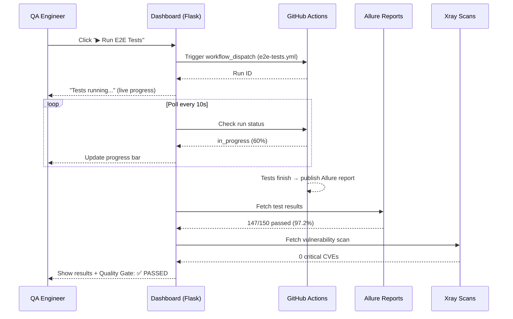
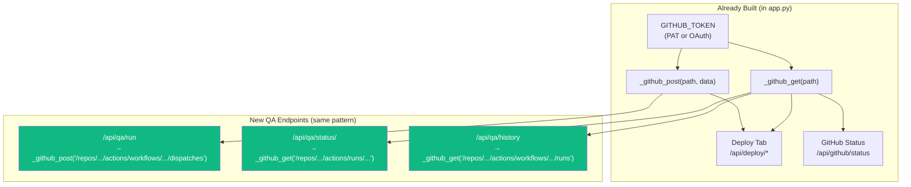
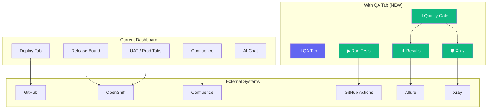

# QA Automation — Implementation Guide

> Step-by-step guide for the QA team: how to build, deploy, and integrate QA test pipelines into the Release Readiness Dashboard.

---

## What We're Building

A new **"🧪 QA" tab** on the Release Readiness Dashboard that lets the QA team:

1. **Run test suites** (E2E, regression, performance, smoke) with one click
2. **See test results** from Allure — pass/fail breakdown, trends, failure details
3. **View quality gate** — a single go/no-go decision combining all test suites + Xray scans
4. **Manage test environments** — run against standing UAT or spin up on-demand

```
┌─────────────────────────────────────────────────────────────────────────┐
│  Release Readiness Dashboard                                            │
│ ┌──────┬──────┬──────┬──────┬───────┬──────┬──────┬──────┬────────────┐ │
│ │Board │ UAT  │ Prod │Drift │Export │Audit │Deploy│ Chat │   🧪 QA   │ │
│ └──────┴──────┴──────┴──────┴───────┴──────┴──────┴──────┴────────────┘ │
│                                                                         │
│  🧪 QA — NEW TAB                                                       │
│ ┌──────────────────────────────────────────────────────────────────────┐ │
│ │  🚦 Quality Gate: PASSED                                            │ │
│ │  ✅ E2E: 97.2%  ✅ Regression: 99.1%  ⚠️ Perf P99: 480ms         │ │
│ │  ✅ Smoke: 100%  ✅ Xray: 0 critical CVEs                          │ │
│ ├──────────────────────────────────────────────────────────────────────┤ │
│ │  ▶ Run E2E Tests   ▶ Run Regression   ▶ Run Perf   ▶ Run Smoke    │ │
│ │  Environment: [UAT ▼]   Version: [auto from board]                 │ │
│ ├──────────────────────────────────────────────────────────────────────┤ │
│ │  📊 Latest Results                                                  │ │
│ │  ┌────────────┬────────────┬────────────┬────────────┐              │ │
│ │  │ E2E        │ Regression │ Performance│ Smoke      │              │ │
│ │  │ ✅ 147/150 │ ✅ 298/300 │ ✅ P99:480 │ ✅ 50/50   │              │ │
│ │  │ 97.2%      │ 99.1%      │ <500ms     │ 100%       │              │ │
│ │  │ 12m ago    │ 3h ago     │ 1d ago     │ 2h ago     │              │ │
│ │  │ [Allure ↗] │ [Allure ↗] │ [Allure ↗] │ [Allure ↗] │              │ │
│ │  └────────────┴────────────┴────────────┴────────────┘              │ │
│ ├──────────────────────────────────────────────────────────────────────┤ │
│ │  📈 Trend (Last 10 Runs)                                           │ │
│ │  E2E:  ████████▓█ 97%                                              │ │
│ │  Regr: █████████▓ 99%                                              │ │
│ │  Perf: ████████▓█ 96%                                              │ │
│ └──────────────────────────────────────────────────────────────────────┘ │
└─────────────────────────────────────────────────────────────────────────┘
```

---

## How It Works — The Big Picture



---

## Step 1: What QA Needs to Prepare

### Your Test Workflows (GitHub Actions)

Your existing test workflows need a `workflow_dispatch` trigger so the dashboard can invoke them. Most teams already have this.

**Check**: Do your workflows already have `workflow_dispatch`?

```bash
# Check your existing workflow files
grep -r "workflow_dispatch" .github/workflows/
```

If not, add this to each test workflow:

```yaml
# .github/workflows/e2e-tests.yml
name: E2E Tests
on:
  push:              # ← keep your existing triggers
    branches: [main]
  workflow_dispatch:  # ← ADD THIS LINE
    inputs:
      environment:
        description: 'Target environment'
        required: true
        default: 'uat'
        type: choice
        options:
          - uat
          - staging
      version:
        description: 'Image tag to test (optional — uses latest if empty)'
        required: false
        type: string

# ... rest of your existing workflow
```

That's it. **No changes to your tests.** The dashboard just triggers the same workflow that already runs on push/schedule.

### Required Secrets / Tokens

| What | Where to Get | Used By |
|---|---|---|
| `GITHUB_TOKEN` (PAT) | GitHub Settings → Developer Settings → Personal Access Tokens | Dashboard → trigger workflows |
| `ALLURE_URL` | Your Allure server URL | Dashboard → fetch results |
| `ALLURE_TOKEN` | Allure TestOps → API Tokens | Dashboard → authenticate |
| `XRAY_URL` | JFrog Platform → Xray | Dashboard → vulnerability results |
| `XRAY_TOKEN` | JFrog → API Keys | Dashboard → authenticate |

> **Note**: The dashboard already uses `GITHUB_TOKEN` for the Deploy tab. The same token works for triggering workflows — it just needs `actions:write` scope added.

---

## Step 2: Where to Store the MCP Servers

### Option A: Inside Release Readiness (Recommended — Fastest)

Since the dashboard already has GitHub API integration (`_github_get`, `_github_post` helpers), the simplest approach is to add the QA endpoints **directly into `app.py`** — no separate MCP server needed for v1.

```
release_readiness/
├── app.py                    ← Add /api/qa/* endpoints here
├── templates/
│   └── index.html            ← Add QA tab UI here
└── docs/
    └── QA-AUTOMATION-MCP-DESIGN.md
```

**Why this is fastest**:
- Reuses existing `GITHUB_TOKEN`, `_github_get()`, `_github_post()` helpers
- No new deployment, no new container, no new service
- QA tab is just another tab like UAT/Prod/Deploy

### Option B: Separate MCP Server (Production Scale)

For production with multiple teams, build dedicated MCP servers:

```
enterprise-mcp-servers/        ← Your existing MCP repo
├── test-runner-mcp/
│   ├── server.py              ← GitHub Actions trigger
│   ├── config.py              ← Workflow file mapping
│   ├── Dockerfile
│   └── requirements.txt
├── test-results-mcp/
│   ├── server.py              ← Allure API client
│   ├── allure_client.py
│   ├── Dockerfile
│   └── requirements.txt
└── xray-security-mcp/
    ├── server.py              ← Xray scan results
    ├── xray_client.py
    ├── Dockerfile
    └── requirements.txt
```

Deploy each as a separate pod on OpenShift. The dashboard connects via `QA_MCP_URL` (same pattern as `CONFLUENCE_MCP_URL`).

### Recommendation

> **Start with Option A** (add to app.py). If the QA team loves it and usage grows, refactor into separate MCP servers (Option B) later. The API endpoints stay the same either way.

---

## Step 3: The API Endpoints (What Gets Built)

These endpoints go into `app.py` (Option A) or the MCP server (Option B):

### Test Runner Endpoints

```
POST /api/qa/run
  Body: { "suite": "e2e", "environment": "uat", "version": "2.4.1" }
  Response: { "run_id": 12345, "status": "triggered", "html_url": "https://github.com/..." }

GET /api/qa/status/<run_id>
  Response: { "status": "in_progress", "conclusion": null, "started_at": "..." }

POST /api/qa/cancel/<run_id>
  Response: { "cancelled": true }

GET /api/qa/history/<suite>?limit=10
  Response: [{ "run_id": 12345, "status": "completed", "conclusion": "success", ... }]
```

### Test Results Endpoints

```
GET /api/qa/results/<run_id>
  Response: {
    "total": 150, "passed": 147, "failed": 3, "skipped": 0,
    "pass_rate": 97.2, "duration_seconds": 840,
    "report_url": "https://allure.company.com/launch/456",
    "failures": [
      { "name": "test_checkout_flow", "message": "Timeout after 30s", "category": "broken" }
    ]
  }

GET /api/qa/results/latest?suite=e2e&environment=uat
  Response: { ... same as above, for the latest run ... }

GET /api/qa/results/trend?suite=e2e&days=30
  Response: [{ "date": "2026-05-21", "pass_rate": 97.2, "total": 150 }, ...]
```

### Quality Gate Endpoint

```
GET /api/qa/quality-gate
  Response: {
    "overall": "PASSED",
    "checks": [
      { "name": "E2E Pass Rate", "value": 97.2, "threshold": 95, "status": "passed" },
      { "name": "Regression Pass Rate", "value": 99.1, "threshold": 98, "status": "passed" },
      { "name": "Performance P99", "value": 480, "threshold": 500, "status": "warning" },
      { "name": "Xray Critical CVEs", "value": 0, "threshold": 0, "status": "passed" },
    ],
    "can_release": true,
    "last_updated": "2026-05-21T14:30:00Z"
  }
```

### Xray Security Endpoints

```
GET /api/qa/xray/scan?image=billing-service&tag=v2.4.1
  Response: {
    "critical": 0, "high": 3, "medium": 12, "low": 45,
    "total_cves": 60,
    "policy_status": "PASSED",
    "violations": [
      { "cve": "CVE-2026-1234", "severity": "high", "component": "log4j", "fixed_version": "2.20.0" }
    ]
  }
```

---

## Step 4: How It Integrates with Existing GitHub Auth

The dashboard already has GitHub integration. Here's how QA reuses it:



**Key point**: No new GitHub tokens needed. The existing `GITHUB_TOKEN` just needs the `actions:write` scope added (if not already present).

```python
# Existing code in app.py (already there)
GITHUB_TOKEN = os.getenv('GITHUB_TOKEN', '')
GITHUB_API   = 'https://api.github.com'  # or GitHub Enterprise URL

def _github_get(path, params=None):
    """GET request to GitHub API."""
    url = f'{GITHUB_API}{path}'
    r = gh_http.get(url, headers=_github_headers(), params=params, timeout=15)
    return r.json()

def _github_post(path, data=None):
    """POST request to GitHub API."""
    url = f'{GITHUB_API}{path}'
    r = gh_http.post(url, headers=_github_headers(), json=data, timeout=15)
    return r

# NEW: QA endpoints use the same helpers
@app.route('/api/qa/run', methods=['POST'])
def qa_run_tests():
    data = request.json
    suite = data.get('suite', 'e2e')
    workflow_file = QA_SUITE_WORKFLOWS.get(suite)
    
    # Trigger using existing GitHub helper
    resp = _github_post(
        f'/repos/{QA_REPO}/actions/workflows/{workflow_file}/dispatches',
        data={
            "ref": "main",
            "inputs": {
                "environment": data.get('environment', 'uat'),
                "version": data.get('version', ''),
            }
        }
    )
    # ... return run_id
```

---

## Step 5: Configuration

Add these environment variables to the dashboard deployment:

```yaml
# deployment.yaml (add to existing env section)
env:
  # ── Existing (already configured) ──
  - name: GITHUB_TOKEN
    valueFrom:
      secretKeyRef:
        name: release-readiness-secrets
        key: github-token

  # ── NEW: QA Test Runner ──
  - name: QA_TEST_REPO
    value: "your-org/qa-tests"          # GitHub repo with test workflows
  - name: QA_WORKFLOW_E2E
    value: "e2e-tests.yml"              # Workflow filename for E2E
  - name: QA_WORKFLOW_REGRESSION
    value: "regression-suite.yml"       # Workflow filename for regression
  - name: QA_WORKFLOW_PERFORMANCE
    value: "performance-tests.yml"      # Workflow filename for perf
  - name: QA_WORKFLOW_SMOKE
    value: "smoke-tests.yml"            # Workflow filename for smoke

  # ── NEW: Allure Results ──
  - name: ALLURE_URL
    value: "https://allure.company.com"
  - name: ALLURE_TOKEN
    valueFrom:
      secretKeyRef:
        name: release-readiness-secrets
        key: allure-token

  # ── NEW: Xray Security ──
  - name: XRAY_URL
    value: "https://xray.company.com"
  - name: XRAY_TOKEN
    valueFrom:
      secretKeyRef:
        name: release-readiness-secrets
        key: xray-token
```

---

## Step 6: The QA Tab UI

### What the QA team sees

The QA tab has 4 sections:

#### Section 1: Quality Gate (top)

A big status banner showing the release readiness verdict:

```
┌──────────────────────────────────────────────────────────────┐
│  🚦 QUALITY GATE: ✅ PASSED — Ready for Release             │
│                                                              │
│  ✅ E2E Pass Rate       97.2%  ≥ 95%   ✓                    │
│  ✅ Regression          99.1%  ≥ 98%   ✓                    │
│  ⚠️ Performance P99    480ms  ≤ 500ms  ⚠ close to threshold │
│  ✅ Smoke Tests         100%   ≥ 100%  ✓                    │
│  ✅ Xray Critical       0      ≤ 0     ✓                    │
│  ⚠️ Xray High          3      ≤ 5     ⚠                    │
│                                                              │
│  [📋 Full Report]  [🔓 Override Gate]                        │
└──────────────────────────────────────────────────────────────┘
```

#### Section 2: Run Tests (action bar)

```
┌──────────────────────────────────────────────────────────────┐
│  ▶ Run Tests                                                 │
│                                                              │
│  Suite: [E2E ▼]  Environment: [UAT ▼]  Version: [auto ▼]   │
│                                                              │
│  [▶ Run Selected Suite]  [▶▶ Run All Suites]                │
│                                                              │
│  ℹ️ Versions auto-populated from the release board           │
└──────────────────────────────────────────────────────────────┘
```

#### Section 3: Live Test Results

```
┌──────────────────────────────────────────────────────────────┐
│  📊 Test Results                                             │
│                                                              │
│  ┌──────────────┐ ┌──────────────┐ ┌──────────────┐        │
│  │ 🧪 E2E       │ │ 🧪 Regression│ │ 🧪 Performance│        │
│  │              │ │              │ │              │        │
│  │   97.2%      │ │   99.1%      │ │   P99: 480ms │        │
│  │  147/150     │ │  298/300     │ │   avg: 120ms │        │
│  │              │ │              │ │              │        │
│  │ 🟢 3 failed  │ │ 🟢 2 failed  │ │ 🟢 passed    │        │
│  │ ⏱ 14 min     │ │ ⏱ 45 min     │ │ ⏱ 22 min     │        │
│  │ 12 min ago   │ │ 3 hrs ago    │ │ 1 day ago    │        │
│  │              │ │              │ │              │        │
│  │ [Allure ↗]   │ │ [Allure ↗]   │ │ [Allure ↗]   │        │
│  │ [GHA Run ↗]  │ │ [GHA Run ↗]  │ │ [GHA Run ↗]  │        │
│  └──────────────┘ └──────────────┘ └──────────────┘        │
│                                                              │
│  ❌ Failed Tests (3)                                         │
│  ├── test_checkout_flow — Timeout after 30s     [Allure ↗]  │
│  ├── test_payment_retry — 500 Internal Error    [Allure ↗]  │
│  └── test_email_notify — SMTP connection refused[Allure ↗]  │
└──────────────────────────────────────────────────────────────┘
```

#### Section 4: Xray Security Summary

```
┌──────────────────────────────────────────────────────────────┐
│  🛡️ Xray Security Scan                                      │
│                                                              │
│  Critical: 0  High: 3  Medium: 12  Low: 45                  │
│                                                              │
│  ⚠️ High Severity (3)                                       │
│  ├── CVE-2026-1234 — log4j 2.17.0 (fix: 2.20.0)           │
│  ├── CVE-2026-5678 — spring-core 5.3.20 (fix: 5.3.27)     │
│  └── CVE-2026-9012 — jackson-databind (fix: 2.15.0)        │
│                                                              │
│  [View Full Xray Report ↗]                                   │
└──────────────────────────────────────────────────────────────┘
```

---

## Step 7: Implementation Phases

### Phase 1 — Test Runner (Week 1)

**Goal**: QA can trigger GitHub Actions workflows from the dashboard

```
What to build:
1. Add QA config to app.py (QA_TEST_REPO, QA_SUITE_WORKFLOWS)
2. Add /api/qa/run endpoint (trigger workflow_dispatch)
3. Add /api/qa/status/<run_id> endpoint (poll GHA run status)
4. Add /api/qa/history/<suite> endpoint (recent runs)
5. Add QA tab UI with suite selector + "Run" button + progress bar
6. Add live polling (every 10s while tests run)
```

**QA team action**: Share your workflow filenames (e.g., `e2e-tests.yml`)

### Phase 2 — Allure Results (Week 2)

**Goal**: Test results appear on the dashboard with Allure links

```
What to build:
1. Add /api/qa/results/<run_id> endpoint (fetch from Allure API)
2. Add /api/qa/results/latest endpoint (latest per suite)
3. Add test result cards (pass/fail gauges) to QA tab
4. Add failure list with stack traces
5. Add "Open Allure Report" links
6. Add trend sparklines (last 10 runs)
```

**QA team action**: Provide Allure server URL and API token

### Phase 3 — Quality Gate (Week 3)

**Goal**: Single go/no-go verdict for release sign-off

```
What to build:
1. Add quality gate rules config (thresholds per suite)
2. Add /api/qa/quality-gate endpoint (aggregate check)
3. Add quality gate banner to QA tab (and also to Board tab)
4. Add override mechanism (QA lead can override with reason)
5. Log gate decisions to audit trail
```

**QA team action**: Define pass/fail thresholds for each suite

### Phase 4 — Xray Integration (Week 3-4)

**Goal**: CVE visibility on the release board

```
What to build:
1. Add /api/qa/xray/scan endpoint (fetch from Xray API)
2. Add security badge next to each nominated service
3. Add Xray summary to Quality Gate checks
4. Block release if critical CVEs > 0
```

**QA team action**: Provide Xray API URL and token

### Phase 5 — On-Demand Environments (Week 4-5)

**Goal**: Spin up isolated test environments for specific versions

```
What to build:
1. Add /api/qa/env/provision endpoint (create OpenShift namespace)
2. Deploy services at board-nominated versions
3. Auto-delete after test completion or 4h TTL
4. Add environment management UI to QA tab
```

**QA team action**: Provide namespace permissions, base deployment specs

---

## FAQ for QA Team

### Q: Do we need to change our tests?
**No.** Your tests stay exactly as they are. The dashboard just triggers the same GitHub Actions workflows that already run. The only change is adding `workflow_dispatch` to the trigger list (if not already there).

### Q: Does this replace our existing CI/CD?
**No.** This is an additional way to trigger tests — from the dashboard UI. Your existing push/PR triggers, scheduled runs, etc. all continue working.

### Q: What if a test fails?
The dashboard shows the failure with a link to the Allure report. QA investigates using Allure just like today. The quality gate prevents release sign-off until the issue is resolved.

### Q: Can we still run tests from GitHub?
**Yes.** The dashboard triggers the exact same workflows. You can still go to GitHub Actions → Run workflow manually, or let them run on push. Results show up on the dashboard either way.

### Q: What permissions does the GitHub token need?
The existing `GITHUB_TOKEN` needs the `actions:write` scope added. Everything else (`repo:read`, etc.) is already configured for the Deploy tab.

### Q: How does version auto-populate?
When a service is nominated on the Release Board (e.g., `billing-service v2.4.1`), the QA tab automatically picks up those versions. So when you click "Run E2E Tests", it tests the exact versions being released.

### Q: What happens if Allure is down?
The dashboard falls back to GitHub Actions' built-in test report (JUnit XML). Results are less detailed but still show pass/fail counts.

---

## Architecture Comparison: Current vs. With QA



---

## Checklist: What QA Team Needs to Provide

- [ ] **Test repo name** — GitHub org/repo where test workflows live (e.g., `your-org/qa-tests`)
- [ ] **Workflow filenames** — The `.yml` files for each suite:
  - [ ] E2E: `__________.yml`
  - [ ] Regression: `__________.yml`
  - [ ] Performance: `__________.yml`
  - [ ] Smoke: `__________.yml`
- [ ] **Allure server URL** — e.g., `https://allure.company.com`
- [ ] **Allure API token** — for fetching results
- [ ] **Xray API URL** — e.g., `https://xray.company.com`
- [ ] **Xray API token** — for fetching scan results
- [ ] **Quality gate thresholds**:
  - [ ] E2E minimum pass rate: ____%
  - [ ] Regression minimum pass rate: ____%
  - [ ] Performance P99 max: ____ms
  - [ ] Smoke minimum pass rate: ____%
  - [ ] Max critical CVEs allowed: ____
  - [ ] Max high CVEs allowed: ____
- [ ] **GitHub PAT scope** — confirm `actions:write` is enabled on the existing token

---

*Last updated: 2026-05-21*
