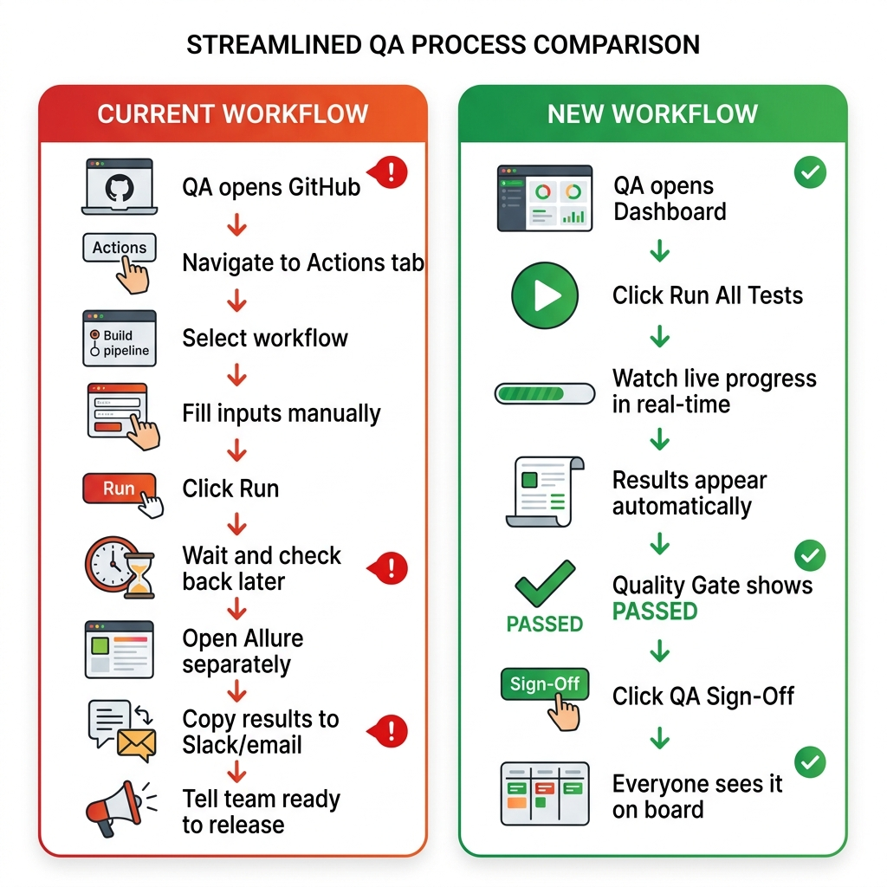

# QA Automation — Implementation Guide

> Step-by-step guide for the QA team: how the test pipeline integrates with the Release Readiness Dashboard.

---

## Your Application Stack

| Layer | Count | Technology |
|---|---|---|
| **UI Apps** | 3+ | Node.js |
| **API Services** | 25+ | Python |
| **Total** | ~28+ services | Full stack |

## What We're Building

A new **"🧪 QA" tab** on the Release Readiness Dashboard that lets the QA team:

1. **Run tests** (E2E, smoke, regression) with one click — triggers your existing single pipeline
2. **See results** from Allure — pass/fail breakdown, trends, failure details
3. **View quality gate** — a go/no-go for QA sign-off
4. **Manage the UAT testing environment** — deploy all services (prod versions + release candidates) to a dedicated UAT namespace on GDC

> **Not included**: Performance testing (LoadRunner) and security scanning (Xray) both already run in your CI pipeline and are not integrated into the dashboard.

---

## Why This Matters — Current vs. New

### The Current Workflow (Today)



**Pain points with the current approach:**

1. 🔀 **Context switching** — QA has to jump between GitHub Actions, Allure, Slack, release board
2. ⏳ **No visibility** — Team can't see test status without asking QA or checking GitHub themselves
3. 📋 **Manual tracking** — QA manually tracks which suites passed/failed, copies results to Slack
4. 🔗 **Disconnected from release** — Test results live in GitHub/Allure, release decisions happen on the board — no link between them
5. 🎯 **Wrong versions** — QA might test against versions different from what's being released
6. ❓ **"Are we ready?"** — Everyone asks QA this question, and QA has to manually check all suites before answering
7. 📊 **No trend data** — Hard to see if test pass rates are improving or degrading over time

### The New Workflow (With Dashboard)

The new workflow reduces 9 manual steps to a single click:

### Side-by-Side Comparison

| Aspect | Current (GitHub) | New (Dashboard) |
|---|---|---|
| **Trigger tests** | Go to GitHub → Actions → Select workflow → Fill inputs → Run | One click: "▶ Run E2E" on the dashboard |
| **Which version to test?** | QA manually checks the release board, copies image tags | Auto-populated from the release board nominations |
| **Monitor progress** | Keep refreshing GitHub Actions page | Live progress bar on the dashboard |
| **View results** | Open Allure in a separate tab, navigate to the report | Results appear right on the dashboard with Allure link |
| **Track all suites** | QA mentally tracks: "E2E ✅, Regression ✅, Smoke ❓" | Quality Gate banner: all suites aggregated in one view |
| **Communicate readiness** | Copy results → paste in Slack → "@team we're good to go" | "✅ QA Sign-Off" button — visible to everyone on the board |
| **Historical trends** | Dig through GitHub Actions run history | Trend sparklines right on the dashboard |
| **Team visibility** | Only QA knows the test status | Everyone on the board sees 🚦 Quality Gate status |
| **Environment setup** | Manually coordinate with DevOps for test environments | One-click UAT environment setup from the dashboard |
| **Audit trail** | Scattered across Slack messages and GHA logs | Built-in: who signed off, when, which runs passed |

### Time Savings

| Activity | Current | New | Saved |
|---|---|---|---|
| Trigger 3 test suites | ~10 min (navigate, fill inputs ×3) | ~30 sec (one click "Run All") | **~9 min** |
| Check all results | ~15 min (open 3 Allure reports, compare) | ~0 min (auto-displayed) | **~15 min** |
| Communicate status | ~10 min (screenshot, Slack, explain) | ~5 sec (click "QA Sign-Off") | **~10 min** |
| Answer "are we ready?" | ~5 min (check each suite, respond) | ~0 min (Quality Gate visible to all) | **~5 min** |
| **Per release cycle** | **~40 min of manual work** | **~1 min** | **~39 min** |

### Key Benefits Summary

| Benefit | Description |
|---|---|
| 🎯 **Version accuracy** | Tests always run against the exact versions nominated on the release board — no mismatch |
| 📡 **Full visibility** | Everyone (QA, dev, management) sees test status on the same dashboard — no asking around |
| ⚡ **One-click execution** | "Run All" triggers smoke → e2e → regression sequentially, stops on first failure |
| ⏰ **Auto-trigger after cutoff** | Tests start automatically when the board locks at cutoff (Wed 12 PM) — results ready when QA checks |
| 🚦 **Clear go/no-go** | Quality Gate gives a single answer: "Can we release?" — no guessing |
| 📝 **Audit trail** | QA sign-off is recorded: who, when, which runs passed — compliance-ready |
| 📈 **Trend tracking** | See pass rate trends over the last 10 releases — catch regressions early |
| 🖥️ **Dedicated UAT env** | Deploy all 28+ services to a dedicated UAT testing namespace on GDC with one click |
| ♻️ **Same pipeline** | Zero changes to existing tests — dashboard triggers the same GitHub Actions workflow |

---

## How It Works — The Big Picture

Your QA pipeline is a **single GitHub Actions workflow** that takes a `test_type` flag to run different suites. The dashboard simply triggers this same workflow.


### Key Point: One Pipeline, Three Test Types

```
┌──────────────────────────────────────────────────────┐
│  test-pipeline.yml                                    │
│                                                       │
│  inputs:                                              │
│    test_type: [e2e | smoke | regression]              │
│    environment: uat-testing (GDC namespace)            │
│                                                       │
│  Dashboard triggers the SAME workflow                 │
│  that already runs on push/schedule.                  │
│  No changes to your tests needed.                     │
└──────────────────────────────────────────────────────┘
```

---

## Step 1: What QA Needs to Prepare

### Your Test Pipeline

Your existing pipeline needs a `workflow_dispatch` trigger. Check if it already has one:

```bash
grep "workflow_dispatch" .github/workflows/test-pipeline.yml
```

If not, add it to the existing `on:` section:

```yaml
# .github/workflows/test-pipeline.yml (your existing file)
name: Test Pipeline
on:
  push:                    # ← keep existing triggers
    branches: [main]
  schedule:                # ← keep if you have scheduled runs
    - cron: '0 6 * * *'
  workflow_dispatch:       # ← ADD THIS BLOCK
    inputs:
      test_type:
        description: 'Test type to run'
        required: true
        type: choice
        options:
          - e2e
          - smoke
          - regression
      environment:
        description: 'Target environment (GDC namespace)'
        required: true
        default: 'uat-testing'
        type: string

# Rest of your pipeline stays exactly the same
jobs:
  test:
    runs-on: [self-hosted]
    steps:
      # ... your existing test steps ...
```

**That's it.** No changes to your tests. The dashboard triggers the exact same workflow.

### Required Tokens

| What | Scope Needed | Who Creates It |
|---|---|---|
| `GITHUB_TOKEN` | `actions:write` + `repo:read` | DevOps (may already exist — used by Deploy tab) |
| `ALLURE_TOKEN` | API read access | QA team |

> **Note**: The dashboard already uses `GITHUB_TOKEN` for the Deploy tab. The same token works — just needs `actions:write` scope added if not already present.

---

## Step 2: Where This Gets Built

### Recommended: Add directly to the dashboard (fastest)

Since the dashboard already has GitHub API helpers, the QA endpoints go **directly into `app.py`** — no separate server needed for v1.

```
release_readiness/
├── app.py                    ← Add /api/qa/* endpoints here
├── templates/
│   └── index.html            ← Add QA tab here
└── docs/
    ├── QA-AUTOMATION-MCP-DESIGN.md
    └── QA-IMPLEMENTATION-GUIDE.md   ← This file
```

The dashboard already has `_github_get()` and `_github_post()` helper functions. QA endpoints just reuse them:

```python
# Already exists in app.py
_github_post('/repos/your-org/qa-tests/actions/workflows/test-pipeline.yml/dispatches', {
    "ref": "main",
    "inputs": {"test_type": "e2e", "environment": "uat-testing"}
})
```

---

## Step 3: The QA Tab UI

### What the QA team sees on the dashboard:

```
┌─────────────────────────────────────────────────────────────────────────┐
│  Release Readiness Dashboard                                            │
│ ┌──────┬──────┬──────┬──────┬───────┬──────┬──────┬──────┬────────────┐ │
│ │Board │ UAT  │ Prod │Drift │Export │Audit │Deploy│ Chat │   🧪 QA   │ │
│ └──────┴──────┴──────┴──────┴───────┴──────┴──────┴──────┴────────────┘ │
└─────────────────────────────────────────────────────────────────────────┘
```

### Section 1: Quality Gate Banner

```
┌──────────────────────────────────────────────────────────────┐
│  🚦 QUALITY GATE: ✅ PASSED — Ready for QA Sign-Off         │
│                                                              │
│  ✅ E2E Pass Rate       97.2%  ≥ 95%   ✓                    │
│  ✅ Regression          99.1%  ≥ 98%   ✓                    │
│  ✅ Smoke Tests         100%   ≥ 100%  ✓                    │
│                                                              │
│  [📋 Full Report]  [✅ QA Sign-Off]                          │
└──────────────────────────────────────────────────────────────┘
```

### Section 2: Run Tests

```
┌──────────────────────────────────────────────────────────────┐
│  ▶ Run Tests                                                 │
│                                                              │
│  Test Type: [E2E ▼]   Environment: [uat-testing (GDC)]            │
│                                                              │
│  Versions auto-populated from the release board              │
│                                                              │
│  [▶ Run Selected]  [▶▶ Run All (E2E + Smoke + Regression)]  │
│                                                              │
│  ⚡ Run All triggers 3 sequential GitHub Actions runs:       │
│     1. smoke → 2. e2e → 3. regression                       │
│                                                              │
│  ⏰ Auto-Trigger: [ON ▼]                                     │
│  ℹ️ Tests auto-run after board locks at cutoff (Wed 12 PM)   │
│     Next scheduled: Wed, May 28 12:05 PM                     │
└──────────────────────────────────────────────────────────────┘
```

**Auto-Trigger Flow**:
1. Board auto-locks at cutoff (Wednesday 12 PM) — nominations are frozen
2. Dashboard waits 5 minutes (configurable) for any last-minute changes
3. Automatically triggers: smoke → e2e → regression
4. Results appear on the QA tab as each suite completes
5. QA checks the dashboard later — results are already there
6. If all pass → Quality Gate shows ✅ PASSED, ready for sign-off

### Section 3: Test Results Cards

```
┌──────────────────────────────────────────────────────────────┐
│  📊 Latest Results                                           │
│                                                              │
│  ┌─────────────────┐  ┌─────────────────┐  ┌──────────────┐ │
│  │ 🧪 E2E          │  │ 🧪 Regression   │  │ 🧪 Smoke     │ │
│  │                 │  │                 │  │              │ │
│  │   97.2%         │  │   99.1%         │  │   100%       │ │
│  │   147/150       │  │   298/300       │  │   50/50      │ │
│  │                 │  │                 │  │              │ │
│  │ 🟢 3 failed     │  │ 🟢 2 failed     │  │ 🟢 0 failed  │ │
│  │ ⏱ 14 min        │  │ ⏱ 45 min        │  │ ⏱ 3 min      │ │
│  │ 12 min ago      │  │ 3 hrs ago       │  │ 2 hrs ago    │ │
│  │                 │  │                 │  │              │ │
│  │ [📊 Allure ↗]   │  │ [📊 Allure ↗]   │  │ [📊 Allure ↗]│ │
│  │ [🔗 GHA Run ↗]  │  │ [🔗 GHA Run ↗]  │  │ [🔗 GHA ↗]  │ │
│  └─────────────────┘  └─────────────────┘  └──────────────┘ │
│                                                              │
│  ❌ Failed Tests (5 total)                                   │
│  ├── test_checkout_flow — Timeout 30s        [Allure ↗]     │
│  ├── test_payment_retry — 500 Error          [Allure ↗]     │
│  ├── test_email_notify — SMTP refused        [Allure ↗]     │
│  ├── test_user_signup  — Assertion failed    [Allure ↗]     │
│  └── test_order_cancel — Connection reset    [Allure ↗]     │
└──────────────────────────────────────────────────────────────┘
```

### Section 4: UAT Testing Environment

```
┌──────────────────────────────────────────────────────────────┐
│  🖥️ UAT Testing Environment (GDC)                            │
│                                                              │
│  Namespace: uat-testing                                      │
│  Platform:  Google Distributed Cloud                         │
│  Status:    ✅ 28 services running                            │
│                                                              │
│  📋 From Release Board (8 release candidates):               │
│  ┌──────────────────┬────────┬─────────────────┬──────────┐ │
│  │ Service          │ Version│ Source           │ Status   │ │
│  ├──────────────────┼────────┼─────────────────┼──────────┤ │
│  │ billing-service  │ v2.3.4 │ 📋 Board         │ ✅ Running│ │
│  │ payment-gateway  │ v2.1.0 │ 📋 Board         │ ✅ Running│ │
│  │ order-service    │ v1.5.3 │ 📋 Board         │ ✅ Running│ │
│  └──────────────────┴────────┴─────────────────┴──────────┘ │
│                                                              │
│  🏭 From Production (20 prod-version services):              │
│  auth-service v2.7.0 ✅ | user-service v3.2.0 ✅ | ...      │
│                                                              │
│  [🧪 Prepare UAT Environment]  [🔄 Refresh Status]           │
└──────────────────────────────────────────────────────────────┘
```

---

## Step 4: UAT Testing Environment — How It Works

### The Strategy

Your app has **28+ services**. The dashboard deploys **all of them** into a dedicated UAT testing namespace on GDC:

- **Nominated services** (from the release board) → deployed at **release candidate versions**
- **Non-nominated services** → deployed at **production live versions**

This gives QA a complete environment that mirrors what production will look like **after** the release.

### How It Works

1. QA clicks **"🧪 Prepare UAT Environment"** on the dashboard
2. Dashboard reads the release board → identifies nominated services + versions
3. Dashboard reads production versions via ArgoCD API (read-only)
4. Merges: nominated services get board versions, everything else gets prod versions
5. Triggers GitHub Actions → ArgoCD MetaApp syncs all 28+ services to `uat-testing` namespace on GDC
6. Dashboard monitors sync progress via ArgoCD API
7. QA team notified: "UAT environment ready"

```
Production Cluster                         UAT Testing (uat-testing)
┌──────────────────────────────────┐       ┌──────────────────────────────────┐
│ billing-service    v2.3.3        │       │ billing-service    v2.3.4        │ ← board
│ payment-gateway    v2.0.0        │       │ payment-gateway    v2.1.0        │ ← board
│ auth-service       v2.7.0        │       │ auth-service       v2.7.0        │ ← prod
│ user-service       v3.2.0        │       │ user-service       v3.2.0        │ ← prod
│ order-service      v1.5.2        │       │ order-service      v1.5.3        │ ← board
│ ... (28+ total)                  │       │ ... (all 28+ services)          │
└──────────────────────────────────┘       └──────────────────────────────────┘
```

**Resources**: All 28+ services deployed at 1 replica each in the dedicated namespace.

---

## Step 5: API Endpoints

### Test Runner

```
POST /api/qa/run
  Body: { "test_type": "e2e", "environment": "uat" }
  Response: { "run_id": 12345, "status": "triggered", "html_url": "..." }

GET /api/qa/status/<run_id>
  Response: { "status": "in_progress", "conclusion": null }

POST /api/qa/cancel/<run_id>
  Response: { "cancelled": true }

POST /api/qa/run-all
  Body: { "environment": "uat" }
  Response: { "runs": [
    { "test_type": "smoke", "run_id": 12345 },
    { "test_type": "e2e", "run_id": 12346 },
    { "test_type": "regression", "run_id": 12347 }
  ]}
```

### Test Results

```
GET /api/qa/results/<run_id>
  Response: {
    "total": 150, "passed": 147, "failed": 3,
    "pass_rate": 97.2, "duration_seconds": 840,
    "report_url": "https://allure.company.com/launch/456",
    "failures": [{ "name": "test_checkout", "message": "Timeout 30s" }]
  }

GET /api/qa/results/latest?test_type=e2e
  Response: { ... same as above ... }
```

### Quality Gate

```
GET /api/qa/quality-gate
  Response: {
    "overall": "PASSED",
    "checks": [
      { "name": "E2E", "value": 97.2, "threshold": 95, "status": "passed" },
      { "name": "Regression", "value": 99.1, "threshold": 98, "status": "passed" },
      { "name": "Smoke", "value": 100, "threshold": 100, "status": "passed" }
    ],
    "can_release": true
  }

POST /api/qa/signoff
  Body: { "signed_off_by": "qa-lead", "notes": "All suites green" }
  Response: { "signed_off": true, "at": "2026-05-21T15:00:00Z" }
```

### UAT Testing Environment

```
POST /api/qa/env/prepare
  Body: { }
  Response: {
    "namespace": "uat-testing",
    "board_services": ["billing-service", "payment-gateway"],
    "prod_services": 20,
    "total_services": 28,
    "status": "deploying"
  }

GET /api/qa/env/status
  Response: {
    "namespace": "uat-testing",
    "synced": 25, "total": 28,
    "status": "syncing",
    "progress_pct": 89
  }

POST /api/qa/env/teardown
  Response: { "scaled_down": 28 }
```

---

## Step 6: Configuration

Add to the dashboard's environment variables:

```yaml
env:
  # ── QA Test Runner (reuses existing GITHUB_TOKEN) ──
  - name: QA_TEST_REPO
    value: "your-org/qa-tests"          # Repo with test pipeline
  - name: QA_WORKFLOW_FILE
    value: "test-pipeline.yml"          # Single workflow filename

  # ── Auto-Trigger After Cutoff ──
  - name: QA_AUTO_TRIGGER
    value: "true"                        # Enable auto-trigger when board locks
  - name: QA_AUTO_TRIGGER_DELAY_MIN
    value: "5"                           # Wait 5 min after cutoff before triggering
  - name: QA_AUTO_TRIGGER_ORDER
    value: "smoke,e2e,regression"        # Order of test suites

  # ── Allure Results ──
  - name: ALLURE_URL
    value: "https://allure.company.com"
  - name: ALLURE_TOKEN
    valueFrom:
      secretKeyRef:
        name: release-readiness-secrets
        key: allure-token

  # ── UAT Testing Environment (GDC) ──
  - name: UAT_TESTING_NAMESPACE
    value: "uat-testing"                   # Pre-provisioned dedicated UAT testing namespace on GDC
  - name: ARGOCD_URL
    value: "https://argocd.internal"       # ArgoCD server URL on GDC
  - name: ARGOCD_READ_TOKEN
    valueFrom:
      secretKeyRef:
        name: release-readiness-secrets
        key: argocd-read-token
```

---

## Step 7: Implementation Phases

### Phase 1 — Test Runner (Week 1)

```
Build:
✅ Add QA_TEST_REPO, QA_WORKFLOW_FILE config to app.py
✅ Add POST /api/qa/run endpoint (triggers workflow_dispatch with test_type)
✅ Add GET /api/qa/status/<run_id> endpoint (polls GHA run)
✅ Add QA tab UI with test type selector + "Run" button
✅ Add live polling (every 10s while tests run)

QA team action:
→ Share workflow filename (test-pipeline.yml or similar)
→ Confirm workflow_dispatch trigger is added
→ Verify GITHUB_TOKEN has actions:write scope
```

### Phase 2 — Allure Results (Week 2)

```
Build:
✅ Add GET /api/qa/results/<run_id> endpoint (fetch from Allure)
✅ Add test result cards (pass/fail gauges) to QA tab
✅ Add failure list with stack traces
✅ Add "Open Allure Report" links
✅ Add trend sparklines

QA team action:
→ Provide Allure server URL
→ Provide Allure API token
```

### Phase 3 — Quality Gate + QA Sign-Off (Week 3)

```
Build:
✅ Add quality gate rules config
✅ Add GET /api/qa/quality-gate endpoint
✅ Add quality gate banner to QA tab
✅ Add POST /api/qa/signoff endpoint
✅ Log sign-off to audit trail

QA team action:
→ Define pass/fail thresholds per test type
→ Decide who can sign off (any QA? QA lead only?)
```

### Phase 4 — UAT Testing Environment (Week 4-5)

```
Build:
✅ Add POST /api/qa/env/prepare endpoint (builds manifest, triggers ArgoCD deploy on GDC)
✅ Add GET /api/qa/env/status endpoint (monitors ArgoCD sync progress)
✅ Add POST /api/qa/env/teardown endpoint (scales down all services)
✅ Add UAT environment management UI to QA tab
✅ Add ArgoCD API integration for prod version reading + sync monitoring

QA team action:
→ Confirm ArgoCD API access (read-only token for prod, read-write for UAT testing)
→ Confirm uat-testing namespace is provisioned on GDC
```

---

## FAQ for QA Team

### Q: Do we need to change our tests?
**No.** The dashboard triggers the same `test-pipeline.yml` workflow you already use. Just make sure `workflow_dispatch` is in the trigger list.

### Q: Does this replace our test pipeline?
**No.** This is an additional way to trigger it — from the dashboard UI. Your existing push/PR/scheduled triggers continue working exactly as before.

### Q: What about performance tests (LoadRunner)?
Performance tests run separately via LoadRunner and are **not** included in the dashboard. Similarly, Xray security scans already run in your CI pipeline. The QA tab covers E2E, smoke, and regression testing only.

### Q: How does the single pipeline know which test type to run?
Your pipeline already accepts a `test_type` input (e2e / smoke / regression). The dashboard sends this as a `workflow_dispatch` input — same as selecting it manually in GitHub Actions UI.

### Q: How does "Run All" work?
It triggers the pipeline **3 times sequentially**: smoke first (fast gate), then e2e, then regression. If smoke fails, it stops and doesn't run the others.

### Q: Can we still run tests from GitHub?
**Yes.** The dashboard triggers the exact same workflow. You can still go to GitHub Actions → Run workflow manually.

### Q: What permissions does the GitHub token need?
The existing `GITHUB_TOKEN` needs `actions:write` scope. Everything else (`repo:read`, etc.) is already configured.

### Q: How does the UAT testing environment work?
The dashboard deploys **all 28+ services** into a pre-provisioned `uat-testing` namespace on GDC. Nominated services get their release candidate versions from the board; everything else gets production live versions via ArgoCD. This gives QA a complete, production-like environment with the changes being tested.

### Q: What happens when testing is complete?
The dashboard can scale down all deployments in the `uat-testing` namespace to 0 replicas. The namespace itself is pre-provisioned and persists — only the workloads are scaled down.

---

## Checklist: What QA Team Needs to Provide

- [ ] **Test repo name** — e.g., `your-org/qa-tests`
- [ ] **Workflow filename** — e.g., `test-pipeline.yml`
- [ ] **Confirm `test_type` input values** — e2e, smoke, regression (exact strings)
- [ ] **Allure server URL** — e.g., `https://allure.company.com`
- [ ] **Allure API token**
- [ ] **Quality gate thresholds**:
  - [ ] E2E minimum pass rate: ____%
  - [ ] Regression minimum pass rate: ____%
  - [ ] Smoke minimum pass rate: ____%
- [ ] **UAT namespace** — is `uat-testing` namespace provisioned on GDC?
- [ ] **ArgoCD access** — read-only token for prod versions, read-write for UAT testing sync

---

*Last updated: 2026-06-08*
