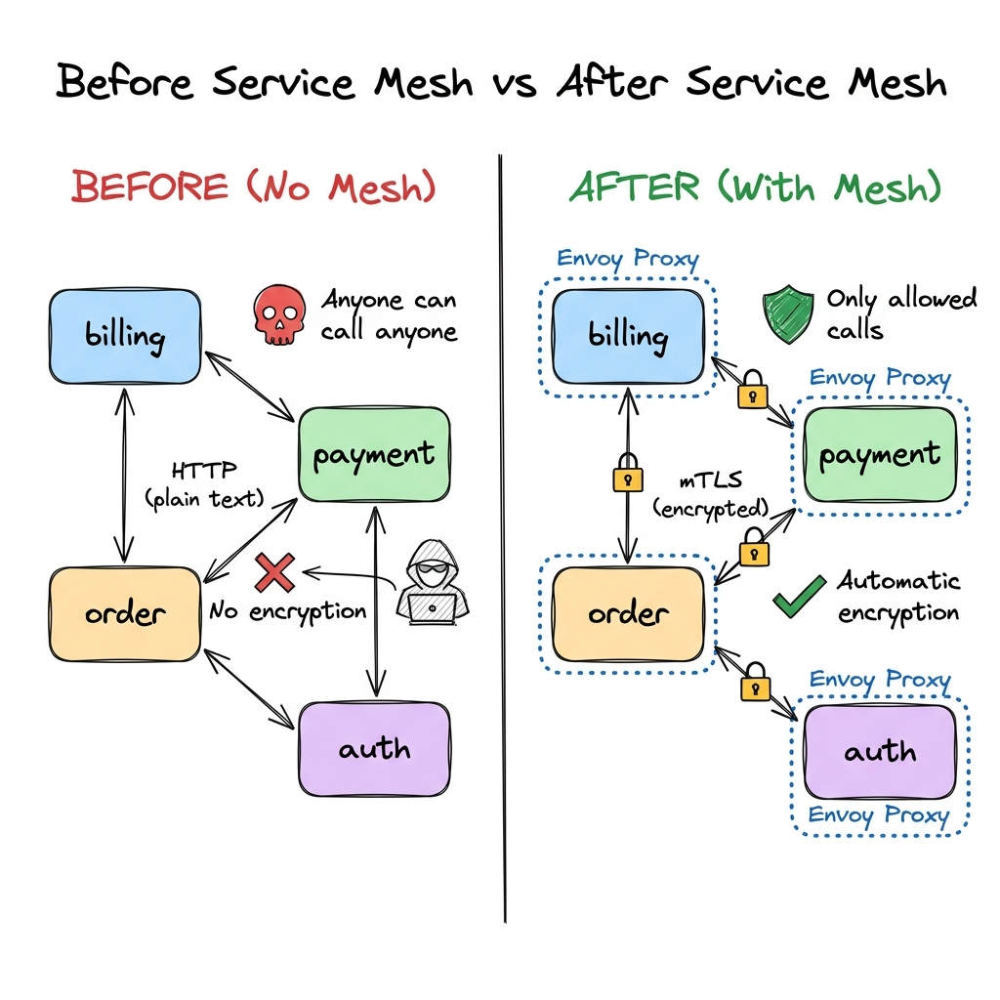
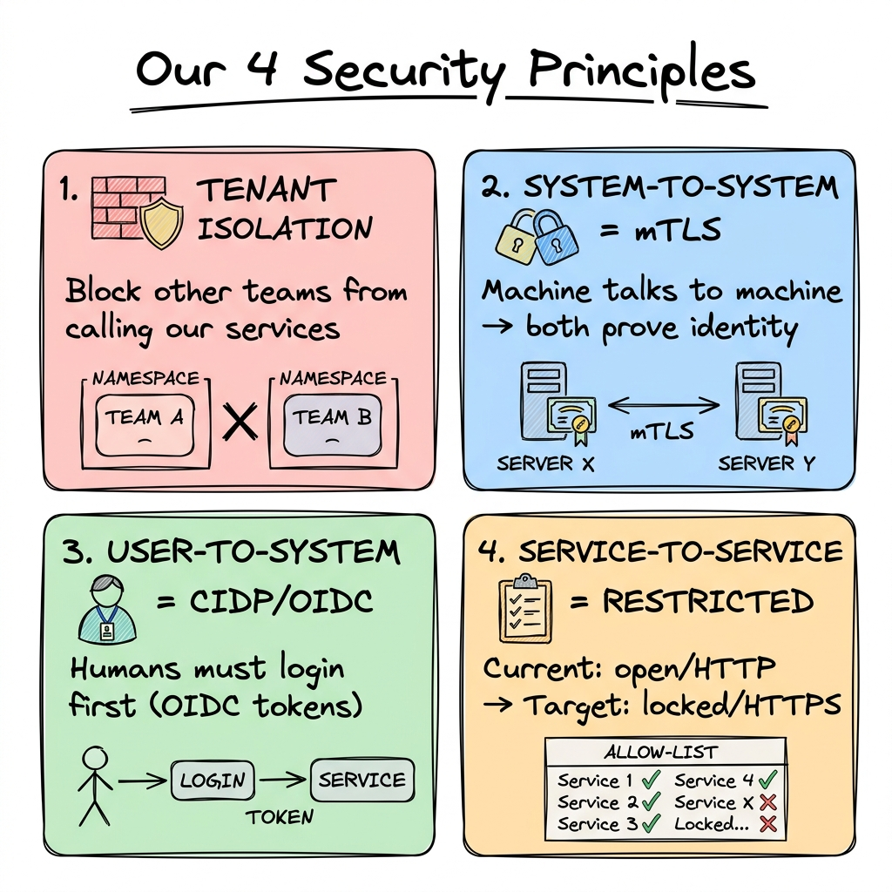
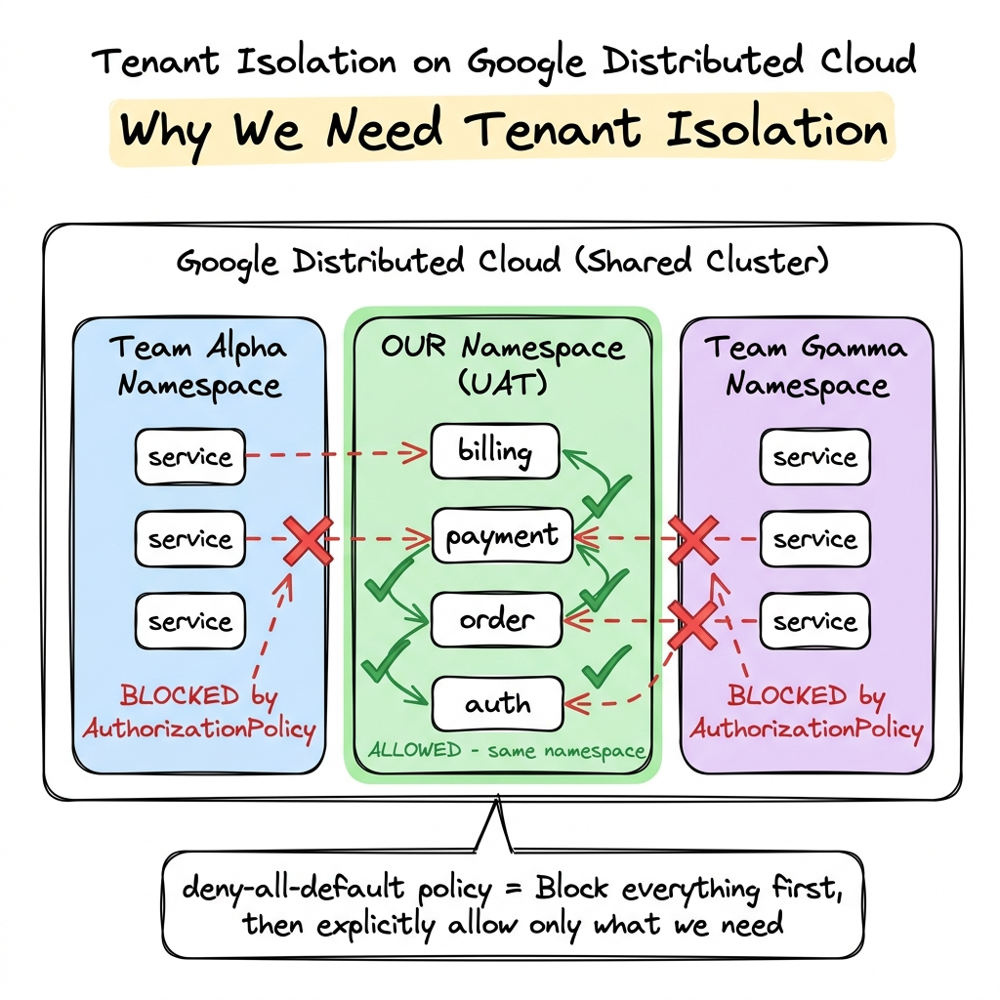
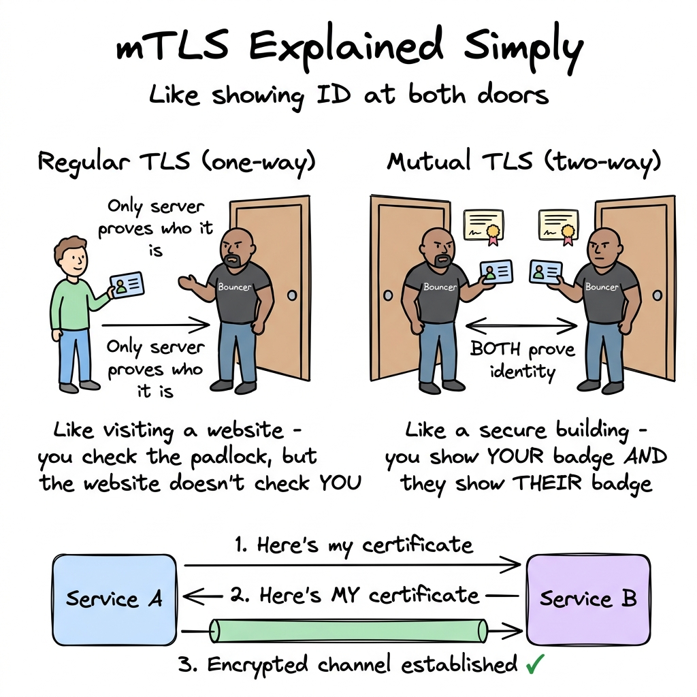
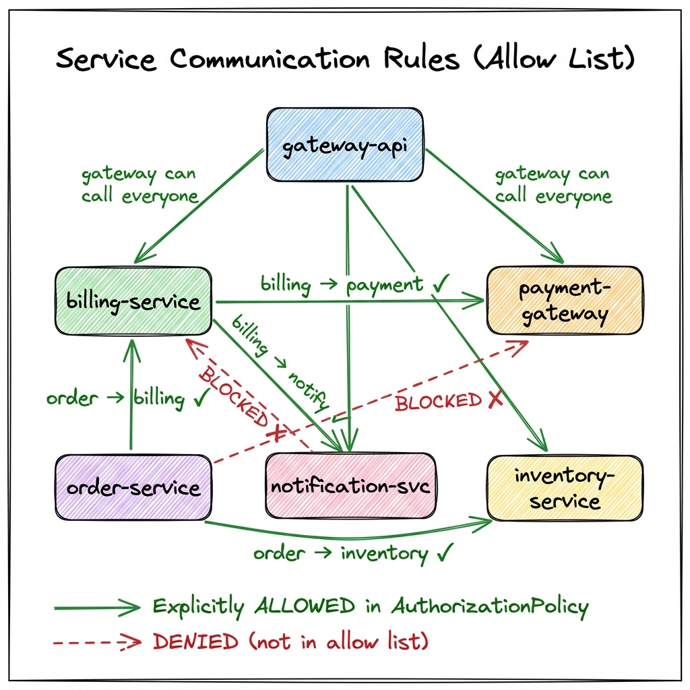
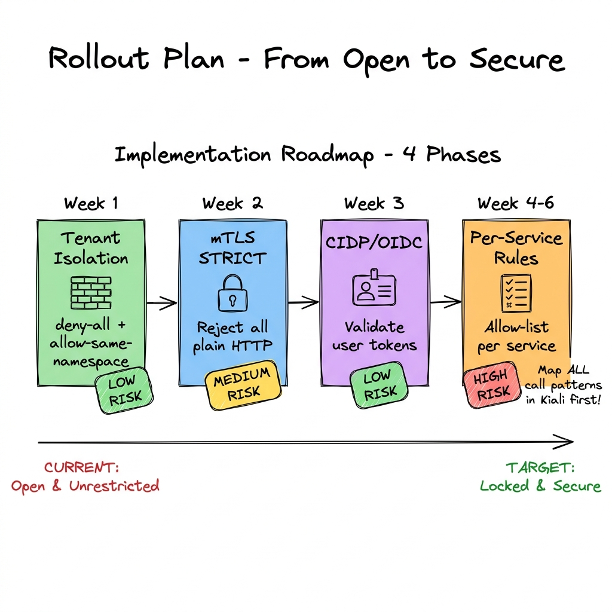

# Service Mesh Security Design
## A Beginner-Friendly Guide to Our 4 Security Principles

**Audience:** Dev Leads, Development Teams
**Purpose:** Design session walkthrough — explaining WHY we need these changes and HOW they work
**Prerequisites:** None — this guide assumes no prior knowledge of service mesh or mTLS

---

## What You'll Learn in This Session

By the end of this document, you'll understand:
1. What a service mesh actually does (in plain English)
2. Why our current setup is insecure
3. The 4 security principles we're implementing
4. What changes for developers (spoiler: almost nothing)
5. The rollout plan and timeline

---

## Part 1: What is a Service Mesh? (The 30-Second Version)

Think of a service mesh as a **security guard network** for your microservices.

Right now, when `billing-service` talks to `payment-gateway`, the request just goes directly — no checking, no encryption, no rules. It's like an office building with no doors, no locks, and no visitor badges. Anyone can walk in and talk to anyone.

A service mesh adds an invisible **bouncer** (called an Envoy proxy) next to each of your services. This bouncer:
- ✅ Encrypts every conversation automatically
- ✅ Checks if the caller is allowed to talk to this service
- ✅ Keeps a log of who talked to whom

**The best part:** Your Python code doesn't change at all. The mesh works at the infrastructure level.



### Real-World Analogy

| Without Mesh | With Mesh |
|---|---|
| Open office — anyone walks in | Badge-access office — ID required at every door |
| Shouting across the room (plain HTTP) | Encrypted phone calls (mTLS) |
| No visitor log | Full audit trail of who called what |
| If one person is compromised, they can reach everyone | Compromised person can only access what they're authorized for |

---

## Part 2: Why Do We Need This?

### Our Current Problem

We run on **Google Distributed Cloud** (GDC). This is a **shared cluster** — multiple teams deploy their services in the same cloud. Think of it like a shared apartment building.

Right now:

| Problem | What it means |
|---|---|
| 🔓 **No tenant isolation** | Other teams on the same cluster could potentially call our services |
| 📡 **Plain HTTP** | All service-to-service traffic is unencrypted — like sending postcards instead of sealed letters |
| 🚪 **No access control** | Any service in our namespace can call any other service — no restrictions |
| 🪪 **CIDP enabled but not enforced** | We have OIDC labels but aren't validating tokens at the mesh level |

### What Could Go Wrong?

1. **Data leak**: A service from Team Alpha accidentally (or intentionally) calls our `billing-service` and reads financial data
2. **Man-in-the-middle**: Since traffic is unencrypted, anyone with network access could intercept calls between our services
3. **Blast radius**: If one of our services is compromised, the attacker can call ALL other services freely

---

## Part 3: The 4 Security Principles

After discussing with the team, we've agreed on **4 core principles** that all our mesh policies will follow:



Let's break each one down in simple terms:

---

### Principle 1: Tenant Isolation
> *"Other teams on GDC cannot call our services. Period."*

**The Problem:** GDC is a shared cluster. Team Alpha, Team Gamma, and other teams all deploy their services in the same cloud. Without isolation, their services could potentially route traffic to ours.

**The Solution:** We create a "deny everything by default" policy for our namespace. Then we explicitly allow only traffic from **within our own namespace**.



**Think of it like this:** We're putting a locked front door on our section of the apartment building. Other tenants can't walk in. Only people with keys (our own services) can access our area.

**What this looks like in practice:**

| Traffic Source | Result |
|---|---|
| Team Alpha's services → our billing-service | ❌ **BLOCKED** |
| Team Gamma's services → our payment-gateway | ❌ **BLOCKED** |
| Unknown external caller → our services | ❌ **BLOCKED** |
| Our order-service → our billing-service | ✅ **ALLOWED** |
| Our auth-service → our user-service | ✅ **ALLOWED** |

**Istio resource used:** `AuthorizationPolicy` (with deny-all default + allow-same-namespace)

**Risk level:** 🟢 **LOW** — We're only blocking traffic from **outside** our namespace. All traffic **within** our namespace still works as before.

---

### Principle 2: System-to-System → mTLS
> *"When machines talk to machines, both sides must prove who they are."*

**The Problem:** Right now, when `billing-service` calls `payment-gateway`, the traffic is plain HTTP. It's like two people shouting across a room — everyone can hear.

**The Solution:** **mTLS** (mutual TLS). This is encryption where **both sides** prove their identity.



**The key difference from regular HTTPS:**
- **Regular HTTPS** (what you use on websites): Only the server proves who it is. You check the padlock in your browser, but the website doesn't check who YOU are.
- **mTLS (mutual TLS)**: BOTH sides prove who they are. Service A shows its ID to Service B, AND Service B shows its ID back to Service A. Then they create an encrypted tunnel.

**What developers need to know:**
- ❌ You do NOT need to add any TLS code to your Python services
- ❌ You do NOT need to manage certificates
- ❌ You do NOT need to change your HTTP calls
- ✅ Istio's Envoy proxy handles everything automatically
- ✅ Your code still says `http://payment-gateway:8080/api/pay` — the proxy silently upgrades it to mTLS

**What this looks like in practice:**

| Before (PERMISSIVE) | After (STRICT) |
|---|---|
| Accepts both plain HTTP and encrypted connections | Only accepts encrypted (mTLS) connections |
| A non-mesh service can still call us | A non-mesh service gets **rejected** |
| Traffic CAN be intercepted | Traffic is encrypted, **cannot** be read |

**Istio resource used:** `PeerAuthentication` (set to STRICT mode)

**Risk level:** 🟡 **MEDIUM** — If any service in our namespace doesn't have the Envoy sidecar, it won't be able to communicate. We need to verify ALL pods have sidecars first.

---

### Principle 3: User-to-System → CIDP (OIDC)
> *"Human users must login through Cloud Identity Provider before accessing our services."*

**The Problem:** We have the `auth-type: oidc` label on our services, and CIDP is enabled. But we're not actually validating the tokens at the mesh level.

**The Solution:** Add `RequestAuthentication` policies that tell Istio to validate JWT tokens from our CIDP provider.

**Think of it like this:**
- **Current state:** The badge reader is installed on the door, but it's not turned on. Anyone can push the door open.
- **Target state:** The badge reader is active. You must swipe your badge (OIDC token) to enter.

**What this means for developers:**
- Your services that face end-users (APIs called by web apps, mobile apps) will require valid OIDC tokens
- Internal service-to-service calls are NOT affected — those are handled by mTLS (Principle 2)
- The mesh validates the token BEFORE the request reaches your code

**What this looks like in practice:**

| Caller Type | Auth Method | Example |
|---|---|---|
| Human user → gateway-api | OIDC JWT token required | User logs in via web app, browser sends token |
| billing-service → payment-gateway | mTLS (automatic) | No JWT needed, services prove identity via certificates |
| External API consumer → our API | OIDC JWT token required | Third-party must authenticate first |

**Istio resources used:** `RequestAuthentication` + `AuthorizationPolicy` (with `requestPrincipals`)

**Risk level:** 🟢 **LOW** — Only affects services with the `auth-type: oidc` label. Internal service calls are unaffected.

---

### Principle 4: Service-to-Service → HTTPS, Restricted
> *"Each service can only call the services it explicitly needs. Everything else is blocked."*

**The Problem:** Today, any service in our namespace can call any other service. If `notification-svc` gets compromised, the attacker can call `payment-gateway`, `billing-service`, `user-service` — everything.

**The Solution:** Create an **allow-list** for each service. Only explicitly permitted calls are allowed. Everything else is denied.

**Think of it like this:**
- **Current state:** Every employee has a master key that opens every room.
- **Target state:** Each employee only has keys to the rooms they need. Finance team has keys to the finance room. Sales team has keys to the sales room. Nobody has keys to rooms they don't need.



**What this means for developers:**
- We need to document which services YOUR service calls
- If your service doesn't call `payment-gateway`, it won't be allowed to
- If you add a new dependency (e.g., billing now needs to call inventory), we need to update the allow-list

**Example allow-list:**

| Your Service | Can Call | Why |
|---|---|---|
| `gateway-api` | Everything | It's the front door — routes to all internal services |
| `billing-service` | `payment-gateway`, `notification-svc` | Billing processes payments and sends notifications |
| `order-service` | `billing-service`, `inventory-service` | Orders create invoices and check stock |
| `auth-service` | `user-service` | Auth validates users against the user database |
| `report-engine` | `billing-service`, `order-service` | Reports pull data from billing and orders |

> ⚠️ **Action needed from dev leads:** Each team needs to document their service's outbound dependencies. We'll use Kiali traffic graphs to validate.

**Istio resource used:** `AuthorizationPolicy` (per-service allow-lists with `principals` and `operations`)

**Risk level:** 🔴 **HIGH** — If we miss a legitimate call pattern, that call will be blocked. This is why we do this LAST (Phase 4) and use Kiali to map all patterns first.

---

## Part 4: What Changes for Developers?

### The Short Answer: Almost Nothing

| What | Changes? | Details |
|---|---|---|
| Your Python code | ❌ No | No code changes needed |
| Your HTTP calls | ❌ No | Still use `http://service-name:port/path` — mesh handles encryption |
| Your Dockerfiles | ❌ No | No changes |
| Your Helm charts | ❌ No | Sidecar injection is already enabled |
| How you debug | ⚠️ Slightly | New error types: `RBAC: access denied` means your service isn't in the allow-list |
| Adding new dependencies | ⚠️ Yes | If your service needs to call a new service, the allow-list must be updated |

### New Errors You Might See

After each phase rolls out, there are specific errors your services might encounter. Here's what they look like and what they mean:

| Error | When You'll See It | What It Means | What To Do |
|---|---|---|---|
| `HTTP 403 — RBAC: access denied` | Phase 1 or Phase 4 | Your service (or an external caller) isn't in the allow-list | Ask platform team to update the `AuthorizationPolicy` |
| `HTTP 401 — Jwt issuer is not configured` | Phase 3 | The JWT token's issuer doesn't match the `RequestAuthentication` config | Verify your CIDP provider URL matches the `issuer` field in the policy |
| `HTTP 403` on user-facing API (with valid token) | Phase 3 | Token is valid but the `requestPrincipals` policy isn't matching | Check that `jwtRules` issuer + audience match the token claims |
| `HTTP 503 — upstream connect error` | Phase 2 | A service without a sidecar can't connect after STRICT mTLS | Ensure the calling pod has `istio-proxy` sidecar (should show `2/2` READY) |
| `ssl.connection_error` in Envoy logs | Phase 2 | Certificate mismatch between services | Restart the pod to get fresh certificates |

> **Simple rule:** If a call that used to work suddenly returns `403`, check which phase was just deployed. The error is almost always a missing policy entry — not a code bug.

---

## Part 5: Rollout Plan

We're rolling this out in **4 phases** over 6 weeks. Each phase adds one security layer. We start with the safest changes and end with the most impactful.



### Phase 1: Tenant Isolation (Week 1) — 🟢 Low Risk

**What we do:**
- Apply `deny-all-default` policy to our namespace
- Apply `allow-same-namespace` policy to permit our internal traffic

**Impact on you:** None. Your services keep working exactly as before. We're only blocking outsiders.

**How to verify it worked:**
- Try calling our service from another namespace → should get blocked
- Call between our services → should still work

---

### Phase 2: mTLS STRICT (Week 2) — 🟡 Medium Risk

**What we do:**
- Switch `PeerAuthentication` from PERMISSIVE to STRICT
- This means: only encrypted (mTLS) connections accepted

**Impact on you:** None, if all your pods have sidecars. If a pod is missing its sidecar, it will be blocked.

**Pre-check:** We'll verify all pods in our namespace have `istio-proxy` sidecars before switching.

---

### Phase 3: CIDP Token Validation (Week 3) — 🟢 Low Risk

**What we do:**
- Add `RequestAuthentication` for services with `auth-type: oidc` label
- The mesh will validate JWT tokens from CIDP

**Impact on you:** Only affects user-facing services. Internal service calls are unaffected.

---

### Phase 4: Per-Service Allow-Lists (Week 4-6) — 🔴 High Risk

**What we do:**
- Create `AuthorizationPolicy` for each service defining who can call it
- Start in **audit mode** (log-only, don't block)
- After 1 week of monitoring, switch to **enforcement mode**

**Impact on you:** If your service calls something not in the allow-list, it will be blocked.

**What we need from you BEFORE Phase 4:**
1. ✅ Document which services your service calls (outbound dependencies)
2. ✅ Review the Kiali traffic graph to verify your dependency list is complete
3. ✅ Test your service during the audit week — check logs for any "would be denied" warnings

---

## Part 5.1: How to Verify Each Phase is Working

After each phase is rolled out, here's how you (or the platform team) can verify it's working correctly. These are simple `kubectl` commands you can run from your namespace.

### Quick Policy Health Check

Run this **one command** to see if all 4 principles have their policies in place:

```bash
echo "=== Principle 1: Tenant Isolation ==="
kubectl get authorizationpolicy deny-all-default -n uat 2>/dev/null \
  && echo "✅ deny-all-default exists" || echo "❌ MISSING"
kubectl get authorizationpolicy allow-same-namespace -n uat 2>/dev/null \
  && echo "✅ allow-same-namespace exists" || echo "❌ MISSING"

echo "=== Principle 2: mTLS ==="
kubectl get peerauthentication default -n uat \
  -o jsonpath='{.spec.mtls.mode}' 2>/dev/null && echo " ← mode" || echo "❌ MISSING"

echo "=== Principle 3: CIDP ==="
kubectl get requestauthentication -n uat 2>/dev/null | grep -v NAME || echo "❌ MISSING"

echo "=== Principle 4: Per-Service Rules ==="
kubectl get authorizationpolicy -n uat 2>/dev/null \
  | grep -v "deny-all\|allow-same" | grep -v NAME || echo "⚠️  Not yet (Phase 4)"
```

**How to read the output:**
- ✅ = Policy exists and is active
- ❌ = Policy is missing — that phase hasn't been applied yet
- ⚠️ = Expected if that phase isn't deployed yet

---

### Phase 1 Verification: Tenant Isolation

**Test: Can services WITHIN our namespace still talk?**
```bash
# This should SUCCEED (same namespace)
kubectl exec -n uat deploy/order-service -c order-service -- \
  curl -s -o /dev/null -w "HTTP %{http_code}\n" http://billing-service:8080/api/ping
# ✅ Expected: HTTP 200
```

**Test: Are services from OTHER namespaces blocked?**
```bash
# Ask someone from another team to run this (should FAIL)
kubectl exec -n other-team deploy/any-pod -- \
  curl -s -o /dev/null -w "HTTP %{http_code}\n" http://billing-service.uat.svc:8080/api/ping
# ✅ Expected: HTTP 403 (RBAC: access denied)
```

**Can't test cross-namespace?** Check your Envoy logs instead:
```bash
kubectl logs deploy/billing-service -n uat -c istio-proxy --tail=50 | grep -i "rbac"
# Any "RBAC: access denied" from non-uat sources = ✅ isolation is working
```

---

### Phase 2 Verification: mTLS STRICT

**Test: Are all pods showing 2/2 containers? (prerequisite)**
```bash
kubectl get pods -n uat
# ✅ Every pod should show 2/2 in the READY column
# ❌ If any pod shows 1/1, it's missing its sidecar and will be blocked
```

**Test: Is mTLS actually encrypting traffic?**
```bash
# Check for successful TLS handshakes
kubectl exec -n uat deploy/billing-service -c istio-proxy -- \
  curl -s localhost:15000/stats | grep ssl.handshake
# ✅ Expected: ssl.handshake > 0 (mTLS is working)
# ❌ If ssl.handshake = 0, mTLS is not negotiating
```

**Test: Is the SPIFFE identity certificate present?**
```bash
kubectl exec -n uat deploy/billing-service -c istio-proxy -- \
  curl -s localhost:15000/certs | grep -o 'spiffe://[^"]*' | head -1
# ✅ Expected: spiffe://cluster.local/ns/uat/sa/billing-service
```

---

### Phase 3 Verification: CIDP / OIDC

**Test: Does a user-facing service reject calls WITHOUT a token?**
```bash
# Call a service with auth-type: oidc label — no token
kubectl exec -n uat deploy/order-service -c order-service -- \
  curl -s -o /dev/null -w "HTTP %{http_code}\n" http://gateway-api:8080/api/user/me
# ✅ Expected: HTTP 401 or 403 (no valid token = rejected)
```

**Test: Do internal service-to-service calls still work WITHOUT a token?**
```bash
# Internal calls use mTLS, NOT JWT — should work without any token
kubectl exec -n uat deploy/order-service -c order-service -- \
  curl -s -o /dev/null -w "HTTP %{http_code}\n" http://billing-service:8080/api/invoices
# ✅ Expected: HTTP 200 (mTLS handles auth for internal calls)
```

> This is a critical distinction: **user → system = needs OIDC token**, but **service → service = mTLS handles it automatically**.

---

### Phase 4 Verification: Service Allow-Lists

**Test: Does an ALLOWED call succeed?**
```bash
# billing IS in payment-gateway's allow-list
kubectl exec -n uat deploy/billing-service -c billing-service -- \
  curl -s -o /dev/null -w "HTTP %{http_code}\n" http://payment-gateway:8080/api/payments/status
# ✅ Expected: HTTP 200
```

**Test: Does a BLOCKED call get denied?**
```bash
# report-engine is NOT in payment-gateway's allow-list
kubectl exec -n uat deploy/report-engine -c report-engine -- \
  curl -s -o /dev/null -w "HTTP %{http_code}\n" http://payment-gateway:8080/api/payments/status
# ✅ Expected: HTTP 403 (RBAC: access denied)
```

**Debugging: Why was my call blocked?**
```bash
# Check the DESTINATION service's proxy logs
kubectl logs deploy/payment-gateway -n uat -c istio-proxy --tail=20 | grep "rbac"
# Look for the policy name that blocked the call
```

---

### Common Troubleshooting (Quick Reference)

| Problem | Which Principle | What Happened | How to Fix |
|---|---|---|---|
| `403 RBAC: access denied` from another namespace | P1 Tenant Isolation | ✅ Working correctly — external traffic blocked | No action needed |
| `403 RBAC: access denied` from same namespace | P4 Allow-Lists | Caller isn't in the destination's allow-list | Add caller to `AuthorizationPolicy` |
| `401 Jwt issuer not configured` | P3 CIDP | Token issuer URL doesn't match policy | Fix `issuer` in `RequestAuthentication` |
| `503 upstream connect error` after STRICT | P2 mTLS | Calling pod has no sidecar | Ensure pod shows `2/2` READY |
| Service works in PERMISSIVE but fails in STRICT | P2 mTLS | A caller doesn't have Envoy sidecar | Add sidecar or keep PERMISSIVE temporarily |
| Call worked yesterday, fails today | P4 Allow-Lists | A new policy was applied | Check `kubectl get authorizationpolicy -n uat` |
| Everything broken after `deny-all-default` | P1 Tenant Isolation | `allow-same-namespace` wasn't applied | Apply the allow-same-namespace policy ASAP |

## Part 6: Summary — What to Remember

### For the Design Session

1. **Service mesh = security guard network** (invisible to your code)
2. **4 principles:** Tenant isolation → mTLS → CIDP → Restricted calls
3. **Developer impact:** Almost zero. Your code doesn't change.
4. **One action item:** Document your service's outbound dependencies before Phase 4

### Quick Reference Card

| Principle | One-Liner | Developer Action |
|---|---|---|
| 🔒 Tenant Isolation | Block other teams | None |
| 🔐 mTLS | Encrypt all internal traffic | None |
| 🪪 CIDP | Validate user tokens | None |
| 🚫 Restricted Calls | Allow-list per service | Document your dependencies |

### Questions to Expect from Dev Leads

| Question | Answer |
|---|---|
| "Do we need to change our code?" | No. The mesh handles everything at the infrastructure level. |
| "Will this break anything?" | Not in Phases 1-3. Phase 4 needs careful planning — that's why we do it last. |
| "How do we add a new service dependency?" | Update the AuthorizationPolicy allow-list. Platform team handles this. |
| "What if we miss a call pattern in Phase 4?" | We run in audit mode first (1 week). Missed patterns show in logs as warnings before they block. |
| "Does this affect performance?" | Minimal. mTLS adds ~1ms latency. The mesh is designed for this scale. |
| "Can we roll back if something breaks?" | Yes. Each phase can be individually reverted by removing the Istio policy. |
| "How do we verify it's working?" | Run the Quick Policy Health Check (see Part 5.1). Each phase has specific tests. |
| "What errors should we watch for?" | `403 RBAC` (Principles 1 & 4), `401 JWT` (Principle 3), `503 upstream` (Principle 2). See the error table in Part 4. |

---

*Prepared for the Security Design Session — For questions, refer to the detailed [ISTIO-SERVICE-MESH-GUIDE.md](ISTIO-SERVICE-MESH-GUIDE.md)*
