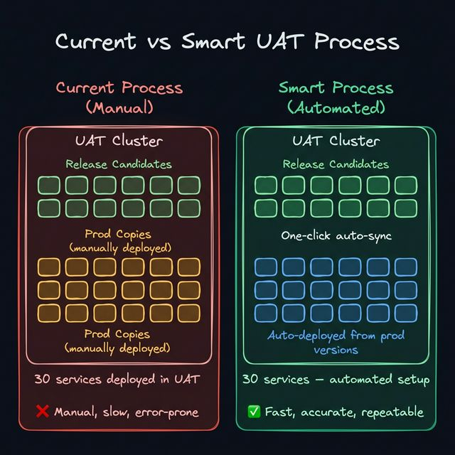
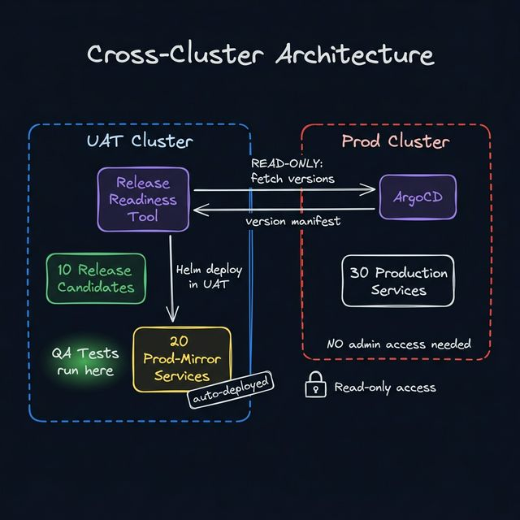
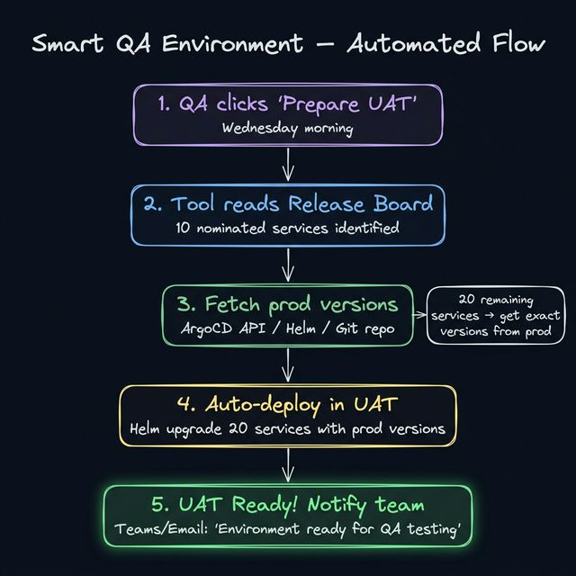

# Smart QA Environment — Implementation Plan

> *Automated UAT environment setup for release testing across separate clusters*

---

## Executive Summary

This document describes how to automate the QA environment setup for release testing. Instead of manually deploying 20+ production-version services into UAT every Wednesday, a single button in Release Readiness will read the release board, fetch production versions from the prod cluster (read-only), and auto-deploy them in UAT — reducing environment setup from **hours of manual work to minutes of automation**.

---

## Current vs Smart Process



### Current Process (Manual)

| Step | Action | Time | Who |
|------|--------|------|-----|
| 1 | Dev team confirms service versions | — | Developers |
| 2 | QA announces UAT takeover | — | QA Lead |
| 3 | QA/DevOps identifies which services to release (e.g., 10 out of 30) | 15 min | Manual |
| 4 | QA/DevOps looks up production versions of remaining 20 services | 30 min | Manual |
| 5 | QA/DevOps deploys 20 services in UAT with prod versions (Helm/kubectl) | 1-2 hours | Manual |
| 6 | Wait for all pods to be healthy | 15-30 min | Manual monitoring |
| 7 | Run regression/integration tests | 2-4 hours | QA |
| 8 | Sign off and communicate results | 30 min | QA Lead |
| **Total setup time** | | **2-3 hours** | |

### Smart Process (Automated)

| Step | Action | Time | Who |
|------|--------|------|-----|
| 1 | QA clicks **"Prepare UAT"** in Release Readiness | 5 seconds | QA |
| 2 | Tool auto-syncs UAT with prod versions | 5-10 min (automated) | Tool |
| 3 | Tool notifies team: "UAT ready" | Instant | Tool |
| 4 | Run regression/integration tests | 2-4 hours | QA |
| 5 | QA signs off per-service in Release Readiness | 10 min | QA |
| **Total setup time** | | **~10 minutes** | |

---

## Cross-Cluster Architecture



### Constraints

| Constraint | Detail |
|-----------|--------|
| **Separate clusters** | UAT and Prod are on different GDC clusters |
| **No prod admin** | Read-only access to prod — cannot deploy, modify, or create resources |
| **UAT admin** | Full admin access to UAT namespace — can deploy, scale, configure |
| **Shared container registry** | Both clusters pull images from the same registry |
| **Shared Helm repo** | Both clusters use the same Helm chart repository |

### How It Works

1. **Release Readiness Tool** (runs in UAT cluster) reads the release board → identifies 10 nominated services
2. Tool queries **prod version source** (ArgoCD API, Helm release list, or Git manifest) → gets exact versions of all 30 prod services
3. Subtracts the 10 nominated services → leaves 20 services that need prod versions
4. **Auto-deploys** those 20 services in UAT using Helm with the exact prod image tags and chart versions
5. Waits for all pods to be healthy
6. Notifies QA team via Teams/email

---

## Automated Flow



### Detailed Step Breakdown

#### Step 1: QA Triggers "Prepare UAT"

New button in Release Readiness UI + API endpoint:

```
POST /api/release/prepare_uat
```

The UI shows a confirmation dialog:
```
"This will auto-deploy 20 services in UAT using production versions.
 10 release candidates will not be touched.
 Proceed?"
```

#### Step 2: Read Release Board

```python
board = get_current_board()
nominated_services = set(board['services'].keys())
# Result: {'billing-service', 'payment-gateway', 'auth-service', ...}  # 10 services
```

#### Step 3: Fetch Production Versions

Query the production version source to get the full inventory:

```python
prod_versions = fetch_prod_versions()
# Result: {
#   'billing-service':  {'image_tag': 'v2.3.3', 'chart': 'billing-chart', 'chart_version': '0.5.0'},
#   'payment-gateway':  {'image_tag': 'v2.0.0', 'chart': 'payment-chart', 'chart_version': '0.4.0'},
#   'user-service':     {'image_tag': 'v3.2.0', 'chart': 'user-chart',    'chart_version': '1.1.0'},
#   ... all 30 services
# }
```

#### Step 4: Calculate What to Deploy

```python
services_to_sync = {
    name: info for name, info in prod_versions.items()
    if name not in nominated_services
}
# Result: 20 services that need prod versions in UAT
```

#### Step 5: Auto-Deploy in UAT

For each non-release service, run Helm upgrade in UAT:

```python
for service_name, version_info in services_to_sync.items():
    helm_upgrade(
        release_name=service_name,
        chart=f"{HELM_REPO}/{version_info['chart']}",
        version=version_info['chart_version'],
        set_values={
            'image.tag': version_info['image_tag'],
            'image.repository': version_info.get('image_repo', f'registry/{service_name}')
        },
        namespace='uat',
        wait=True,          # wait for pods to be ready
        timeout='300s'      # 5 min timeout per service
    )
```

#### Step 6: Health Verification

After all deployments, verify every pod is Running:

```python
def verify_uat_health():
    v1 = client.CoreV1Api()
    pods = v1.list_namespaced_pod('uat')
    
    unhealthy = []
    for pod in pods.items:
        if pod.status.phase != 'Running':
            unhealthy.append(pod.metadata.name)
    
    return {
        'total_pods': len(pods.items),
        'healthy': len(pods.items) - len(unhealthy),
        'unhealthy': unhealthy,
        'ready': len(unhealthy) == 0
    }
```

#### Step 7: Notify Team

```python
send_notification(
    channel='teams',
    message=f"""✅ UAT Environment Ready for QA Testing
    
    📋 Release candidates (new versions): {len(nominated_services)}
    🔄 Synced from prod: {len(services_to_sync)}
    ✅ All pods healthy: {health['ready']}
    
    Environment is ready for regression testing."""
)
```

---

## Requirements

### 1. Production Version Source (Most Critical)

You need a way to read production service versions **without admin access**. Options:

| Source | How It Works | Access Needed | Complexity |
|--------|-------------|---------------|------------|
| **ArgoCD API** | Query ArgoCD's REST API for deployed versions | ArgoCD read-only API token | Low |
| **Git Repo (GitOps)** | Read Helm values/kustomize from the prod Git branch | Git repo read access | Low |
| **Shared Version Manifest** | CI/CD writes a `prod-versions.json` after each deploy | Access to the JSON file (Git/S3/ConfigMap) | Very Low |
| **Helm Release API** | `helm list` on prod cluster via API | Helm read-only access | Medium |
| **Custom Version API** | A lightweight service on prod that returns versions | Deploy one service on prod | Medium |

**Recommendation:** Use **ArgoCD API** if available (it already knows everything), or create a **shared version manifest** in Git that your CI/CD pipeline updates after each prod deploy.

#### Option A: ArgoCD API (Recommended)

```python
import requests

ARGOCD_URL = "https://argocd.prod.internal"
ARGOCD_TOKEN = os.environ.get('ARGOCD_READ_TOKEN')

def fetch_prod_versions_argocd():
    """Fetch deployed versions from ArgoCD (read-only)."""
    headers = {'Authorization': f'Bearer {ARGOCD_TOKEN}'}
    
    response = requests.get(
        f'{ARGOCD_URL}/api/v1/applications',
        headers=headers,
        params={'projects': 'prod-namespace'}
    )
    
    apps = response.json()['items']
    versions = {}
    
    for app in apps:
        name = app['metadata']['name']
        # Extract image tag from the deployed spec
        images = app.get('status', {}).get('summary', {}).get('images', [])
        helm_params = app.get('spec', {}).get('source', {}).get('helm', {})
        
        versions[name] = {
            'image_tag': extract_tag(images[0]) if images else 'latest',
            'chart': app['spec']['source'].get('chart', ''),
            'chart_version': app['spec']['source'].get('targetRevision', ''),
        }
    
    return versions
```

#### Option B: Shared Version Manifest (Simplest)

Your CI/CD pipeline writes a JSON file after each prod deploy:

```json
// prod-versions.json (stored in Git or shared artifact store)
{
  "last_updated": "2026-03-21T08:30:00Z",
  "namespace": "prod",
  "services": {
    "billing-service": {
      "image": "registry.example.com/billing:v2.3.3",
      "image_tag": "v2.3.3",
      "chart": "billing-chart",
      "chart_version": "0.5.0"
    },
    "payment-gateway": {
      "image": "registry.example.com/payment:v2.0.0",
      "image_tag": "v2.0.0",
      "chart": "payment-chart",
      "chart_version": "0.4.0"
    }
    // ... all 30 services
  }
}
```

```python
def fetch_prod_versions_manifest():
    """Read version manifest from Git or shared store."""
    # Option 1: From a Git repo
    response = requests.get(
        f'{GIT_API_URL}/repos/org/config-repo/contents/prod-versions.json',
        headers={'Authorization': f'token {GIT_TOKEN}'}
    )
    manifest = json.loads(base64.b64decode(response.json()['content']))
    return manifest['services']
```

### 2. UAT Cluster Access

| Requirement | Detail |
|-------------|--------|
| **Kubernetes RBAC** | ServiceAccount in UAT namespace with deploy/scale/delete permissions |
| **Helm access** | Ability to run `helm upgrade` in UAT namespace |
| **Container registry** | UAT cluster can pull same images as prod |
| **Helm chart repo** | UAT cluster can access shared Helm chart repository |

### 3. Notification Channels (Optional)

| Channel | Requirement |
|---------|------------|
| **Teams** | Incoming webhook URL for the QA/release channel |
| **Email** | SMTP server or email API (SendGrid, etc.) |
| **Jira** | Jira API token + project ID |

### 4. Environment Variables

```bash
# Required
PROD_VERSION_SOURCE=argocd          # argocd, git, manifest
ARGOCD_URL=https://argocd.prod.internal
ARGOCD_READ_TOKEN=<read-only-token>
UAT_NAMESPACE=uat
HELM_REPO=https://charts.internal/

# Optional
TEAMS_WEBHOOK_URL=https://outlook.office.com/webhook/...
EMAIL_RECIPIENTS=qa-team@company.com
JIRA_URL=https://jira.company.com
JIRA_TOKEN=<api-token>
```

---

## New API Endpoints

| Endpoint | Method | Description |
|----------|--------|-------------|
| `/api/release/prepare_uat` | POST | Trigger UAT environment setup |
| `/api/release/uat_status` | GET | Check UAT preparation status (progress, errors) |
| `/api/release/prod_versions` | GET | View current prod versions |
| `/api/release/uat_diff` | GET | Show diff: what will be deployed vs what's in UAT now |
| `/api/release/qa_signoff` | POST | QA sign-off per service |
| `/api/release/cleanup_uat` | POST | Remove prod-mirror deployments after QA |

---

## New UI Components

### 1. "Prepare UAT" Button (Release Board)

On the Export tab, add a new button:

```
[🧪 Prepare UAT Environment]
```

Clicking it shows:
- List of 10 release candidates (new versions) — will NOT be touched
- List of 20 services to sync from prod — will be auto-deployed
- Version diff table (current UAT vs prod version being deployed)
- Confirm button

### 2. UAT Status Panel

Shows real-time progress:

```
UAT Environment Setup — In Progress
━━━━━━━━━━━━━━━━━━━━━━━━━━ 65%

✅ billing-service v2.3.3 — deployed
✅ user-service v3.2.0 — deployed
⏳ notification-service v1.4.0 — deploying...
⏳ reporting-service v2.1.0 — pending
...

10/20 services synced
```

### 3. QA Sign-Off Panel

Per-service sign-off after testing:

```
QA Sign-Off
┌────────────────────────────────────────┐
│ billing-service v2.3.4 (release)       │
│ ☐ QA Approved  ☐ QA Rejected          │
│ Notes: ________________________________│
│ Signed by: ____________________________│
├────────────────────────────────────────┤
│ payment-gateway v2.0.1 (release)       │
│ ☑ QA Approved                          │
│ Signed by: Priya (March 21, 10:30 AM)  │
└────────────────────────────────────────┘
```

---

## Helm Deployment Strategy

### Running Helm from the Release Readiness Pod

The tool needs Helm CLI inside its container. Two approaches:

#### Approach A: Helm Python SDK (Recommended)

Use the `pyhelm` library or subprocess calls to Helm CLI:

```python
import subprocess

def helm_upgrade(release_name, chart, version, set_values, namespace, timeout='300s'):
    """Run helm upgrade --install in UAT namespace."""
    cmd = [
        'helm', 'upgrade', '--install', release_name,
        chart,
        '--version', version,
        '--namespace', namespace,
        '--wait',
        '--timeout', timeout,
    ]
    
    for key, value in set_values.items():
        cmd.extend(['--set', f'{key}={value}'])
    
    result = subprocess.run(cmd, capture_output=True, text=True, timeout=360)
    
    return {
        'service': release_name,
        'success': result.returncode == 0,
        'stdout': result.stdout,
        'stderr': result.stderr
    }
```

#### Approach B: Kubernetes API Directly

If Helm is too complex, deploy using raw Kubernetes API (patch Deployment image tags):

```python
def deploy_prod_version_in_uat(service_name, image_tag, namespace='uat'):
    """Update deployment image tag directly via K8s API."""
    apps_v1 = client.AppsV1Api()
    
    # Patch the deployment's container image
    body = {
        'spec': {
            'template': {
                'spec': {
                    'containers': [{
                        'name': service_name,
                        'image': f'registry.example.com/{service_name}:{image_tag}'
                    }]
                }
            }
        }
    }
    
    apps_v1.patch_namespaced_deployment(
        name=service_name,
        namespace=namespace,
        body=body
    )
```

### Dockerfile Update

Add Helm CLI to the container:

```dockerfile
FROM python:3.11-slim

# Install Helm
RUN curl -fsSL https://raw.githubusercontent.com/helm/helm/main/scripts/get-helm-3 | bash

# Install kubectl (for health checks)
RUN curl -LO "https://dl.k8s.io/release/$(curl -L -s https://dl.k8s.io/release/stable.txt)/bin/linux/amd64/kubectl" \
    && install kubectl /usr/local/bin/

COPY requirements.txt .
RUN pip install -r requirements.txt

COPY . /app
WORKDIR /app

CMD ["python", "app.py"]
```

---

## Error Handling

| Scenario | Handling |
|----------|----------|
| **Prod version source unreachable** | Retry 3x, then fail with clear error: "Cannot reach ArgoCD. Check ARGOCD_READ_TOKEN." |
| **Helm deploy fails for one service** | Continue with remaining services. Report partial success. |
| **Pod doesn't become healthy** | Timeout after 5 min. Flag in status: "notification-service: pods not ready" |
| **Image not found in registry** | Skip service, report: "Image v2.3.3 not found in registry" |
| **UAT namespace permissions** | Pre-check RBAC permissions before starting. Fail fast. |
| **Already running** | Prevent duplicate runs: "UAT prep already in progress" |

---

## Security Considerations

| Aspect | Mitigation |
|--------|------------|
| **Prod ArgoCD token** | Store as K8s Secret, mount as env var. Read-only scope only. |
| **Prod cluster access** | NO writes to prod. API calls are read-only queries. |
| **Container images** | Same registry as prod — no image trust chain issues. |
| **UAT isolation** | UAT services talk to UAT databases, not prod databases. |
| **Credential management** | Helm values may contain secrets — use `--reuse-values` or Secret refs. |

---

## Implementation Phases

### Phase 1: Core Automation (1 week)

- [ ] Choose and implement prod version source (ArgoCD API or Git manifest)
- [ ] Build `prepare_uat` endpoint (fetch versions → deploy → verify)
- [ ] Add Helm CLI to Dockerfile
- [ ] Add "Prepare UAT" button to UI
- [ ] Add UAT status progress panel

### Phase 2: QA Workflow (3-4 days)

- [ ] Add QA sign-off per service (approve/reject + notes)
- [ ] Add QA sign-off status to release board cards
- [ ] Block board finalization if any service QA-rejected
- [ ] Add QA sign-off to audit trail

### Phase 3: Notifications (2-3 days)

- [ ] Teams webhook on UAT ready
- [ ] Email notification with environment summary
- [ ] Teams notification on QA sign-off completion

### Phase 4: Intelligence (1 week)

- [ ] AI analysis: "10 release candidates detected. 3 have major version bumps. Recommend extra regression testing on billing-service."
- [ ] Auto-suggest test priorities based on change magnitude
- [ ] Post-QA report generation
- [ ] Cleanup UAT after release is complete

---

*This plan is ready for review. Requires decision on prod version source (ArgoCD vs Git manifest) before implementation can begin.*
