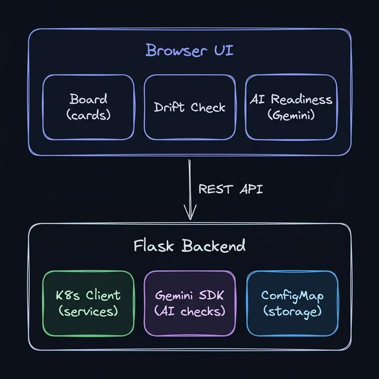
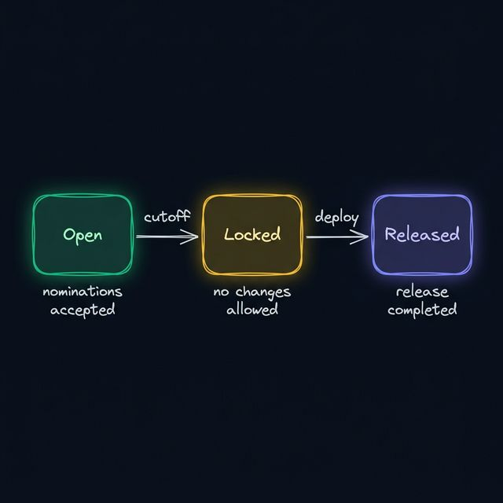

# Release Readiness Dashboard — Walkthrough

> AI-Powered Release Coordination Board for Operations Teams

---

## Overview

The Release Readiness Dashboard is a Flask-based web application that helps ops/support teams coordinate production releases. It provides a visual board for tracking which microservices are going into the next release, with AI-powered health checks and version drift detection.

### Architecture



---

## Two Modes

| | Production (`app.py`) | Mock (`mock_app.py`) |
|---|---|---|
| **K8s** | Real cluster via `kubernetes` client | 15 hardcoded fake services |
| **AI** | Gemini API for readiness analysis | Random scores + fake analysis |
| **Storage** | ConfigMap per release week | In-memory dict |
| **Dependencies** | gevent, kubernetes, google-genai | Just Flask + SocketIO |

### Running Locally (Mock Mode)

```bash
pip install flask flask-socketio pyyaml
python mock_app.py
# → http://localhost:8090
```

### Running in Production

```bash
# Required environment variables:
export GEMINI_API_KEY=your-key        # or GOOGLE_CLOUD_PROJECT + GOOGLE_CLOUD_LOCATION
export POD_NAMESPACE=your-namespace   # K8s namespace to monitor

python app.py
# → http://localhost:9090
```

---

## The Release Workflow

### Step 1: 📋 Nominate Services

Use the **sidebar panel** to nominate services for the upcoming release:

1. Select a service from the dropdown (auto-populated from the K8s cluster)
2. Version info (image tag, Helm chart version) auto-fills from the live cluster
3. Enter your name and optional release notes
4. Click **🚀 Nominate**

The service appears as a card on the main board. Re-nominating an existing service updates its version and logs the change in the version history.

### Step 2: 🔀 Version Drift Detection

Navigate to the **Version Drift** tab and click **Check Now** to compare:

- **Nominated version** (what was on the board when nominated)
- **Live cluster version** (what's currently deployed)

This catches cases where someone deployed a newer version after nomination.

| Color | Meaning |
|-------|---------|
| 🟢 Match | Nominated and live versions are identical |
| 🟡 Drift | Minor version difference (e.g., `v2.3.1` → `v2.3.4`) |
| 🔴 Major Drift | Major version bump (e.g., `v2.x` → `v3.x`) |

### Step 3: 🤖 AI Readiness Check

Navigate to the **AI Readiness** tab and click **Run AI Check**:

In production mode, the app collects real health data from the cluster and sends it to **Gemini** for analysis. The AI evaluates each service on:

| Check | What It Looks At |
|-------|-----------------|
| **Health** | Are pods running normally? |
| **Stability** | Any restarts, CrashLoopBackOff, OOMKills? |
| **Probes** | Are readiness/liveness probes configured? |
| **Resources** | Are CPU/memory limits set? |
| **Image Tag** | Using a proper versioned tag (not `:latest`)? |

Each service gets a **readiness score** (0–100) and a color:
- 🟢 **Green** (80+): Ready to release
- 🟡 **Yellow** (55–79): Review recommended
- 🔴 **Red** (<55): At risk, needs attention

### Step 4: 📦 Export & Release

Navigate to the **Export** tab for release actions:

| Action | Description |
|--------|-------------|
| **Export JSON** | Download the release manifest as JSON |
| **Export YAML** | Download the release manifest as YAML |
| **AI Release Notes** | Auto-generate markdown release notes |
| **🔒 Lock Board** | Freeze nominations (cutoff reached) |
| **✅ Mark Released** | Complete the release cycle |

### Step 5: 📜 Audit Trail

Every action is logged with who, what, and when:

- Service nominations and re-nominations
- Service removals
- Board finalization (cutoff lock)
- Release completion

---

## Key Concepts

| Concept | Description |
|---------|-------------|
| **Release Date** | Auto-calculated as the next Friday |
| **Cutoff** | Wednesday 5:00 PM before the release Friday (configurable) |
| **Board Status** | `open` → `locked` → `released` |
| **ConfigMap Storage** | One ConfigMap per release: `release-board-2026-03-21` |
| **Version History** | Tracks all version changes per service across re-nominations |

### Board Lifecycle



---

## API Reference

| Endpoint | Method | Description |
|----------|--------|-------------|
| `/api/services` | GET | List all deployable services from cluster |
| `/api/release/current` | GET | Get current release board |
| `/api/release/nominate` | POST | Nominate a service for release |
| `/api/release/remove` | DELETE | Remove a nomination |
| `/api/release/drift` | GET | Check version drift vs live cluster |
| `/api/ai/release_readiness` | POST | Run AI-powered readiness check |
| `/api/release/export` | GET | Export release manifest (JSON or YAML) |
| `/api/ai/release_notes` | POST | Generate AI release notes |
| `/api/release/finalize` | POST | Lock the board (cutoff) |
| `/api/release/complete` | POST | Mark release as completed |
| `/api/release/history` | GET | List past releases |

---

## Configuration

| Environment Variable | Default | Description |
|---------------------|---------|-------------|
| `POD_NAMESPACE` | `default` | K8s namespace to monitor |
| `RELEASE_CADENCE` | `friday` | Release day |
| `CUTOFF_DAY` | `2` (Wed) | Cutoff day (0=Mon, 4=Fri) |
| `CUTOFF_HOUR` | `17` | Cutoff hour (24h format) |
| `GEMINI_MODEL` | `gemini-2.0-flash` | Gemini model to use |
| `GEMINI_API_KEY` | — | API key for Gemini |
| `GOOGLE_CLOUD_PROJECT` | — | GCP project (alternative to API key) |
| `GOOGLE_CLOUD_LOCATION` | `us-central1` | GCP region |
| `FLASK_SECRET_KEY` | auto-generated | Flask session secret |
| `PIPELINE_HUB_PORT` | `9090` | Port for production app |

---

## Project Structure

```
release_readiness/
├── app.py              # Production app (K8s + Gemini)
├── mock_app.py          # Local dev (fake data, in-memory)
├── templates/
│   └── index.html       # Single-page frontend (42KB)
├── docs/
│   └── WALKTHROUGH.md   # This document
├── Dockerfile           # Container build
└── requirements.txt     # Python dependencies
```
