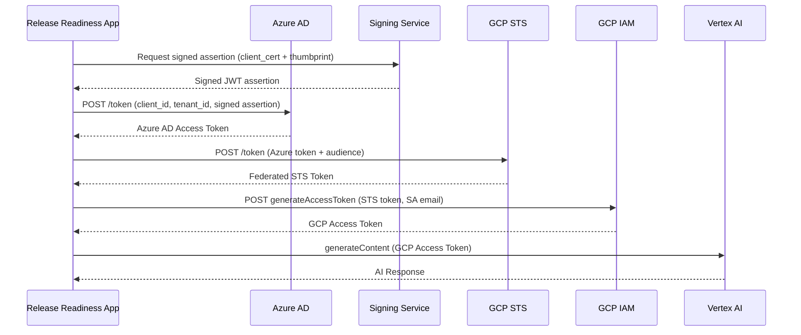

# WIF Authentication for Vertex AI — Design Document

Migrate from GCP Service Account JSON key file (`GOOGLE_APPLICATION_CREDENTIALS`) to **Azure-to-GCP Workload Identity Federation (WIF)** for Vertex AI / Gemini access.

## Current State

```
App → SA key JSON file → GCP Vertex AI
```

Your app currently uses `GOOGLE_APPLICATION_CREDENTIALS` pointing to a downloaded SA key JSON file. This is a security concern (long-lived credentials).

## Target State (WIF)

```
App → Azure AD Token (cert-based) → Signing Service → GCP STS → SA Impersonation → Vertex AI
```

No static keys. Identity is federated at runtime.

---

## WIF Authentication Flow



---

## Proposed Changes

### 1. [NEW] WIF Config File (`wif-config.yaml`)

Mount this as a ConfigMap or Secret:

```yaml
# wif-config.yaml
azure:
  client_id: "your-azure-app-client-id"
  tenant_id: "your-azure-tenant-id"
  scope: "api://your-scope/.default"
  proxy: "http://proxy.your-org.com:8080"         # Optional
  certificate_thumbprint: "ABC123DEF456..."

signing_service:
  host: "https://signing-service.your-org.com"
  from_parameter: "your-app-identifier"
  client_cert_path: "/certs/client.crt"
  client_key_path: "/certs/client.key"

gcp:
  audience: "//iam.googleapis.com/projects/PROJECT_NUMBER/locations/global/workloadIdentityPools/POOL_ID/providers/PROVIDER_ID"
  service_account_email: "vertex-ai-sa@your-project.iam.gserviceaccount.com"
  adc_json_path: "/config/adc-config.json"         # Generated ADC config for WIF

http:
  verify_ssl: "/certs/ca-bundle.crt"               # Custom CA bundle
```

---

### 2. [NEW] ADC Config File for WIF (`adc-config.json`)

This is the GCP Application Default Credentials config that tells the Google SDK to use WIF instead of a key file:

```json
{
  "type": "external_account",
  "audience": "//iam.googleapis.com/projects/PROJECT_NUMBER/locations/global/workloadIdentityPools/POOL_ID/providers/PROVIDER_ID",
  "subject_token_type": "urn:ietf:params:oauth:token-type:jwt",
  "token_url": "https://sts.googleapis.com/v1/token",
  "credential_source": {
    "file": "/tmp/azure-token.json",
    "format": {
      "type": "json",
      "subject_token_field_name": "access_token"
    }
  },
  "service_account_impersonation_url": "https://iamcredentials.googleapis.com/v1/projects/-/serviceAccounts/vertex-ai-sa@your-project.iam.gserviceaccount.com:generateAccessToken",
  "service_account_impersonation": {
    "token_lifetime_seconds": 3600
  }
}
```

---

### 3. [MODIFY] [app.py](file:///Users/rajeshe/.gemini/antigravity/scratch/release_readiness/app.py) — `get_model()` function

#### What changes (lines 184-242):

```python
# ── Gemini SDK setup ─────────────────────────────────────────────────────────
GEMINI_MODEL = os.environ.get('GEMINI_MODEL', 'gemini-2.0-flash')
WIF_CONFIG_PATH = os.environ.get('WIF_CONFIG_PATH', '')      # NEW
_model_client = None
_model_lock = threading.Lock()

def _get_wif_credentials():
    """Obtain GCP credentials via Azure AD → GCP Workload Identity Federation."""
    import yaml
    import requests as req
    from google.auth import identity_pool
    from google.auth.transport.requests import Request

    # 1. Load WIF config
    with open(WIF_CONFIG_PATH) as f:
        wif = yaml.safe_load(f)

    azure = wif['azure']
    signing = wif['signing_service']
    gcp = wif['gcp']
    ssl_verify = wif.get('http', {}).get('verify_ssl', True)
    proxy = azure.get('proxy')
    proxies = {'https': proxy, 'http': proxy} if proxy else None

    # 2. Get signed assertion from signing service
    sign_resp = req.post(
        f"{signing['host']}/sign",
        json={'from': signing['from_parameter'], 'thumbprint': azure['certificate_thumbprint']},
        cert=(signing['client_cert_path'], signing['client_key_path']),
        verify=ssl_verify,
        proxies=proxies,
        timeout=30
    )
    sign_resp.raise_for_status()
    signed_assertion = sign_resp.json()['signed_assertion']

    # 3. Exchange signed assertion for Azure AD token
    azure_token_url = f"https://login.microsoftonline.com/{azure['tenant_id']}/oauth2/v2.0/token"
    token_resp = req.post(azure_token_url, data={
        'client_id': azure['client_id'],
        'scope': azure['scope'],
        'client_assertion_type': 'urn:ietf:params:oauth:client-assertion-type:jwt-bearer',
        'client_assertion': signed_assertion,
        'grant_type': 'client_credentials',
    }, verify=ssl_verify, proxies=proxies, timeout=30)
    token_resp.raise_for_status()
    azure_token = token_resp.json()['access_token']

    # 4. Write Azure token to temp file for GCP ADC credential_source
    import tempfile
    token_file = os.path.join(tempfile.gettempdir(), 'azure-token.json')
    with open(token_file, 'w') as f:
        json.dump({'access_token': azure_token}, f)

    # 5. Load GCP credentials using the ADC config (external_account type)
    adc_path = gcp.get('adc_json_path', '/config/adc-config.json')
    os.environ['GOOGLE_APPLICATION_CREDENTIALS'] = adc_path
    
    from google.auth import default
    credentials, project_id = default(
        scopes=['https://www.googleapis.com/auth/cloud-platform']
    )
    credentials.refresh(Request())
    
    print(f"[gemini-wif] ✅ WIF credentials obtained (SA: {gcp['service_account_email']})")
    return credentials

def get_model():
    global _model_client
    if _model_client is not None:
        return _model_client
    with _model_lock:
        if _model_client is not None:
            return _model_client
        try:
            from google import genai
            from google.oauth2 import service_account

            sa_key_path = os.environ.get('GOOGLE_APPLICATION_CREDENTIALS', '')
            project = (os.environ.get('GCP_PROJECT_ID')
                       or os.environ.get('GOOGLE_CLOUD_PROJECT')
                       or os.environ.get('GEMINI_PROJECT_ID'))
            location = os.environ.get('GCP_REGION',
                       os.environ.get('GOOGLE_CLOUD_LOCATION', 'us-central1'))

            # ── NEW: WIF authentication (Azure AD → GCP) ──
            if WIF_CONFIG_PATH and os.path.exists(WIF_CONFIG_PATH) and project:
                creds = _get_wif_credentials()
                _model_client = genai.Client(
                    vertexai=True,
                    project=project,
                    location=location,
                    credentials=creds,
                )
                print(f"[gemini] Model client initialised via WIF "
                      f"(project={project}, model={GEMINI_MODEL})")

            elif sa_key_path and project:
                # Existing: Explicit service-account JSON file
                ...existing code unchanged...

            elif project:
                # Existing: Application Default Credentials
                ...existing code unchanged...

            else:
                # Existing: API key fallback
                ...existing code unchanged...
```

#### Summary of `get_model()` changes:

| Priority | Method | Env Vars | When |
|---|---|---|---|
| **1 (NEW)** | WIF (Azure→GCP) | `WIF_CONFIG_PATH` + `GCP_PROJECT_ID` | On-prem / Azure / cross-cloud |
| 2 | SA key file | `GOOGLE_APPLICATION_CREDENTIALS` + `GCP_PROJECT_ID` | On-prem (legacy) |
| 3 | ADC | `GCP_PROJECT_ID` | GKE with native Workload Identity |
| 4 | API key | `GEMINI_API_KEY` | Dev/testing |

---

### 4. [MODIFY] [deploy.yaml](file:///Users/rajeshe/.gemini/antigravity/scratch/release_readiness/manifests/deploy.yaml)

Add WIF env vars and volume mounts:

```yaml
# ═══ WIF Authentication (Azure → GCP) ═════════════════════
- name: WIF_CONFIG_PATH
  value: "/config/wif/wif-config.yaml"
- name: GCP_PROJECT_ID
  value: "your-gcp-project-id"
- name: GCP_REGION
  value: "europe-west2"
- name: GEMINI_MODEL
  value: "gemini-2.5-flash"

# Remove these (no longer needed with WIF):
# - name: GOOGLE_APPLICATION_CREDENTIALS
#   value: "/secrets/gcp-sa-key.json"
```

Volume mounts:
```yaml
volumeMounts:
- name: wif-config
  mountPath: /config/wif
  readOnly: true
- name: signing-certs
  mountPath: /certs
  readOnly: true
- name: adc-config
  mountPath: /config
  readOnly: true

volumes:
- name: wif-config
  secret:
    secretName: release-readiness-wif-config
- name: signing-certs
  secret:
    secretName: release-readiness-signing-certs
- name: adc-config
  configMap:
    name: release-readiness-adc-config
```

---

### 5. [NEW] Kubernetes Secrets & ConfigMap

```bash
# WIF config
kubectl create secret generic release-readiness-wif-config \
  --from-file=wif-config.yaml=wif-config.yaml \
  -n YOUR_NAMESPACE

# Signing service client certs
kubectl create secret generic release-readiness-signing-certs \
  --from-file=client.crt=/path/to/client.crt \
  --from-file=client.key=/path/to/client.key \
  --from-file=ca-bundle.crt=/path/to/ca-bundle.crt \
  -n YOUR_NAMESPACE

# ADC config (external_account JSON)
kubectl create configmap release-readiness-adc-config \
  --from-file=adc-config.json=adc-config.json \
  -n YOUR_NAMESPACE
```

---

### 6. Python Dependencies

Add to `requirements.txt`:
```
PyYAML           # For wif-config.yaml parsing
google-auth      # Already present — handles external_account type
google-genai     # Already present
```

---

## GCP IAM Prerequisites (one-time setup)

These are done by your GCP admin, not in your app:

```bash
# 1. Create Workload Identity Pool
gcloud iam workload-identity-pools create azure-wif-pool \
  --location=global --project=YOUR_PROJECT_ID

# 2. Create OIDC Provider (Azure AD)
gcloud iam workload-identity-pools providers create-oidc azure-ad-provider \
  --workload-identity-pool=azure-wif-pool \
  --location=global \
  --issuer-uri="https://login.microsoftonline.com/TENANT_ID/v2.0" \
  --allowed-audiences="api://YOUR_AUDIENCE" \
  --attribute-mapping="google.subject=assertion.sub" \
  --project=YOUR_PROJECT_ID

# 3. Grant SA impersonation
gcloud iam service-accounts add-iam-policy-binding \
  vertex-ai-sa@YOUR_PROJECT_ID.iam.gserviceaccount.com \
  --role=roles/iam.workloadIdentityUser \
  --member="principalSet://iam.googleapis.com/projects/PROJECT_NUMBER/locations/global/workloadIdentityPools/azure-wif-pool/attribute.sub/YOUR_AZURE_CLIENT_ID" \
  --project=YOUR_PROJECT_ID
```

---

## Open Questions

> [!IMPORTANT]
> 1. **Signing Service API**: What is the exact API contract for your signing service? I assumed `POST /sign` — what's the actual endpoint and request/response format?
> 2. **Token refresh**: WIF tokens expire (~1hr). Should the app auto-refresh, or is a restart acceptable?
> 3. **Proxy**: Does the proxy apply to GCP STS calls too, or only Azure AD?
> 4. **Custom CA**: Does the `ca-bundle.crt` apply to all outbound HTTPS, or only specific endpoints?
