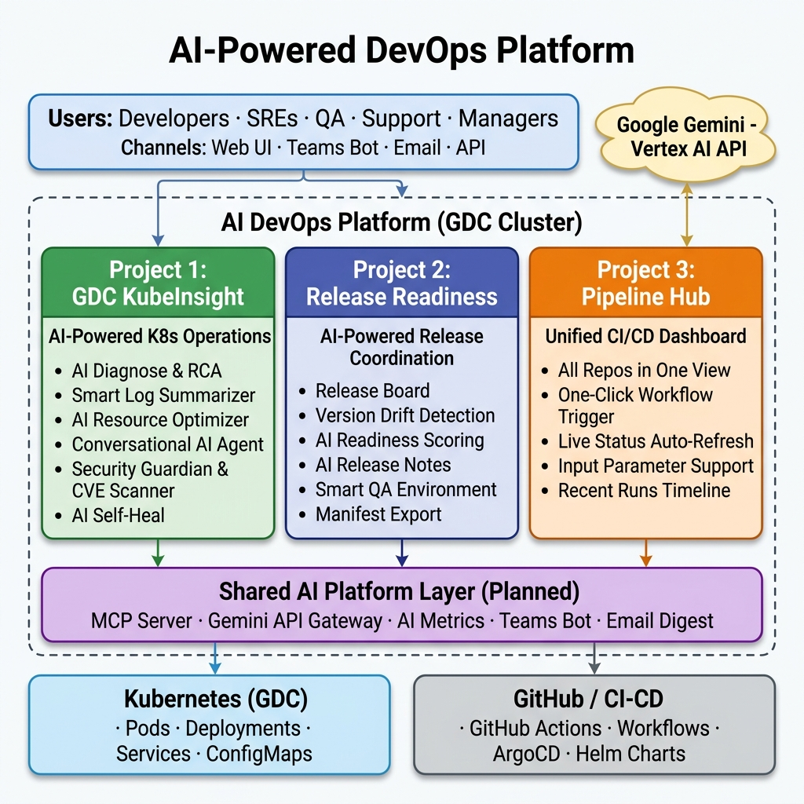
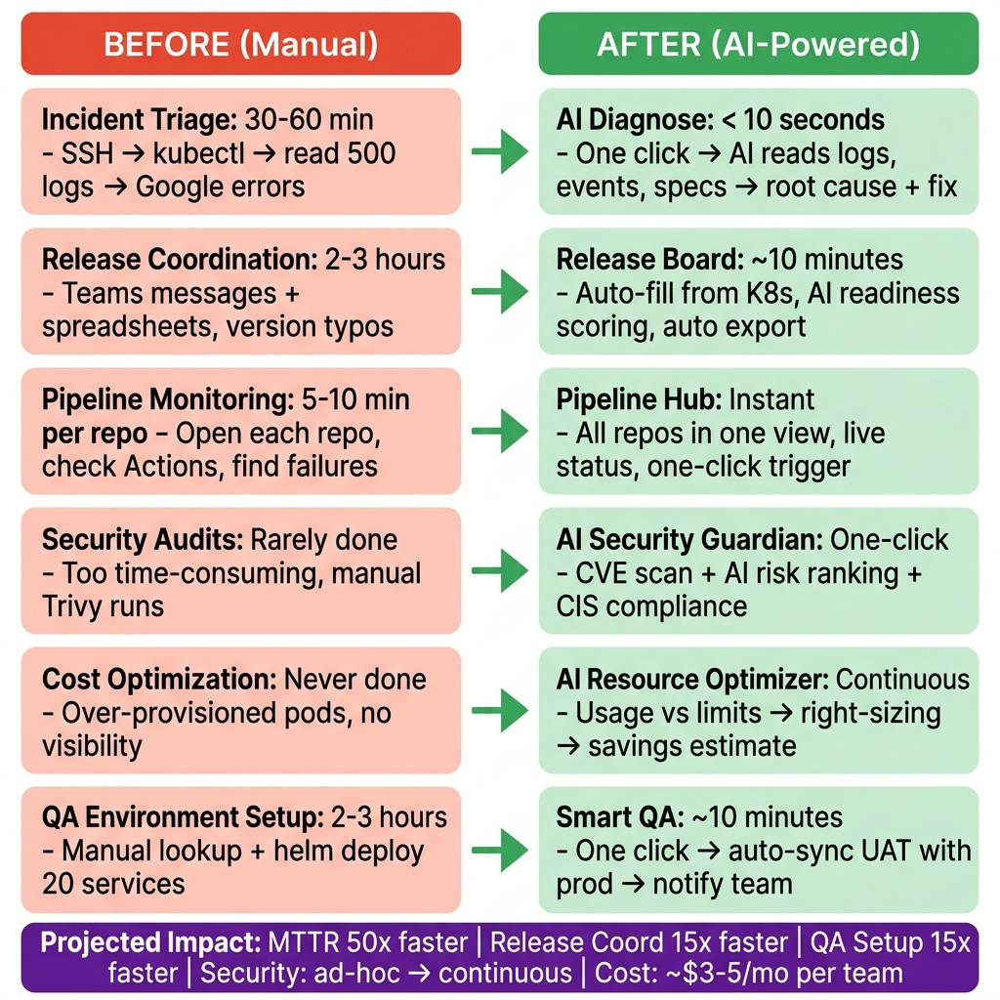
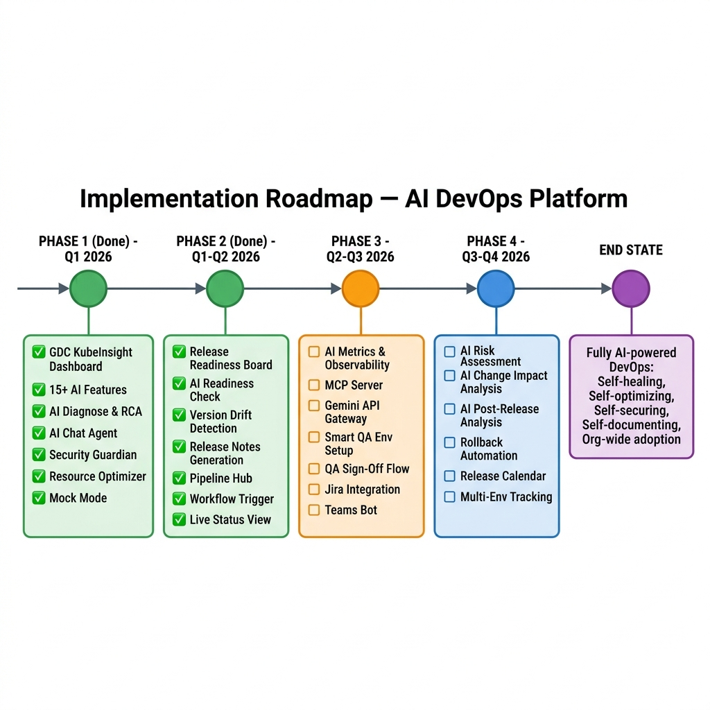

# AI-Powered DevOps Platform — Initiative Overview

> **Space:** AI Initiatives for DevOps  
> **Status:** 🟢 Active  
> **Owner:** Rajesh E  
> **Last Updated:** April 9, 2026  
> **Confluence Home**

---

## 🎯 Executive Summary

Our team is building an **AI-Powered DevOps Platform** that transforms how we operate, release, and monitor microservices on Google Distributed Cloud (GDC). Using **Google Gemini AI**, we're replacing manual, expertise-dependent workflows with intelligent automation — reducing incident triage from **30-60 minutes to under 10 seconds**, release coordination from **hours of spreadsheet work to one-click automation**, and security auditing from **ad-hoc efforts to continuous AI-powered scanning**.

The platform consists of **3 purpose-built projects**, each solving a distinct DevOps challenge, unified by a shared AI layer powered by Gemini.

> [!IMPORTANT]
> **Key Differentiator:** We consume Gemini as a pre-trained model via Vertex AI API — no custom model training, no GPUs, no ML ops. Cost is ~$3-5/month per team at heavy usage.

---

## 📐 Platform Architecture



---

## 📋 The Three Projects

### Project 1: GDC KubeInsight — AI-Powered Kubernetes Operations Dashboard

| Attribute | Detail |
|-----------|--------|
| **Purpose** | Real-time K8s operations dashboard with Gemini AI for monitoring, troubleshooting, and management |
| **Status** | ✅ Built & Demonstrated |
| **Tech Stack** | Flask + Socket.IO + google-genai + kubernetes SDK |
| **Deployment** | Single pod per namespace, namespace-scoped RBAC |
| **AI Model** | Gemini 2.5 Flash via Vertex AI |

**The 30-Second Pitch:**
> *"When a pod crashes at 2am, your team shouldn't have to SSH into a cluster, run 15 kubectl commands, read 500 log lines, and Google error messages. They should click one button and get an AI-generated root cause analysis with the exact fix."*

#### AI Features (15+)

| Feature | What It Does | AI Pattern |
|---------|-------------|------------|
| **AI Diagnose** | One-click full health analysis with health score, risks, and kubectl fix commands | Direct Prompt |
| **Root Cause Analysis (RCA)** | Deep investigation: reads ALL container logs, correlates events, produces structured report | Direct Prompt |
| **Smart Log Summarizer** | 500 log lines → key errors, patterns, and remediation steps | Direct Prompt |
| **Multi-Container Log Correlation** | Cross-container causal chain analysis (sidecar ↔ app) | Direct Prompt |
| **AI Resource Optimizer** | Actual vs. configured CPU/memory → right-sizing + monthly savings estimate | Direct Prompt |
| **Conversational AI Agent** | ChatGPT-like panel with live K8s tool-calling (10 read-only tools, 5 investigation rounds) | Agentic Function Calling |
| **Natural Language Search** | "show me crashing pods" → AI understands intent → executes action | Direct Prompt |
| **AI Config Explainer** | Plain-English explanation of ConfigMaps/Secrets with security flagging | Direct Prompt |
| **Security Guardian** | Scans all workloads: privileged containers, missing policies, host mounts, CIS benchmarks | Direct Prompt |
| **CVE Scanner** | Trivy-powered vulnerability scan with AI risk ranking | Direct Prompt |
| **AI Self-Heal** | Proposes specific fix actions with one-click apply (e.g., "OOMKilled → increase to 512Mi") | Direct Prompt |
| **YAML Generation** | Natural language → production-ready K8s YAML with security best practices | Direct Prompt |
| **Networking AI** | Service dependency mapping, Istio route validation, traffic policy review | Direct Prompt |
| **Health Pulse** | Namespace-wide 0-100 health score in one click | Direct Prompt |
| **Job Insights** | Kubernetes Job failure diagnosis | Direct Prompt |

#### How It Complements ArgoCD

| Scenario | ArgoCD | GDC KubeInsight |
|----------|--------|-----------------|
| Deploy v2.4 of billing-service | ✅ Sync from Git | ❌ Not its job |
| billing-service is crash-looping — why? | ❌ Just shows sync status | ✅ AI reads logs, events → root cause + fix |
| What CVEs are in our container images? | ❌ No scanning | ✅ Trivy scan + AI risk summary |
| Are we wasting money on over-provisioned pods? | ❌ No visibility | ✅ AI usage analysis → savings estimate |
| Scale backend-api to 5 replicas | ❌ Requires Git commit | ✅ One click or type it in AI search |

```
ArgoCD = "How do I DEPLOY my application?"       → CI/CD Pipeline
KubeInsight = "How do I OPERATE my application?"  → Day-2 Operations
```

**📚 Detailed Documentation:**
- [PROJECT-OVERVIEW.md](../../mock-project-gemini/docs/PROJECT-OVERVIEW.md) — Full project overview with integration details
- [ARCHITECTURE.md](../../mock-project-gemini/docs/ARCHITECTURE.md) — Technical architecture & API endpoint map
- [GEMINI-AI-FEATURES.md](../../mock-project-gemini/docs/GEMINI-AI-FEATURES.md) — Deep-dive on every AI feature
- [DEMO-PRESENTATION.md](../../mock-project-gemini/docs/DEMO-PRESENTATION.md) — Demo script and talking points
- [DEMO-QA.md](../../mock-project-gemini/docs/DEMO-QA.md) — Common Q&A for presentations

---

### Project 2: Release Readiness — AI-Powered Release Coordination

| Attribute | Detail |
|-----------|--------|
| **Purpose** | Replace manual Teams-channel-based release coordination with an AI-powered Release Board + integrated deployment |
| **Status** | ✅ Built (Core + Deploy + AI Chatbot) · 🔄 Enhancements Planned |
| **Tech Stack** | Flask + Socket.IO + google-genai + kubernetes SDK + GitHub API |
| **Storage** | ConfigMap-based (no external DB required) |
| **Authentication** | GitHub OAuth (per-user) or PAT (shared) — supports GitHub Enterprise |
| **AI Model** | Gemini 2.5 Flash via Vertex AI |

**The Problem It Solves:**

| Step | Before (Manual) | After (AI-Powered) |
|------|----------------|-------------------|
| **Nominate** | Post in Teams: "billing v2.3.1" (typed manually) | Select from live K8s dropdown, auto-fill version |
| **Collect** | Read Teams messages, compile spreadsheet | All nominations on one board, real-time |
| **Validate** | Cross-check versions manually, hope for the best | AI readiness check: health, stability, probes, CVEs |
| **Document** | Manually update Jira release ticket | One-click export: YAML manifest + AI release notes |
| **Deploy** | Switch to GitHub, find workflow, fill inputs manually | One-click deploy from within Release Readiness (Deploy tab) |
| **Ask** | Search Teams history / ask people | AI Chatbot: "What's in Friday's release?" → data-backed answer |

#### Core Features (Built)

| Feature | Description | Status |
|---------|------------|--------|
| **Release Board** | Nominate/remove services from live K8s cluster dropdown | ✅ |
| **Auto-Fill Versions** | Image tag + Helm chart auto-populated from K8s API | ✅ |
| **Custom Components** | Support non-K8s components (Spark/PySpark on Linux servers) with manual version entry | ✅ New |
| **Version Drift Detection** | Compare nominated vs live cluster versions (🟢 Match / 🟡 Drift / 🔴 Major) | ✅ |
| **Version Rollback** | Rollback a nominated service to any previously nominated version from version history | ✅ New |
| **AI Readiness Check** | Gemini analyzes: health, stability, probes, resources, image tags → 🟢/🟡/🔴 | ✅ |
| **AI Release Notes** | Auto-generated Markdown release notes for Teams/Jira | ✅ |
| **AI Release Chatbot** | Conversational AI agent with 6 release-specific tools (see details below) | ✅ New |
| **Deploy Tab** | Trigger GitHub Actions workflows directly from the dashboard with input parameter support | ✅ New |
| **GitHub OAuth** | Per-user GitHub authentication with audit trail (supports GitHub Enterprise + Kerberos proxy) | ✅ New |
| **Deploy Status Tracking** | Real-time workflow run monitoring with step-by-step progress | ✅ New |
| **Deploy History** | View recent deploy runs with status, trigger info, and GitHub links | ✅ New |
| **Release Manifest Export** | YAML/JSON export of the full release manifest | ✅ |
| **Board Lifecycle** | open → locked → released with cutoff enforcement | ✅ |
| **Audit Trail** | Every nomination, update, removal, deploy, rollback tracked with timestamps | ✅ |
| **ConfigMap Storage** | Native K8s storage, no external database | ✅ |
| **Release History** | View past release boards | ✅ |
| **K8s Deployment Manifest** | Production-ready `deploy.yaml` with RBAC, ServiceAccount, probes, secrets config | ✅ New |

#### AI Release Chatbot (New)

A conversational AI agent powered by Gemini function-calling, purpose-built for release questions:

| Tool | What It Does |
|------|--------------|
| `release_get_board` | Returns the full release board: all services, versions, status, cutoff |
| `release_get_service_status` | Detailed status of a specific service + live pod health from K8s |
| `release_check_drift` | Compare all nominated versions against live cluster versions |
| `release_get_readiness` | Return cached AI readiness scores for all services |
| `release_get_audit_trail` | Chronological log of all board actions (nominations, rollbacks, deploys) |
| `release_get_uat_services` | List all services currently running in the UAT namespace with versions |

**Example conversations:**
```
QA:     "What's going into this Friday's release?"
Bot:    "7 services nominated. 5 green, 1 yellow (billing-service has drift), 
         1 red (auth-service: 3 restarts). Full board: [table]"

Dev:    "Is my service payment-gateway included?"
Bot:    "Yes, payment-gateway v2.0.0 nominated by Rajesh on March 19. 
         Readiness: Green (92/100). No drift detected."

Lead:   "Who deployed last and what happened?"
Bot:    "[Queries audit trail] Last deploy: billing-service triggered by Priya 
         at 14:30. Workflow succeeded. Currently running v2.3.5 in UAT."
```

#### Deploy Tab Integration (New)

The dashboard now includes an embedded **Deploy tab** that connects directly to GitHub Actions:

| Capability | Detail |
|-----------|--------|
| **Workflow Discovery** | Auto-lists all active workflows from the configured deployment repo |
| **Input Parameters** | Parses `workflow_dispatch` inputs (dropdowns, text, booleans) and prompts before triggering |
| **UAT-Only Enforcement** | Environment input is force-set to `uat` — production deploys require separate approval |
| **Run Tracking** | After trigger, fetches the run ID and provides real-time step-by-step status |
| **Audit Integration** | Every deploy trigger is logged in the release board's audit trail |
| **GitHub Enterprise** | Full support for GHE with custom API URLs, SSL config, and Kerberos proxy auth |

#### Planned Enhancements

| Enhancement | Description | Priority |
|-------------|------------|----------|
| **Smart QA Environment** | One-click auto-deploy of prod versions in UAT for regression testing | High |
| **QA Sign-Off Workflow** | Per-service QA approval with approve/reject states | High |
| **AI Risk Assessment** | Analyze service combinations for dependency conflicts and historical patterns | Medium |
| **Jira Integration** | Auto-create/update release tickets | Medium |
| **Teams/Slack Notifications** | Real-time release updates, drift alerts, cutoff reminders | Medium |
| **AI Change Impact Analysis** | Analyze what changed between old and new version, flag breaking changes | Medium |
| **Rollback Automation** | Post-release monitoring with one-click rollback capability | Low |
| **Release Calendar** | Visual calendar with trend analytics | Low |

**📚 Detailed Documentation:**
- [RELEASE-READINESS-PLAN.md](../RELEASE-READINESS-PLAN.md) — Feature plan with architecture diagrams
- [ENHANCEMENT-IDEAS.md](../ENHANCEMENT-IDEAS.md) — 20 enhancement ideas with prioritization
- [SMART-QA-ENVIRONMENT-PLAN.md](../SMART-QA-ENVIRONMENT-PLAN.md) — Smart QA environment automation plan
- [deploy.yaml](../../manifests/deploy.yaml) — Production K8s deployment manifest with RBAC

---

### Project 3: Pipeline Hub — Unified CI/CD Workflow Dashboard

| Attribute | Detail |
|-----------|--------|
| **Purpose** | Single pane of glass for all GitHub Actions workflows across all repos |
| **Status** | ✅ Built |
| **Tech Stack** | Flask + GitHub REST API |
| **Deployment** | Single pod, configurable via env vars |

**The Problem It Solves:**
> Developers hop across 20+ GitHub repositories to check build status, trigger deployments, and investigate failures. Pipeline Hub consolidates everything into one view.

#### Features

| Feature | Description |
|---------|------------|
| **All Repos in One Place** | View workflows from all configured repos in a single table |
| **One-Click Workflow Trigger** | Run any `workflow_dispatch` workflow directly from the dashboard |
| **Live Status** | Auto-refresh every 5 seconds with real-time status badges |
| **Input Parameter Support** | Prompts for workflow inputs (dropdowns, text, booleans) before triggering |
| **Recent Runs Timeline** | Pass/fail history visualization at a glance |
| **Search & Filter** | Filter repos by name or language |
| **Mock Mode** | Works without a GitHub token for demos and testing |

#### Configuration Options

| Mode | How |
|------|-----|
| **Specific repos** | `GITHUB_REPOS="org/repo1,org/repo2"` |
| **All repos from org** | `GITHUB_ORG=my-org` |
| **All accessible repos** | Just set `GITHUB_TOKEN` |
| **Demo mode** | No token needed |

**📚 Detailed Documentation:**
- [Pipeline Hub README](../../dashboard/pipeline_hub/README.md) — Setup, deployment, and usage guide
- [GitHub OAuth Setup](../../dashboard/pipeline_hub/docs/GITHUB_OAUTH_SETUP.md) — OAuth configuration guide

---

## 📊 Impact Analysis



### Quantified Impact

| Area | Before (Manual) | After (AI-Powered) | Improvement |
|------|----------------|-------------------|-------------|
| **Incident Triage (MTTR)** | 30-60 minutes (SSH, kubectl, read logs, Google errors) | < 1 minute (one-click AI Diagnose) | **~50x faster** |
| **Release Coordination** | 2-3 hours (Teams messages, spreadsheets, manual Jira) | ~10 minutes (Release Board + AI export) | **~15x faster** |
| **QA Environment Setup** | 2-3 hours (manual lookup + helm deploy 20 services) | ~10 minutes (one-click Smart QA) | **~15x faster** |
| **Security Auditing** | Rarely done (too time-consuming) | Continuous (one-click AI scan) | **Ad-hoc → Continuous** |
| **Cost Optimization** | Never done proactively | Real-time AI analysis with savings estimates | **Zero → Full Visibility** |
| **Pipeline Monitoring** | 5-10 minutes per repo (manual GitHub checks) | Instant (all repos in one view) | **~10x faster** |
| **Kubernetes Expertise Required** | Senior SRE level (kubectl proficiency) | Anyone (natural language + AI) | **Democratized** |

### Who Benefits

| Role | How They Benefit |
|------|-----------------|
| **Application Developers** | Check deployment health, read logs, understand crashes — without learning kubectl |
| **SREs / DevOps Engineers** | AI reads 500 log lines and delivers the root cause in 3 seconds. Focus on fixing, not finding |
| **QA Engineers** | One-click UAT setup, per-service sign-off, AI test recommendations |
| **Team Leads / Managers** | Namespace-wide health pulse, cost reports, security posture overview, release analytics |
| **On-Call Engineers** | 2am incidents: click AI Diagnose → get the fix → done. No context-switching to terminals |
| **Support Teams** | Release coordination without spreadsheets, AI-generated release notes for stakeholders |

### Cost-Benefit Summary

| Cost Item | Amount |
|-----------|--------|
| **Gemini API** | ~$3-5/month per team (Gemini Flash pricing) |
| **Infrastructure** | 1 pod per tool, ~200MB each, no GPUs |
| **Maintenance** | Zero ML ops — no training, fine-tuning, or model management |
| **Time Saved** | Estimated 10-20 hours/week across the team |

---

## 🧠 AI Architecture — How Gemini Integrates

All three projects use Google Gemini through a unified integration pattern:

### Pattern 1: Direct Prompt (Used by 13+ features)

```
User clicks AI action → Backend collects K8s data → Builds structured prompt → 
Gemini returns structured JSON → Frontend renders actionable insights
```

| Step | Detail |
|------|--------|
| 1. User Action | Click "Diagnose", "Security Scan", "Check Readiness", etc. |
| 2. Data Collection | Backend queries K8s API: pods, events, logs, specs, metrics |
| 3. Prompt Engineering | Structured prompt with persona, real data, output schema, and guardrails |
| 4. AI Analysis | Gemini 2.5 Flash processes and returns structured JSON |
| 5. Rendering | Frontend maps fields to UI components (risk=red, healthy=green, etc.) |

### Pattern 2: Agentic Function Calling (AI Chat)

```
User asks question → Gemini receives question + available tools → 
Gemini autonomously calls tools → Backend executes API calls → 
Gemini reasons over results → Up to 5 rounds → Final answer
```

This pattern is now used in **two** projects:

| Project | Tools Available | Use Case |
|---------|----------------|----------|
| **GDC KubeInsight** | 10 read-only K8s tools (list pods, get logs, get events, etc.) | K8s operations troubleshooting |
| **Release Readiness** | 6 release-specific tools (get board, check drift, get readiness, audit trail, etc.) | Release coordination questions |

| Capability | Detail |
|-----------|--------|
| Max Rounds | 5 investigation iterations per question |
| Session Management | Per-browser session, trimmed to 30 turns |
| Temperature | 0.2–0.3 (high accuracy, low creativity) |
| Safety | Read-only tools only — AI cannot modify cluster resources or trigger deploys |

### Fallback Behavior

> Every AI feature works without Gemini — in degraded mode. If `GCP_PROJECT_ID` is not set or Gemini is unreachable, features fall back to deterministic heuristic logic.

---

## 🗺️ Implementation Roadmap



### Phase 1: Foundation ✅ (Completed — Q1 2026)

| Deliverable | Status |
|-------------|--------|
| GDC KubeInsight Dashboard | ✅ Built |
| 15+ AI Features (Diagnose, RCA, Chat, Security, Optimizer, etc.) | ✅ Built |
| Mock mode for demo and local development | ✅ Built |
| K8s Deployment manifests | ✅ Ready |

### Phase 2: Release & CI/CD ✅ (Completed — Q1-Q2 2026)

| Deliverable | Status |
|-------------|--------|
| Release Readiness Board (nominate, drift, readiness, export) | ✅ Built |
| AI Readiness Check (Gemini-powered scoring) | ✅ Built |
| AI Release Notes Generation | ✅ Built |
| Pipeline Hub (GitHub Actions dashboard) | ✅ Built |
| AI Release Chatbot (6 release-specific tools, Gemini function calling) | ✅ Built |
| GitHub OAuth Integration (per-user auth, GHE support, Kerberos proxy) | ✅ Built |
| Deploy Tab (trigger GitHub Actions workflows from dashboard, UAT-only) | ✅ Built |
| Custom Components (non-K8s: Spark/PySpark on Linux servers) | ✅ Built |
| Version Rollback (revert to any previous nominated version) | ✅ Built |
| Production K8s Manifest (deploy.yaml with RBAC, probes, secrets) | ✅ Ready |

### Phase 3: Platform Layer 🔄 (In Progress — Q2-Q3 2026)

| Deliverable | Priority | Effort |
|-------------|----------|--------|
| AI Metrics & Observability (built-in metrics → LangFuse) | High | 2-3 days (built-in) + 1 week (LangFuse) |
| Smart QA Environment Setup | High | 1 week |
| QA Sign-Off Workflow | High | 2-3 days |
| MCP Server (centralized K8s data access) | Medium | 1-2 weeks |
| Gemini API Gateway (rate limiting, cost tracking) | Medium | 1 week |
| Jira Integration | Medium | 3-5 days |
| Teams Bot (basic) | Medium | 3-5 days |

### Phase 4: Advanced AI 📋 (Planned — Q3-Q4 2026)

| Deliverable | Priority | Effort |
|-------------|----------|--------|
| AI Risk Assessment (cross-service analysis) | Medium | 3-4 days |
| AI Change Impact Analysis | Medium | 3-4 days |
| AI Post-Release Analysis | Low | 2-3 days |
| Rollback Automation (post-release monitoring) | Low | 1 week |
| Release Calendar & History Analytics | Low | 1 week |
| Multi-Environment Coordination (dev → staging → prod) | Low | 1-2 weeks |
| Email Digest Automation | Low | 2-3 days |

---

## 🔗 5 Strategic AI Initiatives

Beyond the three built projects, we've identified 5 platform-level AI initiatives that extend the platform's reach:

### Initiative 1: AI Metrics & Observability

**Problem:** 15+ types of Gemini API calls with zero visibility into usage, cost, latency, or success rates.

**Solution:** Instrument every Gemini call with metrics tracking. Start with built-in lightweight metrics, evolve to LangFuse for full tracing.

| Metric | Why It Matters |
|--------|---------------|
| Calls per feature | Prioritize optimization on most-used features |
| Latency (p50/p95/p99) | Ensure Gemini is responding fast enough |
| Token usage | Are prompts efficient? Can they be shortened? |
| Cost per day/week | Budget tracking and forecasting |
| Success rate | Is Gemini failing? Network issues? |

---

### Initiative 2: MCP Server (Model Context Protocol)

**Problem:** K8s data access tools are locked inside the dashboard. Other apps (Teams bot, CI pipeline) need the same data.

**Solution:** Externalize K8s tools as an MCP-compliant server with auth, audit logging, and rate limiting.

| Current Dashboard Tool | MCP URI |
|----------------------|---------|
| `k8s_list_pods` | `mcp://k8s/pods/list` |
| `k8s_get_pod_logs` | `mcp://k8s/pods/{name}/logs` |
| `k8s_get_pod_events` | `mcp://k8s/pods/{name}/events` |
| `k8s_list_deployments` | `mcp://k8s/deployments/list` |
| Release Board | `mcp://release/current` |

---

### Initiative 3: Gemini API Gateway

**Problem:** Multiple apps call Gemini directly — no governance, no cost tracking, no rate limits.

**Solution:** Route ALL Gemini calls through a central gateway for auditing, rate limiting, and cost visibility.

| Control | How It Works |
|---------|-------------|
| Usage Auditing | Every call logged: app, feature, tokens, cost, timestamp |
| Rate Limiting | Per-app limits (dashboard: 200/hr, Teams bot: 50/hr) |
| Cost Tracking | Real-time cost per app per day |
| Model Routing | Route expensive calls to Flash, complex calls to Pro |

---

### Initiative 4: AI for Log Analytics (Expand Existing)

**Already built** in KubeInsight: Log summarization, multi-container correlation, RCA.  
**Expand to:** Cross-namespace correlation, log pattern library, anomaly detection, historical baselines.

---

### Initiative 5: AI Self-Service via Teams/Email

**Problem:** Developers must open the dashboard for every question.

**Solution:** Teams bot and email integration that routes natural language to the dashboard's existing AI APIs.

| Developer Asks | Dashboard API Used |
|---------------|-------------------|
| "Is billing-service healthy?" | `/api/ai/diagnose` |
| "Why is pod X crashing?" | `/api/ai/rca` |
| "What's in Friday's release?" | `/api/release/current` |
| "Any security issues?" | `/api/ai/security_scan` |

---

## 📂 Project Document Index

### GDC KubeInsight (Operations Dashboard)
| Document | Description |
|----------|-------------|
| [PROJECT-OVERVIEW.md](../../mock-project-gemini/docs/PROJECT-OVERVIEW.md) | Full project overview, ArgoCD comparison, who uses it |
| [ARCHITECTURE.md](../../mock-project-gemini/docs/ARCHITECTURE.md) | Technical architecture, API endpoints, file structure |
| [GEMINI-AI-FEATURES.md](../../mock-project-gemini/docs/GEMINI-AI-FEATURES.md) | Deep-dive on all 15+ AI features with flow diagrams |
| [AI-INITIATIVES-PLAN.md](../../mock-project-gemini/docs/AI-INITIATIVES-PLAN.md) | 5 strategic AI platform initiatives |
| [AI-USECASE-SUBMISSION.md](../../mock-project-gemini/docs/AI-USECASE-SUBMISSION.md) | AI use case submission document |
| [CVE-SCANNING-IMPLEMENTATION-GUIDE.md](../../mock-project-gemini/docs/CVE-SCANNING-IMPLEMENTATION-GUIDE.md) | CVE scanning implementation details |
| [DEMO-PRESENTATION.md](../../mock-project-gemini/docs/DEMO-PRESENTATION.md) | Demo script and talking points |
| [DEMO-QA.md](../../mock-project-gemini/docs/DEMO-QA.md) | Q&A preparation for demos |
| [ENGINEERING-EXCELLENCE-AWARD.md](../../mock-project-gemini/docs/ENGINEERING-EXCELLENCE-AWARD.md) | Engineering award submission |

### Release Readiness
| Document | Description |
|----------|-------------|
| [RELEASE-READINESS-PLAN.md](../RELEASE-READINESS-PLAN.md) | Feature plan, architecture, implementation phases |
| [ENHANCEMENT-IDEAS.md](../ENHANCEMENT-IDEAS.md) | 20 enhancement ideas with effort estimates |
| [SMART-QA-ENVIRONMENT-PLAN.md](../SMART-QA-ENVIRONMENT-PLAN.md) | Smart QA environment automation plan |

### Pipeline Hub
| Document | Description |
|----------|-------------|
| [README.md](../../dashboard/pipeline_hub/README.md) | Setup, deployment, and usage guide |
| [GITHUB_OAUTH_SETUP.md](../../dashboard/pipeline_hub/docs/GITHUB_OAUTH_SETUP.md) | GitHub OAuth configuration |

### Diagrams
| Diagram | Description |
|---------|-------------|
| [ai-devops-platform-overview.png](diagrams/ai-devops-platform-overview.png) | High-level platform architecture |
| [before-after-impact.png](diagrams/before-after-impact.png) | Before vs After impact comparison |
| [implementation-roadmap.png](diagrams/implementation-roadmap.png) | 4-phase implementation roadmap |

---

## ❓ Frequently Asked Questions

### "Does our data leave the cluster?"
**Partially.** When an AI feature triggers, relevant K8s data (logs, events, specs) is sent to Vertex AI over HTTPS. Google does **not** store prompts or responses (no training on your data). Secret values are never sent.

### "How much does Gemini cost?"
Gemini 2.5 Flash: ~$0.001 per AI call. Heavy usage (100 calls/day) costs ~$3-5/month per team.

### "Do we need cluster admin?"
**No.** Namespace-level admin is sufficient. No DaemonSets or cluster-level permissions.

### "What if Gemini goes down?"
Every feature has a deterministic fallback. The platforms fully function without Gemini in basic mode.

### "Does this replace ArgoCD?"
**No.** ArgoCD handles deployment (CI/CD pipeline). Our tools handle Day-2 operations, release coordination, and pipeline visibility. They are complementary.

### "Can the AI make destructive changes?"
The AI Chat agents (both KubeInsight and Release Readiness) have **read-only tools only**. Destructive actions (scale, delete, restart) go through dedicated API endpoints with confirmation dialogs. The AI cannot modify cluster resources or trigger deployments.

### "How does the Deploy tab work? Can it deploy to production?"
**No.** The Deploy tab triggers GitHub Actions `workflow_dispatch` events and **force-sets the environment to UAT**. Production deployments require a separate approval workflow outside the dashboard. Every deploy trigger is logged in the release board's audit trail with the GitHub user identity.

### "What are Custom Components?"
Non-Kubernetes workloads (e.g., Spark jobs, PySpark pipelines running on Linux servers) that are part of the release but don't live in the K8s cluster. Developers enter versions manually for these. Configure via `CUSTOM_COMPONENTS` env var or use the built-in defaults.

---

> **Next Steps:** Review the roadmap, prioritize Phase 3 items, and identify pilot teams for broader adoption.  
> **Contact:** Rajesh E — AI DevOps Platform Lead
